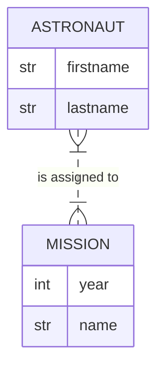

* `||..||` - one to one
* `||..|{` - one to many
* `}|..||` - many to one
* `}|..|{` - many to many

```mermaid
erDiagram

ASTRONAUT }|..|{ MISSION : "is assigned to"

ASTRONAUT {
    str firstname
    str lastname
}

MISSION {
    int year
    str name
}


```
