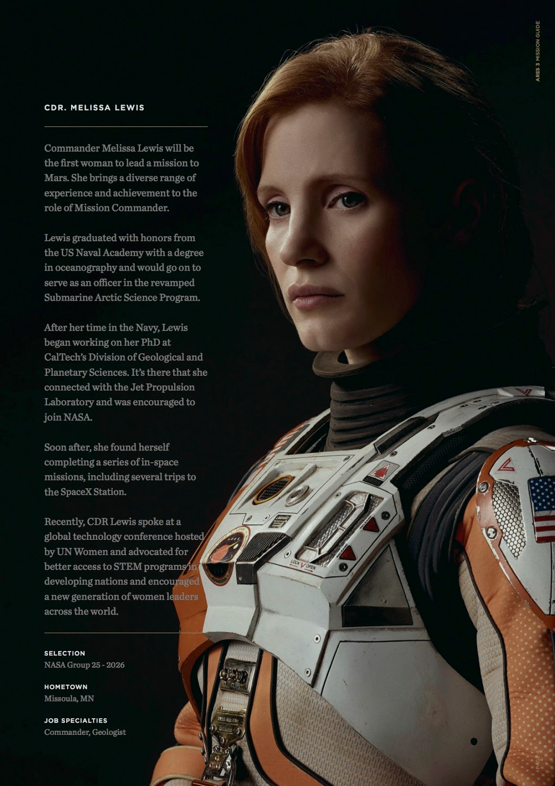
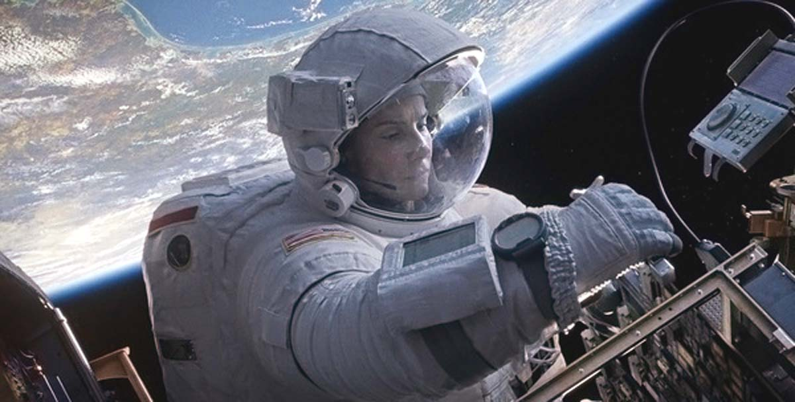
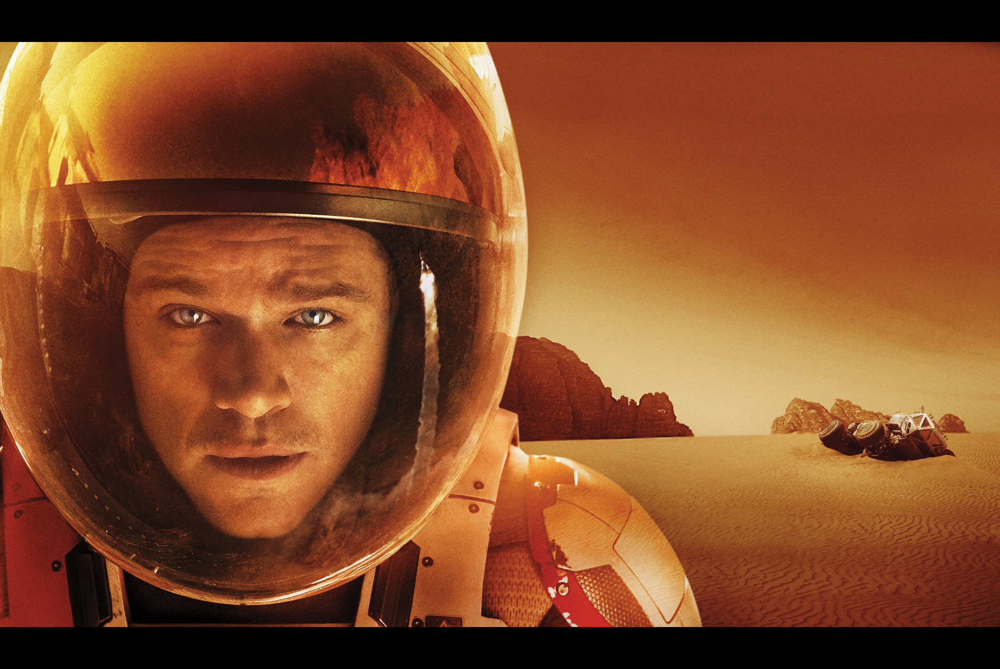
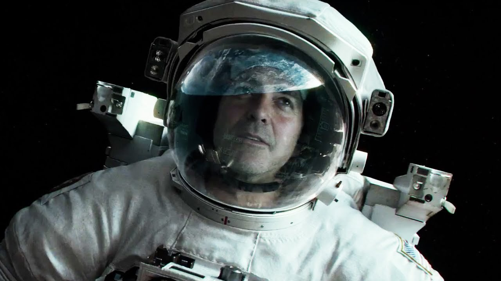
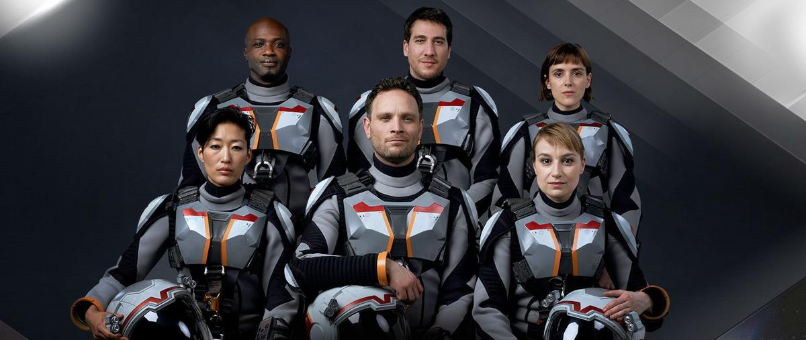

**********************
References in the book
**********************

Iris Dataset
============

Iris Species
------------
.. figure:: img/iris-species.jpg
    :scale: 50%
    :align: center

    Iris Species

Iris Dataset
------------
.. figure:: img/iris-dataset.png
    :scale: 50%
    :align: center

    Iris Dataset

Iris Grid
---------
.. figure:: img/iris-grid.png
    :scale: 50%
    :align: center

    Iris Grid

Ehlo World!
===========
W lekcjach programowania utarło się, że zawsze zaczynamy od już przysłowiowego "Hello World".
Tym razem jednak zaczniemy od 'Ehlo World!' i nie jest to pomyłka.
Jest to przywitanie serwera SMTP.
W tej książce znajdziesz kilka żartów informatycznych i nawiązań do starych

Addresses
=========
.. csv-table:: Addresses used in a book
    :header-rows: 1

    "name", "street", "city", "post_code", "state", "country"
    "Kosmodrom Bajkonur", "Wochod", "Bajkonur", "101503", "Kyzyłordyński", "Kazachstan"
    "Johnson Space Center", "2101 E NASA Pkwy", "Huston", "77058", "Texas", "USA"
    "Kennedy Space Center", None, "Cape Canaveral", "32899", "Floryda", "USA"
    "NASA Jet Propulsion Laboratory", "4800 Oak Grove Dr", "Pasadena", "91109", "California", "USA"
    "NASA Armstrong Research Center", "2825 E Ave P", "Palmdale", "93550", "California", "USA"
    "ESA EAC", "Linder Hoehe", "Köln", "51147", "North Rhine-Westphalia", "Germany"

Dates and timezones
===================
.. csv-table:: Dates used in book
    :header: Date, Time, Timezone Description

    "1957-10-04", "19:28:34", "UTC", "Sputnik launch"
    "1961-04-12", "06:07:00", "UTC", "Yuri Gagarnin's launch"
    "1969-07-21", "14:56:15", "UTC", "Apollo 11 Neil Armstrong's first step on the Moon"

Main Characters
===============

Astronauts
----------

Jan Twardowski
^^^^^^^^^^^^^^
.. figure:: img/jan-twardowski.jpg
    :scale: 50%
    :align: center

    Jan Twardowski

José Jiménez
^^^^^^^^^^^^
.. figure:: img/jose-jimenez.jpg
    :scale: 50%
    :align: center

    José Jiménez

* https://www.youtube.com/watch?v=kPnaaHR9pLc
* https://www.youtube.com/watch?v=i6ckW7uRRNw
* https://www.youtube.com/watch?v=PVxfJYw59cM
* https://www.youtube.com/watch?v=i6ckW7uRRNw
* https://www.youtube.com/watch?v=PVxfJYw59cM
* https://youtu.be/kPnaaHR9pLc?t=16

Иван Иванович
^^^^^^^^^^^^^
.. figure:: img/ivan-ivanovich.jpg
    :scale: 50%
    :align: center

    Иван Иванович

Melissa Lewis
^^^^^^^^^^^^^

    Melissa Lewis

Ryan Stone
^^^^^^^^^^

    Ryan Stone

Mark Watney
^^^^^^^^^^^

    Mark Watney

Matt Kowalski
^^^^^^^^^^^^^

    Matt Kowalski

Alex Vogel
^^^^^^^^^^
.. figure:: img/alex-vogel.jpg
    :scale: 25%
    :align: center

    Alex Vogel

Crews
-----

National Geographic's Mars
^^^^^^^^^^^^^^^^^^^^^^^^^^

    Crew from National Geographic's Mars: Robert Foucault (top left), Javier Delgado (top center), Amelie Durand (top right), Hana Seung (bottom left), Ben Sawyer (bottom center), Marta Kamen (bottom right)

Martian Movie
^^^^^^^^^^^^^
.. figure:: img/crew-martian.jpg
    :scale: 40%
    :align: center

    Crew from Martian Movie: Melissa Lewis (top left), Alex Vogel (top center), Mark Watney (top right), Chris Beck (bottom left), Beth Johanssen (bottom center), Rick Martinez (bottom right)
