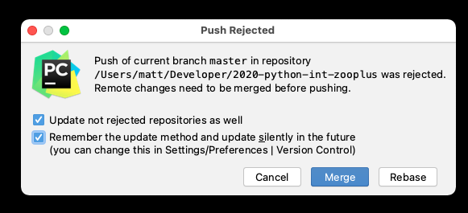

*******
Install
*******

Requirements
============
* Python 3.7, 3.8, 3.9 (preferred)
* Free `Github <https://github.com/join>`_ account
* Any IDE:

    * `PyCharm (Community or Professional) <https://www.jetbrains.com/pycharm/download/>`_ (preferred)
    * Jupyter Notebook
    * Visual Studio Code
    * `PyDev <http://www.pydev.org/download.html>`_
    * Spyder
    * Atom
    * Vim
    * any other

.. note:: Trainer will use PyCharm. If you choose any other IDE, make sure you know how to use refactoring options.

Assignments
===========

About IDE
---------
* Assignment name: About IDE
* Last update: 2020-10-12
* Complexity level: easy
* Lines of code to write: 0 lines
* Estimated time of completion: 5 min
* Solution: TODO

:English:
    .. todo:: English Translation

:Polish:
    #. Trener poda Ci link do repozytorium
    #. Stwórz projekt w Twoim IDE wykorzystując opcję 'Create from VCS'
    #. Kliknij "clone" i zaczekaj na pobranie repozytorium
    #. Po stworzeniu projektu załóż katalog gdzie będziesz przechowywał kod tworzony podczas szkolenia

        * Katalog ma mieć nazwę jak Twoje imie i pierwsza litera naziwska, np. ``JanT`` albo ``MarkW``, ``MelissaL``
        * W nazwie katalogu nie powinno być polskich znaków diakrytycznych
        * W nazwie katalogu nie powinno być spacji ani żadnych znaków specjalnych

    #. WAŻNE: Już do końca szkolenia w tym katalogu będą tworzone rozwiązania do wszystkich zadań
    #. Dzięki oddzielnym katalogom dla każdego uczestnika unikniemy konfliktów w Git

About Version
-------------
* Assignment name: About Version
* Last update: 2020-10-12
* Complexity level: easy
* Lines of code to write: 0 lines
* Estimated time of completion: 3 min
* Solution: :download:`solution/about_version.py`

:English:
    #. In your directory create file ``about_version.py``
    #. If question about adding file to GIT repository pops-up, mark checkbox "Always add" and click "Yes"
    #. Use code from "Input" section (see below)
    #. Run code in your IDE (right click on code -> "Run File in Python Console")
    #. What Python version is installed?
    #. Compare result with "Output" section (see below)
    #. Write result (version number) in shared spreadsheet

:Polish:
    #. W swoim katalogu stwórz plik ``about_version.py``
    #. Jeżeli wyskoczy pytanie czy dodać plik do repozytorium GIT, zaznacz checkbox "Always add" i wybierz "Yes"
    #. Użyj kodu z sekcji "Input" (patrz poniżej)
    #. Uruchom kod swoim IDE (prawy klawisz myszy na kodzie -> "Run File in Python Console")
    #. Jaka wersja Python jest zainstalowana?
    #. Porównaj wyniki z sekcją "Output" (patrz poniżej)
    #. Zapisz rezultat (numer wersji) we współdzielonym arkuszu kalkulacyjnym

:Input:
    .. code-block:: python

        import sys
        print(sys.version[:5])

:Output:
    .. code-block:: text

        3.9.0

About Push
----------
* Assignment name: About Push
* Last update: 2020-10-12
* Complexity level: easy
* Lines of code to write: 0 lines
* Estimated time of completion: 3 min
* Solution: TODO

:English:
    .. todo:: English Translation

:Polish:
    #. W Twoim IDE
    #. Kliknij prawym klawiszem na nazwę projektu
    #. Z menu wybierz ``Git -> Commit Directory...``  lub użyj skrótu klawiszowego ``ctrl+k``
    #. Wpisać opis zamin (np. Python szkolenie)
    #. Na dole wybrać ``Commit and Push``
    #. Jeżeli wyskoczy informacja o niekatualnym branchu i zapytanie czy odświeżyć, zaznacz checkbox "Remember the update method and update silently in future" i wybierz "Yes"
    #. Sprawdzić Github

    Jeżeli wyskoczy informacja o odrzuceniu pusha, zaznacz checkbox "Remember the update method and update silently in future" i wybierz "Rebase"
