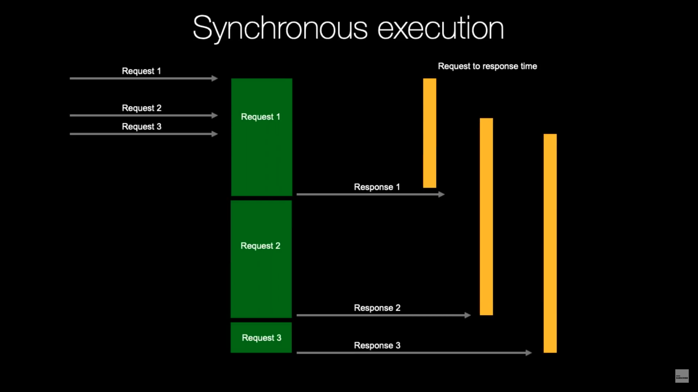
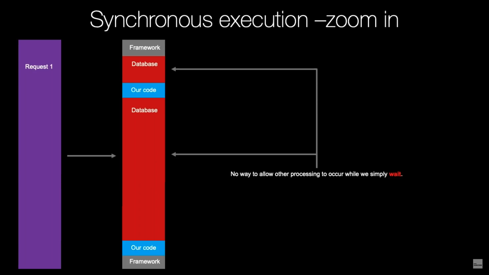
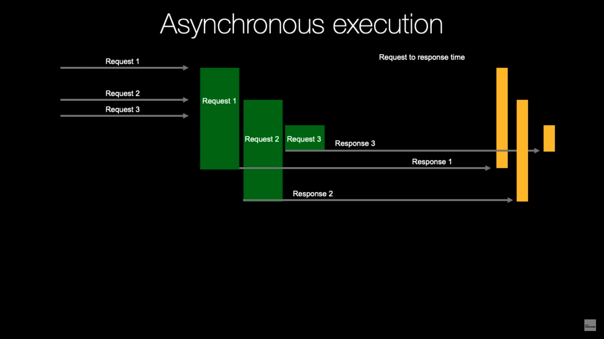
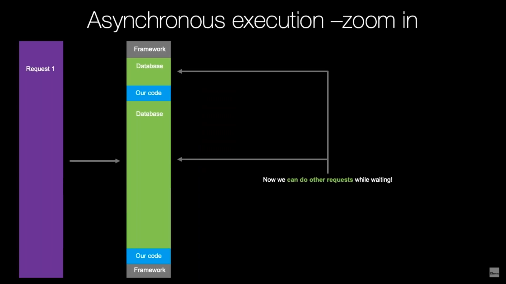
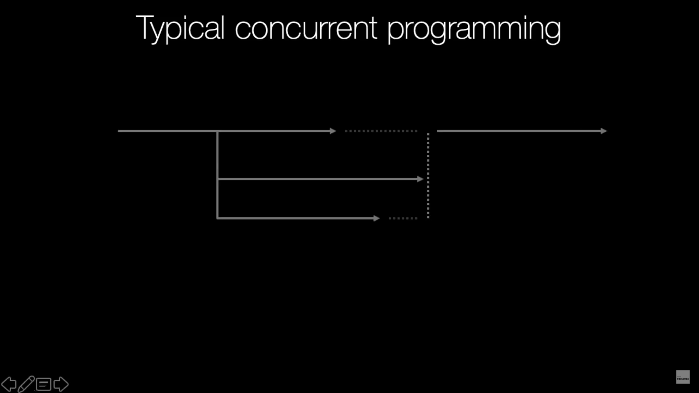
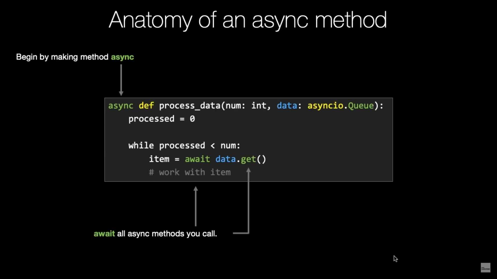
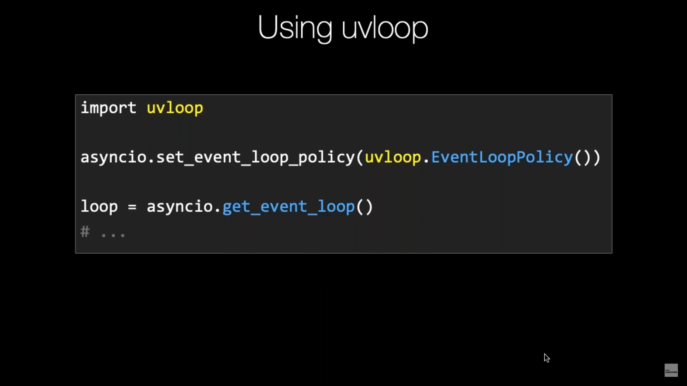

*****************
Async Programming
*****************

.. glossary::

    Promises
    Futures
    Coroutines
    Awaitable

Built-in Keywords
=================
* ``yield from``
* ``asyncio``
* ``async``/``await``

* old fashion: Twisted, Tornado
* Curio, Trio

Async Programming
=================
* Source: https://www.youtube.com/watch?v=F19R_M4Nay4
* Source: https://talkpython.fm/async
* By Michael Kennedy

.. figure:: img/async-python.png
    :align: center
    :width: 75%

High-Level Concurrency
======================
* CPU-bound Concurrency:

    * Using Queues and Multiprocessing
    * Using Futures and Multiprocessing

* I/O-bound Concurrency:

    * Using Queues and Threading
    * Using Futures and Threading

Coroutine
=========
The word "coroutine", like the word "generator", is used for two different (though related) concepts:

    * The function that defines a coroutine (a function definition using async def or decorated with ``@asyncio.coroutine``). If disambiguation is needed we will call this a coroutine function (``iscoroutinefunction()`` returns ``True``).
    * The object obtained by calling a coroutine function. This object represents a computation or an I/O operation (usually a combination) that will complete eventually. If disambiguation is needed we will call it a coroutine object (``iscoroutine()`` returns ``True``).

``Asyncio``
===========
.. code-block:: python
    :caption: Python 3.7

    import asyncio

    async def my_function():
        pass

    result = asyncio.run(my_function())

.. code-block:: python
    :caption: Python 3.6

    import asyncio

    async def my_function():
        pass

    loop = asyncio.new_event_loop()
    asyncio.set_event_loop(loop)
    result = loop.run_until_complete(my_function())

Protocol
--------
* ``__await__``
* ``__aiter__``, ``__anext__``
* ``__aenter__``, ``__aexit__``

.. code-block:: python

    class Reader:
        async def readline(self):
            ...

        def __aiter__(self):
            return self

        async def __anext__(self):
            val = await self.readline()
            if val == b'':
                raise StopAsyncIteration
            return val

.. code-block:: python

    class AsyncContextManager:
        async def __aenter__(self):
            await print('entering context')

        async def __aexit__(self, exc_type, exc, tb):
            await print('exiting context')

Low-level API
-------------
* callbacks
* Transport and Protocols
* network, subprocesses, signals

``async``/``await``
-------------------
* run coroutines
* streams, sockets, subprocesses, locks, timeouts, cancelations

Mainstream
----------
* in standard library since Python 3.5
* stable and supported
* healthy ecosystem
* HTTP: aiohttp, Sanic
* DBs: asyncpg, aio-libs, aiomysql

Pluggable event loop
--------------------
* uvloop - makes asyncio 2-4x faster
* PyO3

.. code-block:: python

    loop = asyncio.get_event_loop()
    loop.create_task()
    loop.run_until_complete()
    loop.run_forever()

    asyncio.geather()
    loop.run_in_executor()

Przykłady praktyczne
====================

Hello World coroutine
---------------------
.. code-block:: python

    import asyncio

    async def hello_world():
        print("Hello World!")

    loop = asyncio.get_event_loop()
    # Blocking call which returns when the hello_world() coroutine is done
    loop.run_until_complete(hello_world())
    loop.close()

Coroutine displaying the current date
-------------------------------------
.. code-block:: python

    import asyncio
    import datetime

    async def display_date(loop):
        end_time = loop.time() + 5.0
        while True:
            print(datetime.datetime.now())
            if (loop.time() + 1.0) >= end_time:
                break
            await asyncio.sleep(1)

    loop = asyncio.get_event_loop()
    # Blocking call which returns when the display_date() coroutine is done
    loop.run_until_complete(display_date(loop))
    loop.close()

Chain coroutines
----------------
.. code-block:: python

    import asyncio

    async def compute(x, y):
        print(f"Compute {x} + {y} ...")
        await asyncio.sleep(1.0)
        return x + y

    async def print_sum(x, y):
        result = await compute(x, y)
        print(f"{x} + {y} = {result}")

    loop = asyncio.get_event_loop()
    loop.run_until_complete(print_sum(1, 2))
    loop.close()

Future with ``run_until_complete()``
------------------------------------
.. code-block:: python

    import asyncio

    async def slow_operation(future):
        await asyncio.sleep(1)
        future.set_result('Future is done!')

    loop = asyncio.get_event_loop()
    future = asyncio.Future()
    asyncio.ensure_future(slow_operation(future))
    loop.run_until_complete(future)
    print(future.result())
    loop.close()

Parallel execution of tasks
---------------------------
.. code-block:: python

    import asyncio

    async def factorial(name, number):
        f = 1
        for i in range(2, number+1):
            print(f"Task {name}: Compute factorial({i})...")
            await asyncio.sleep(1)
            f *= i
        print(f"Task {name}: factorial({number}) = {f}")

    loop = asyncio.get_event_loop()
    loop.run_until_complete(asyncio.gather(
        factorial("A", 2),
        factorial("B", 3),
        factorial("C", 4),
    ))
    loop.close()

Trio
====
* https://trio.readthedocs.io/en/latest/tutorial.html

.. code-block:: console

    $ pip install trio

.. code-block:: python

    import trio

    async def child1():
        print("  child1: started! sleeping now...")
        await trio.sleep(1)
        print("  child1: exiting!")

    async def child2():
        print("  child2: started! sleeping now...")
        await trio.sleep(1)
        print("  child2: exiting!")

    async def parent():
        print("parent: started!")
        async with trio.open_nursery() as nursery:
            print("parent: spawning child1...")
            nursery.start_soon(child1)

            print("parent: spawning child2...")
            nursery.start_soon(child2)

            print("parent: waiting for children to finish...")
            # -- we exit the nursery block here --
        print("parent: all done!")

    trio.run(parent)

Client
------
.. code-block:: python

    import sys
    import trio

    # arbitrary, but:
    # - must be in between 1024 and 65535
    # - can't be in use by some other program on your computer
    # - must match what we set in our echo server
    PORT = 12345
    # How much memory to spend (at most) on each call to recv. Pretty arbitrary,
    # but shouldn't be too big or too small.
    BUFSIZE = 16384

    async def sender(client_stream):
        print("sender: started!")
        while True:
            data = b"async can sometimes be confusing, but I believe in you!"
            print(f"sender: sending {data!r}")
            await client_stream.send_all(data)
            await trio.sleep(1)

    async def receiver(client_stream):
        print("receiver: started!")
        while True:
            data = await client_stream.receive_some(BUFSIZE)
            print(f"receiver: got data {data!r}")
            if not data:
                print("receiver: connection closed")
                sys.exit()

    async def parent():
        print(f"parent: connecting to 127.0.0.1:{PORT}")
        client_stream = await trio.open_tcp_stream("127.0.0.1", PORT)
        async with client_stream:
            async with trio.open_nursery() as nursery:
                print("parent: spawning sender...")
                nursery.start_soon(sender, client_stream)

                print("parent: spawning receiver...")
                nursery.start_soon(receiver, client_stream)

    trio.run(parent)

Server
------
.. code-block:: python

    import trio
    from itertools import count

    # Port is arbitrary, but:
    # - must be in between 1024 and 65535
    # - can't be in use by some other program on your computer
    # - must match what we set in our echo client
    PORT = 12345
    # How much memory to spend (at most) on each call to recv. Pretty arbitrary,
    # but shouldn't be too big or too small.
    BUFSIZE = 16384

    CONNECTION_COUNTER = count()

    async def echo_server(server_stream):
        # Assign each connection a unique number to make our debug prints easier
        # to understand when there are multiple simultaneous connections.
        ident = next(CONNECTION_COUNTER)
        print("echo_server {}: started".format(ident))
        try:
            while True:
                data = await server_stream.receive_some(BUFSIZE)
                print(f"echo_server {ident}: received data {data!r}")
                if not data:
                    print(f"echo_server {ident}: connection closed")
                    return
                print(f"echo_server {ident}: sending data {data!r}")
                await server_stream.send_all(data)
        # FIXME: add discussion of MultiErrors to the tutorial, and use
        # MultiError.catch here. (Not important in this case, but important if the
        # server code uses nurseries internally.)
        except Exception as exc:
            # Unhandled exceptions will propagate into our parent and take
            # down the whole program. If the exception is KeyboardInterrupt,
            # that's what we want, but otherwise maybe not...
            print(f"echo_server {ident}: crashed: {exc!r}")

    async def main():
        await trio.serve_tcp(echo_server, PORT)

    # We could also just write 'trio.run(serve_tcp, echo_server, PORT)', but real
    # programs almost always end up doing other stuff too and then we'd have to go
    # back and factor it out into a separate function anyway. So it's simplest to
    # just make it a standalone function from the beginning.
    trio.run(main)

Unsync library
==============
* Library decides which to run, thread, asyncio or sync

.. code-block:: console

    $ pip install unsync

.. code-block:: python

    @unsync
    def my_function():
        pass

References
==========
* https://www.youtube.com/watch?v=Pe3b9bdRtiE
