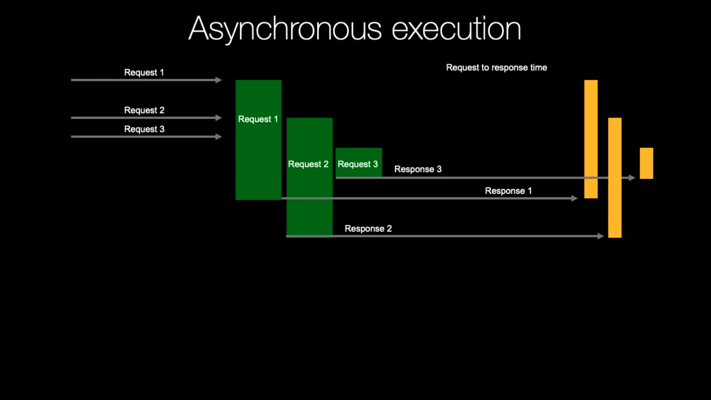
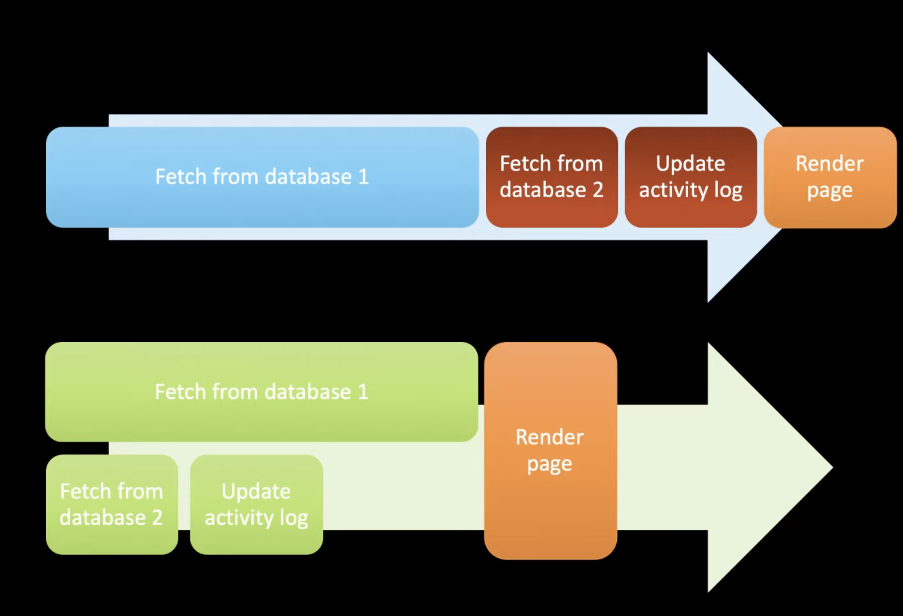
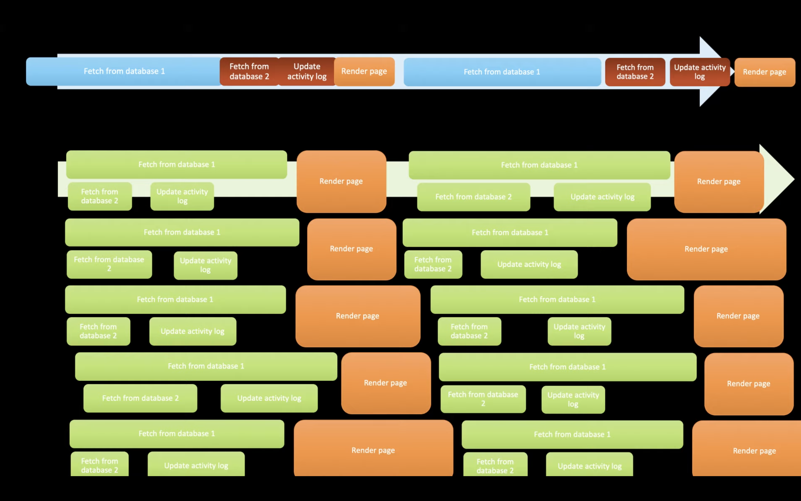

AsyncIO About
=============
* ``asyncio`` in Python standard library
* ``async`` and ``await`` builtin keywords
* Running asynchronously: 3s + 1s + 1s = bit over 3s [execution time]
* Async is the future of programming

Advantages
----------
* Maximize the usage of a single thread
* Handling I/O asynchronously
* Enabling concurrent code using coroutines
* Async will fill the gaps, otherwise wasted on waiting for I/O
* You control when tasks switches occur, so locks and other synchronization are no longer needed
* Async is the cheapest way to task switch
* Cost task switches is incredibly low; calling a pure Python function has more overhead than restarting a generator or awaitable
* Function builds stack each time it's called, whereas async uses generators underneath, which already has stack created
* In terms of speed async servers blows threaded servers in means of thousands
* Async is very cheap in means of resources
* Async world has a huge ecosystem of support tools
* Coding is easier to get right, than threads

Disadvantages
-------------
* Async switches cooperatively, so you do need to add explicit code ``yield`` or ``await`` to cause a task to switch
* Everything you do need a non-blocking version (for example ``open()``)
* Increased learning curve
* Create event loop, acquire, crate non-blocking versions of your code
* You think you know Python, there is a second half to learn (async)

Sync vs Async
-------------
.. figure:: img/asyncio-sequence-sync.png

    Source: Michael Kennedy [#Kennedy2019]_

    Source: Michael Kennedy [#Kennedy2019]_

    Source: Langa, Ł. import asyncio: Learn Python's AsyncIO [#Langa2020]_

    Source: Langa, Ł. import asyncio: Learn Python's AsyncIO [#Langa2020]_

Execution
---------
.. figure:: img/asyncio-execution-sync.png

    Source: Michael Kennedy [#Kennedy2019]_

.. figure:: img/asyncio-execution-async.png

    Source: Michael Kennedy [#Kennedy2019]_

Example
-------
>>> import asyncio
>>>
>>>
>>> async def a():
...     print('a: started')
...     await asyncio.sleep(0.2)
...     print('a: finished')
...     return 'a'
>>>
>>> async def b():
...     print('b: started')
...     await asyncio.sleep(0.1)
...     print('b: finished')
...     return 'b'
>>>
>>> async def c():
...     print('c: started')
...     await asyncio.sleep(0.3)
...     print('c: finished')
...     return 'c'
>>>
>>> async def main():
...     result = await asyncio.gather(a(), b(), c())
...     print(f'Result: {result}')
>>>
>>>
>>> asyncio.run(main())
a: started
b: started
c: started
b: finished
a: finished
c: finished
Result: ['a', 'b', 'c']

Further Reading
---------------
* Kennedy, M. Demystifying Python's Async and Await Keywords [#Kennedy2019]_
* Kennedy, M. Async Techniques and Examples in Python [#Kennedy2022]_
* Abdalla, A. Creating a Bittorrent Client using Asyncio [#Abdalla2017]_
* Langa, Ł. import asyncio: Learn Python's AsyncIO [#Langa2020]_

References
----------
.. [#Kennedy2019] Kennedy, M. Demystifying Python's Async and Await Keywords. Publisher: JetBrainsTV. Year: 2019. Retrieved: 2022-03-10. URL: https://www.youtube.com/watch?v=F19R_M4Nay4

.. [#Kennedy2022] Kennedy, M. Async Techniques and Examples in Python Course. Publisher: TalkPython. Year: 2022. Retrieved: 2022-03-10. URL: https://talkpython.fm/async

.. [#Abdalla2017] Abdalla, A. Creating a Bittorrent Client using Asyncio. Year: 2017. Retrieved: 2022-03-10. URL: https://www.youtube.com/watch?v=Pe3b9bdRtiE

.. [#Langa2020] Langa, Ł. import asyncio: Learn Python's AsyncIO. Year: 2020. Retrieved: 2022-03-10. URL: https://www.youtube.com/playlist?list=PLhNSoGM2ik6SIkVGXWBwerucXjgP1rHmB
