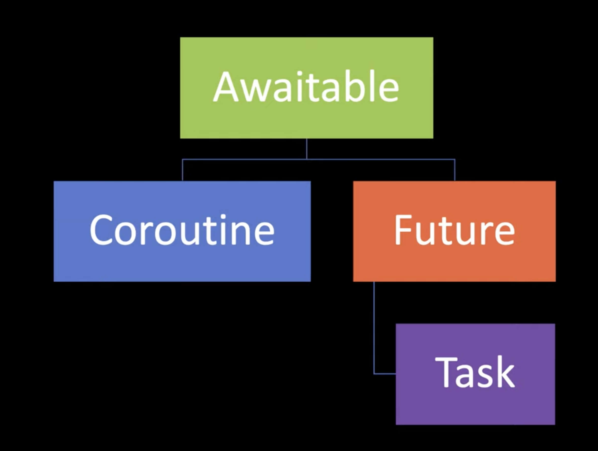

AsyncIO Awaitable
=================
* Since Python 3.5 :pep:`492` -- Coroutines with async and await syntax
* Object is an awaitable if it can be used in an ``await`` expression
* Awaitable objects: Coroutines, Tasks, Futures
* ``__await__`` and ``await`` keyword

.. glossary::

    aw
    awaitable
        Object is an awaitable if it can be used in an ``await`` expression

    aws
        Awaitables

    coroutine
        Coroutine - a function which can run concurrently.

    tasks
        Runs thing in the "background". Can be awaited and cancelled.

    future

An awaitable object generally implements an ``__await__()`` method.
Coroutine objects returned from async def functions are awaitable. Note
The generator iterator objects returned from generators decorated with
``types.coroutine()`` or ``asyncio.coroutine()`` are also awaitable, but
they do not implement ``__await__()``.

``object.__await__(self)`` Must return an iterator. Should be used to
implement awaitable objects. For instance, ``asyncio.Future`` implements
this method to be compatible with the await expression.
[#pydocDatamodelAwaitable]_

Awaitables
----------
There are three main types of awaitable objects:

    * Coroutines,
    * Tasks,
    * Futures.

Coroutines are a low level concept and doesn't know about asyncio concepts
such as EventLoop and Cancellations.

Tasks wraps around a coroutine object and allows for handling exceptions,
gathering results etc.

Objects
-------
Features of Python:

>>> from collections.abc import Awaitable
>>> from collections.abc import Coroutine

Features of AsyncIO library:

>>> from asyncio import Future
>>> from asyncio import Task

    Source: Langa, Ł. import asyncio: Learn Python's AsyncIO [#Langa2020]_

Type Annotations
----------------
>>> from collections.abc import Awaitable
>>> from collections.abc import Coroutine
>>> from collections.abc import AsyncIterable
>>> from collections.abc import AsyncIterator
>>> from collections.abc import AsyncGenerator

References
----------
.. [#Langa2020] Langa, Ł. import asyncio: Learn Python's AsyncIO. Year: 2020. Retrieved: 2022-03-10. URL: https://www.youtube.com/playlist?list=PLhNSoGM2ik6SIkVGXWBwerucXjgP1rHmB

.. [#pydocDatamodelAwaitable] Python core developers. Data model. Coroutines. Awaitable Objects. Year: 2022. Retrieved: 2022-04-01. URL: https://docs.python.org/3/reference/datamodel.html#awaitable-objects
