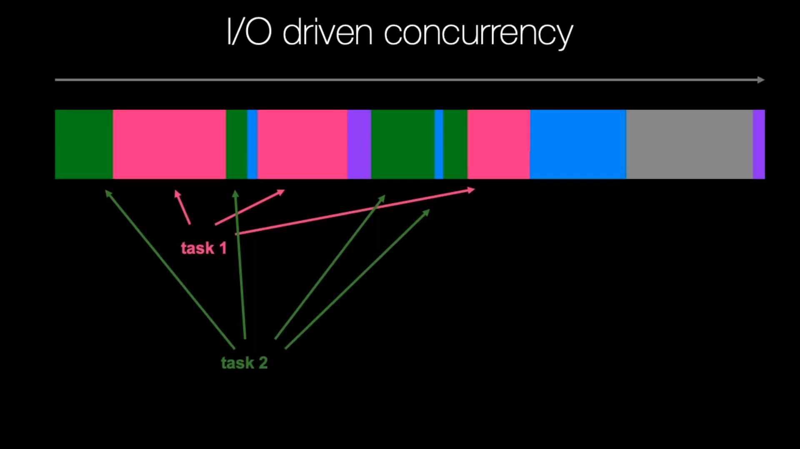
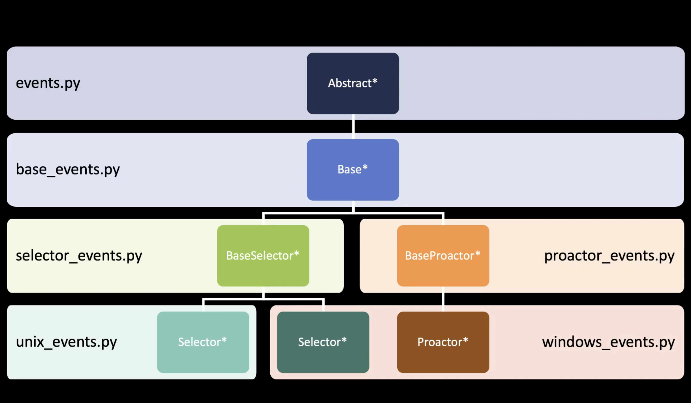
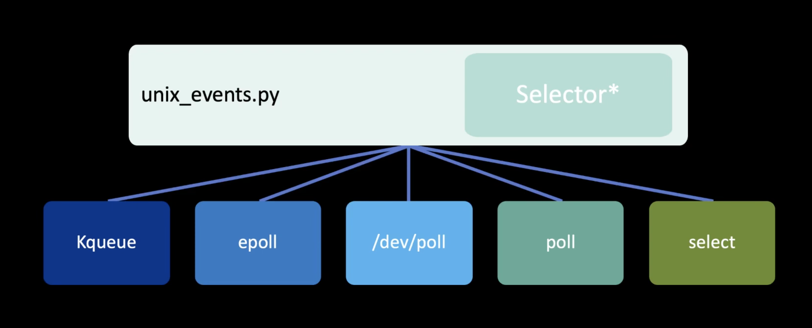

AsyncIO Event Loop
==================
* Async code can only run inside an event loop.
* The event loop is the driver code that manages the cooperative multitasking.
* You can create multiple threads and run different event loops in each of them.
* Python will create a default event loop only in Main Thread
* Python will not create an event loop automatically for you on any other than main thread by default, this is to prevent from having multiple event lops created explicitly
* Event loop can execute only one callback (coroutine) at a time
* Some callbacks (coroutines) can schedule themselves once again (trampoline)
* Reactors
* Proactors

For example, Django uses the main thread to wait for incoming requests, so
we can't run an asyncio event loop there, but we can start a separate
worker thread for our event loop [#Poirier2021]_.

An event loop runs in a thread (typically the main thread) and executes all
callbacks and Tasks in its thread. While a Task is running in the event loop,
no other Tasks can run in the same thread. When a Task executes an await
expression, the running Task gets suspended, and the event loop executes
the next Task. [#pydocMultithreading]_

.. figure:: img/asyncio-eventloop-sync.png

    Source: Michael Kennedy [#Kennedy2019]_

    Source: Michael Kennedy [#Kennedy2019]_

.. figure:: img/asyncio-eventloop-uvloop-doc.png

    Source: Michael Kennedy [#Kennedy2019]_

.. figure:: img/asyncio-eventloop-uvloop-using.png

    Source: Michael Kennedy [#Kennedy2019]_

Selectors
---------

    Source: Langa, Ł. import asyncio: Learn Python's AsyncIO [#Langa2020]_

    Source: Langa, Ł. import asyncio: Learn Python's AsyncIO [#Langa2020]_

Loop
----
.. todo:: rewrite

.. code-block:: python

    import asyncio

    loop = asyncio.new_event_loop()

    Return the running event loop in the current OS thread.

    If there is no running event loop a RuntimeError is raised. This function can only be called from a coroutine or a callback.

    loop = asyncio.get_event_loop()
    loop.run_forever()

    loop = asyncio.get_event_loop()
    loop.run_until_complete(asyncio.sleep(3))

    from datetime import datetime

    def print_now():
         print(datetime.now())

    loop.call_soon(print_now)
    loop.call_soon(print_now)
    loop.run_until_complete(asyncio.sleep(3))

    def trampoline(name: str = '') -> None:
         print(name, end=' ')
         print_now()
         loop.call_later(0.5, trampoline, name)

    loop.call_soon(trampoline)
    loop.call_later(8, loop.stop)
    loop.run_forever()

    loop.call_soon(trampoline, 'First')
    loop.call_soon(trampoline, 'Second')
    loop.call_soon(trampoline, 'Third')
    loop.call_later(8, loop.stop)
    loop.run_forever()

    # loop.run_until_complete(future)
    #   Run until the future (an instance of Future) has completed.
    #
    # loop.run_forever()
    #   Run the event loop until stop() is called.
    #
    # loop.stop()
    #   Stop the event loop.
    #
    # loop.is_running()
    #   Return True if the event loop is currently running.
    #
    # loop.is_closed()
    #   Return True if the event loop was closed.
    #
    # loop.close()
    #   Close the event loop.

    # loop.call_soon(callback, *args, context=None)
    #   Schedule the callback callback to be called with args arguments at the
    # next iteration of the event loop. This method is not thread-safe.
    #
    # loop.call_soon_threadsafe(callback, *args, context=None)
    #   A thread-safe variant of call_soon(). Must be used to schedule callbacks
    # from another thread.

    # loop.call_later(delay, callback, *args, context=None)
    #   Schedule callback to be called after the given delay number of seconds (
    # can be either an int or a float).
    #
    # loop.call_at(when, callback, *args, context=None)
    #   Schedule callback to be called at the given absolute timestamp when (an
    # int or a float), using the same time reference as loop.time().
    #
    # loop.time()
    #   Return the current time, as a float value, according to the event loop's
    # internal monotonic clock.

UVLoop
------
* The ultimate loop implementation for UNIXes (run this on production)

.. code-block:: console

    $ pip install uvloop

>>> # doctest: +SKIP
... import uvloop
...
... uvloop.install()
...
... loop = asyncio.new_event_loop()
... loop
<uvloop.Loop running=False closed=False debug=False>

References
----------
.. [#Kennedy2019] Kennedy, M. Demystifying Python's Async and Await Keywords. Publisher: JetBrainsTV. Year: 2019. Retrieved: 2022-03-10. URL: https://www.youtube.com/watch?v=F19R_M4Nay4

.. [#Langa2020] Langa, Ł. import asyncio: Learn Python's AsyncIO. Year: 2020. Retrieved: 2022-03-10. URL: https://www.youtube.com/playlist?list=PLhNSoGM2ik6SIkVGXWBwerucXjgP1rHmB

.. [#Poirier2021] Poirier, D. Asyncio (superseded by async page). Year: 2021. Retrieved: 2022-03-17. URL: https://cheat.readthedocs.io/en/latest/python/asyncio.html

.. [#pydocMultithreading] Python core developers. Developing with asyncio. Concurrency and Multithreading. Python documentation. Year: 2022. Retrieved: 2022-03-17. URL: https://docs.python.org/3/library/asyncio-dev.html#concurrency-and-multithreading
