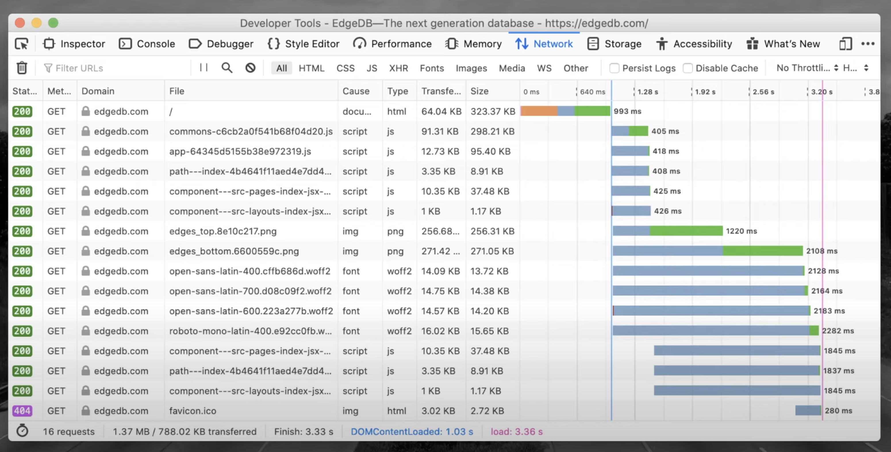

Threading About
===============

.. glossary::

    thread
    lock
    daemon
    worker
    timer

Rationale
---------
#. Co to jest wątek?
#. Ile czasu trwa tworzenie wątków?
#. Kto zarządza wątkami?
#. Ile może być równoległych wątków?
#. Ile wątków może być w ramach jednego procesu?
#. Jak komunikować się między wątkami?
#. Czy współdzielenie pamięci przez wątki jest dobre czy złe?

* Zaletą wątków jest to, że mają współdzielony stan
* Jeden wątek może zapisać kod do pamięci a drugi odczytać bez narzutu komunikacyjnego
* Wadą jest również współdzielony stan i race condition
* Ideą wątków jest tani dostęp do współdzielonej pamięci, tylko trzeba wszędzie wstawiać locki
* Run very fast, but hard to get correct
* It's insanely difficult to create large multi-threaded programs with multiple locks
* Even if you lock resource, there is no protection if other parts of the system do not even try to acquire the lock
* Threads switch preemptively
* Preemptively means that the thread manager decides to switch tasks for you (you don't have to explicitly say to do so). Programmer has to do very little.
* This is convenient because you dont need to add explicit code to cause a task switch
* The cost of this convenience is that you have to assume a switch can happen at any time
* Accordingly, critical sections have to be a guarded with locks
* The limit on threads is total CPU power minus the cost of tasks switches and synchronization overhead

Source: [#Hettinger2017]_

    Green: actual data transfer; blue: waiting; orange: domain name
    resolution, TLS handshake, etc. Source: Langa, Ł. import asyncio: Learn
    Python's AsyncIO [#Langa2020]_

.. figure:: img/threading-join.png

    Source: Michael Kennedy [#Kennedy2019]_

Every real operating system thread allocates full sized callstack. It's
overhead. So you cannot run hundreds of threads without without sacrificing
resources.

Daemon
------
* https://stackoverflow.com/a/190017/228517

Some threads do background tasks, like sending keepalive packets, or
performing periodic garbage collection, or whatever. These are only useful
when the main program is running, and it's okay to kill them off once the
other, non-daemon, threads have exited.

Without daemon threads, you'd have to keep track of them, and tell them to
exit, before your program can completely quit. By setting them as daemon
threads, you can let them run and forget about them, and when your program
quits, any daemon threads are killed automatically.

GIL
---
* Global Interpreter Lock
* CPython has a lock for its internal shared global state
* One lock instead of hundreds smaller
* The unfortunate effect of GIL is that no more than one thread can run at a time
* For I/O bound applications, GIL doesn't present much of an issue
* For CPU bound applications, using threads makes the application speed worse
* Accordingly, that drives us to multiprocessing to gain more CPU cycles
* Larry Hastings, Gilectomy project - removed GIL, but Python slowed down

Source: [#Hettinger2017]_

.. figure:: img/threading-gil.png

    Source: Michael Kennedy [#Kennedy2019]_

Thread-safety
-------------
* Thread-safe code is code that will work even if many Threads are executing it simultaneously.

Thread-safe code is code that will work even if many Threads are executing
it simultaneously. Writing it is a black art. It is extremely difficult to
debug since you can’t reproduce all possible interactions between Threads.
You have to do it by logic. In a computer, something that happens only one
in a billion times must be dealt with because on average it will happen
once a second. To write code that will run stably for weeks takes extreme
paranoia [#Green2017]_.

A class is thread-safe if it behaves correctly when accessed from multiple
threads, regardless of the scheduling or interleaving of the execution of
those threads by the runtime environment, and with no additional
synchronization or other coordination on the part of the calling code
[#Goetz2006]_.

References
----------
.. [#Hettinger2017] Hettinger, Raymond. Keynote on Concurrency. PyBay 2017. https://youtu.be/9zinZmE3Ogk?t=1243

.. [#Kennedy2019] Kennedy, M. Demystifying Python's Async and Await Keywords. Publisher: JetBrainsTV. Year: 2019. Retrieved: 2022-03-10. URL: https://www.youtube.com/watch?v=F19R_M4Nay4

.. [#Langa2020] Langa, Ł. import asyncio: Learn Python's AsyncIO. Year: 2020. Retrieved: 2022-03-10. URL: https://www.youtube.com/playlist?list=PLhNSoGM2ik6SIkVGXWBwerucXjgP1rHmB

.. [#Green2017] Green, R. Thread safe code. Publisher: Canadian Mind Products. Year: 2017. Retrieved: 2022-03-18. URL: https://www.mindprod.com/jgloss/threadsafe.html

.. [#Goetz2006] Goetz, B. and Peierls, T. and Bloch. J. and Bowbeer, J. and Holmes D. and Lea, D. Java Concurrency in Practice. Publisher: Addison-Wesley Professional; 1st edition. Year: 2006. ISBN: 978-0321349606.
