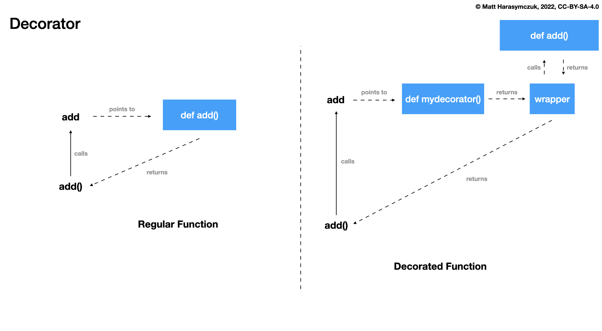

Decorator About
===============
* Decorator is an object, which takes another object as it's argument
* Since Python 2.4: :pep:`318` -- Decorators for Functions and Methods
* Since Python 3.9: :pep:`614` -- Relaxing Grammar Restrictions On Decorators
* Decorator can do things before call
* Decorator can do things after call
* Decorator can modify arguments
* Decorator can modify returned value
* Decorator can avoid calling
* Decorator can modify globals
* Decorator can add or change metadata

Syntax
------
* ``func`` is a reference to function which is being decorated
* ``args`` arbitrary number of positional arguments
* ``kwargs`` arbitrary number of keyword arguments
* By calling ``func(*args, **kwargs)`` you actually run original (wrapped) function with it's original arguments

>>> def mydecorator(func):
...     def wrapper(*args, **kwargs):
...         return func(*args, **kwargs)
...     return wrapper
>>>
>>>
>>> @mydecorator
... def myfunction(*args, **kwargs):
...     pass
>>>
>>>
>>> myfunction()

Decoration
----------
Syntax:

>>> @mydecorator
... def myfunction(*args, **kwargs):
...     ...

Is equivalent to:

>>> myfunction = mydecorator(myfunction)
