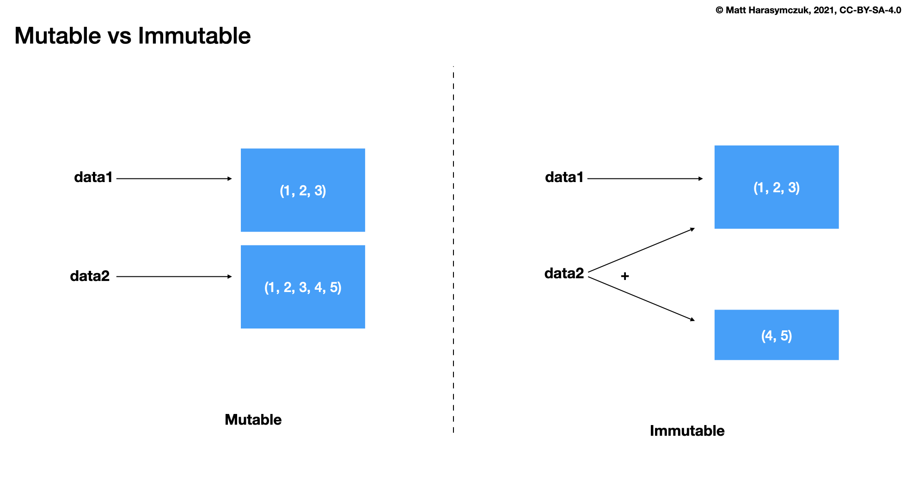
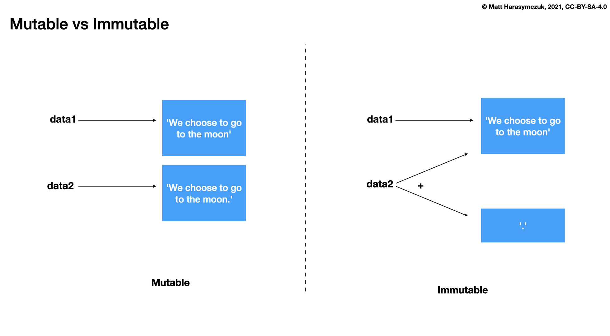
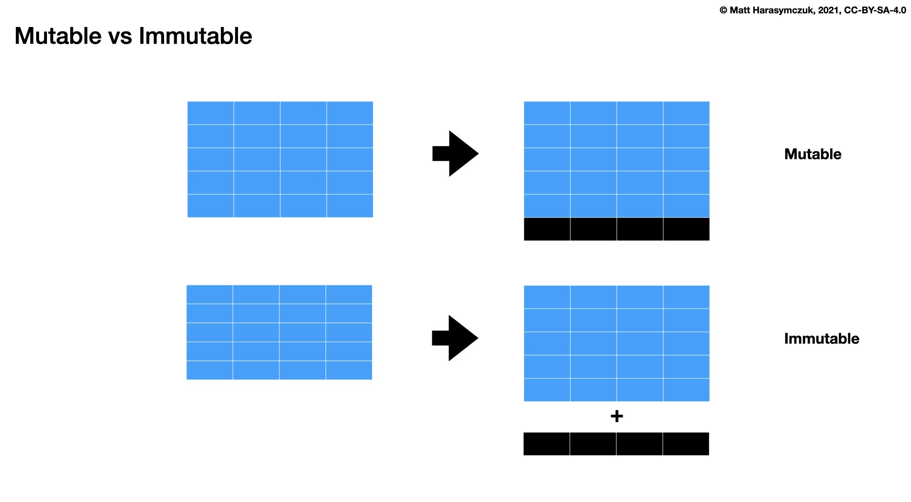
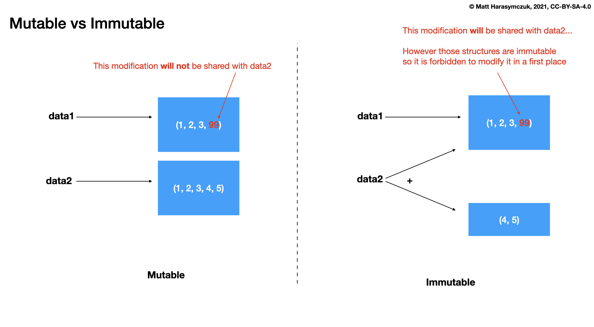

FuncProg Immutable
==================
* Purely functional data structures have persistence
* (keeps previous versions of the data structure unmodified)

The array with constant access and update times is a basic component
of most imperative languages, and many imperative data-structures,
such as the hash table and binary heap, are based on arrays. Arrays
can be replaced by maps or random access lists, which admit purely
functional implementation, but have logarithmic access and update
times. Source: [#WikipediaFunc]_

Variables are immutable, i.e., it isn't possible to modify one once it has
been initialized. However, we can create a new variable. The immutable nature
of variables helps preserve the state throughout the program. [#Inouye2022]_

Mutable:

>>> data = [1, 2, 3]
>>> id(data)  # doctest: +SKIP
4505485888
>>>
>>> data += [4, 5, 6]
>>> id(data)  # doctest: +SKIP
4505485888

Immutable:

>>> data = (1, 2, 3)
>>> id(data)  # doctest: +SKIP
4506214016
>>>
>>> data += (4, 5, 6)
>>> id(data)  # doctest: +SKIP
4502812416

Mutable vs Immutable
--------------------

Changes
-------

Immutable Types
---------------
* ``int``
* ``float``
* ``complex``
* ``bool``
* ``None``
* ``str``
* ``bytes``
* ``tuple``
* ``frozenset``
* ``mappingproxy``

Mutable Types
-------------
* ``list``
* ``set``
* ``dict``

Comparison
----------
.. csv-table:: Comparison
    :header: Immutable, Mutable
    :widths: 50, 50

    int                       ,
    float                     ,
    complex                   ,
    bool                      ,
    None                      ,
    str                       ,
    bytes                     , bytearray
    tuple                     , list
    frozenset                 , set
    mappingproxy              , dict
    NamedTuple                ,
    namedtuple                ,
                              , array
                              , TypedDict
    dataclass(frozen=True)    , dataclass

Array
-----
Return a new array whose items are restricted by typecode, and
initialized from the optional initializer value, which must be a list,
string or iterable over elements of the appropriate type.

Arrays represent basic values and behave very much like lists, except
the type of objects stored in them is constrained. The type is specified
at object creation time by using a type code, which is a single character.
The following type codes are defined:

.. csv-table:: Comparison
    :widths: 10, 70, 20
    :header: Type code, C Type, Minimum size in bytes

    'b',    signed integer     , 1
    'B',    unsigned integer   , 1
    'u',    Unicode character  , 2 (see note)
    'h',    signed integer     , 2
    'H',    unsigned integer   , 2
    'i',    signed integer     , 2
    'I',    unsigned integer   , 2
    'l',    signed integer     , 4
    'L',    unsigned integer   , 4
    'q',    signed integer     , 8 (see note)
    'Q',    unsigned integer   , 8 (see note)
    'f',    floating point     , 4
    'd',    floating point     , 8

SetUp:

>>> from array import array

Define:

>>> data = array('b')  # 8 bit signed integer -> values from -128 to 127

Use:

>>> data.append(0)
>>> data.append(1)
>>> data.append(127)
>>> data.append(128)
Traceback (most recent call last):
OverflowError: signed char is greater than maximum

>>> data.append(-1)
>>> data.append(-128)
>>> data.append(-129)
Traceback (most recent call last):
OverflowError: signed char is less than minimum

Mutable Dataclass
-----------------
>>> from dataclasses import dataclass

>>> @dataclass
... class Point:
...     x: int
...     y: int

>>> pt = Point(x=1, y=2)
>>> pt.x = 10
>>> pt.y = 20
>>> pt
Point(x=10, y=20)
>>>
>>> pt.z = 30
>>> pt
Point(x=10, y=20)
>>>
>>> vars(pt)
{'x': 10, 'y': 20, 'z': 30}

Immutable Dataclass
-------------------
>>> from dataclasses import dataclass

>>> @dataclass(frozen=True)
... class Point:
...     x: int
...     y: int

>>> pt = Point(x=1, y=2)
>>> pt.x = 10
Traceback (most recent call last):
dataclasses.FrozenInstanceError: cannot assign to field 'x'
>>>
>>> pt.x = 20
Traceback (most recent call last):
dataclasses.FrozenInstanceError: cannot assign to field 'x'
>>>
>>> pt
Point(x=1, y=2)
>>>
>>> pt.z = 30
Traceback (most recent call last):
dataclasses.FrozenInstanceError: cannot assign to field 'z'
>>>
>>> pt
Point(x=1, y=2)

References
----------
.. [#WikipediaFunc] Functional programming. Retrieved: 2020-10-09. URL: https://en.wikipedia.org/wiki/Functional_programming

.. [#Inouye2022] Inouye, Jenna. "Functional Programming Languages: Concepts & Advantages". Year: 2022. Retrieved: 2022-07-28, URL: https://hackr.io/blog/functional-programming
