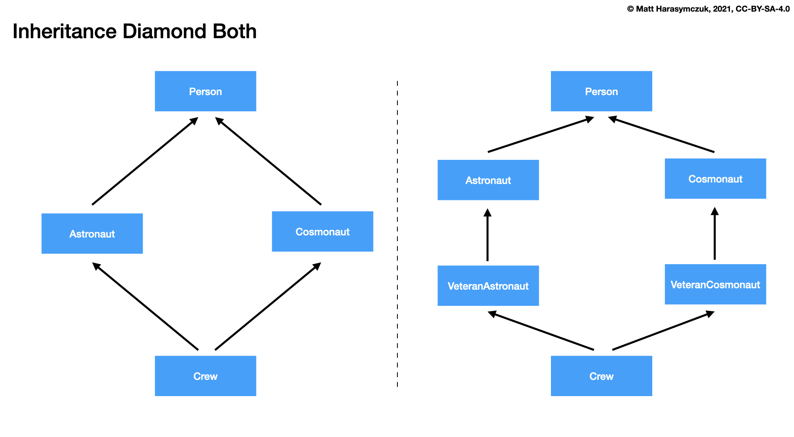
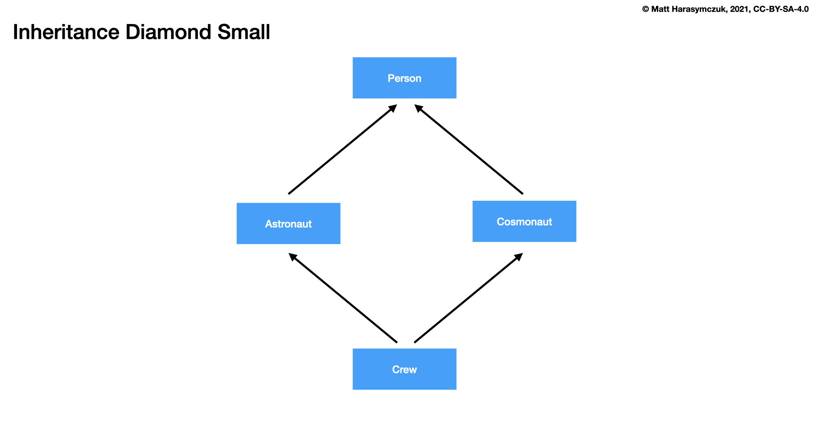
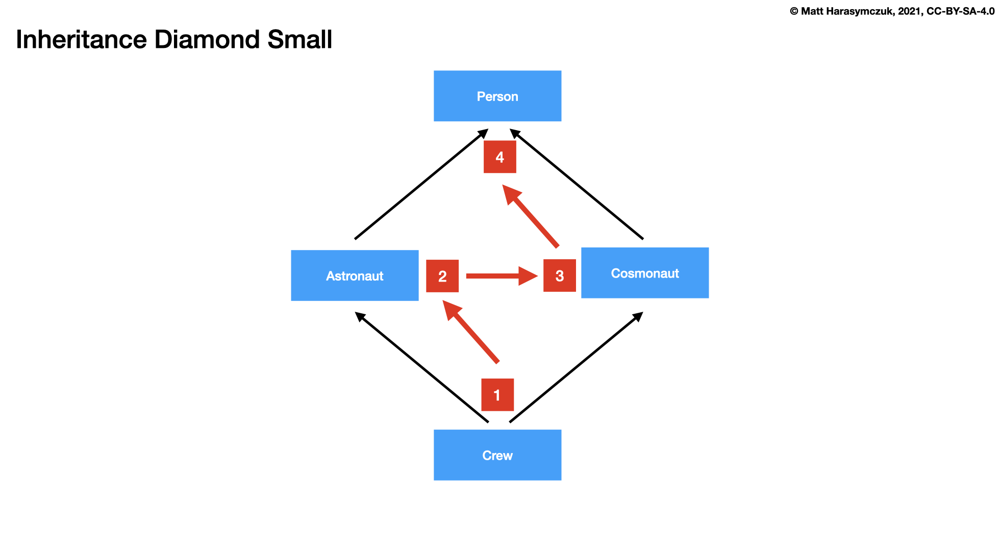
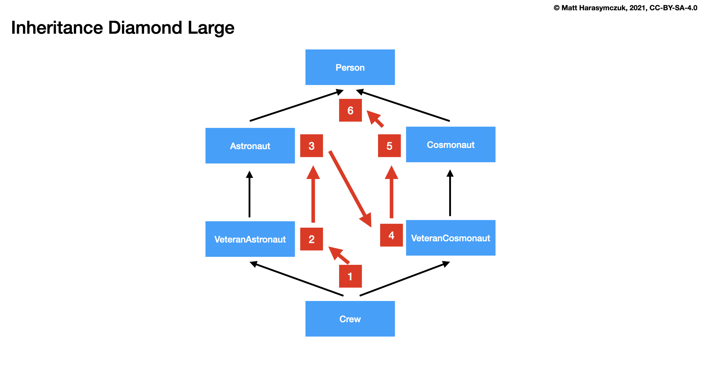

OOP Method Resolution Order
===========================

Recap
-----
>>> class Person:
...     def __init__(self):
...         print('Person init')
>>>
>>>
>>> class Astronaut(Person):
...     pass
>>>
>>>
>>> astro = Astronaut()
Person init

>>> class Person:
...     def __init__(self):
...         print('Person init')
>>>
>>>
>>> class Astronaut(Person):
...     def __init__(self):
...         print('Astronaut init')
>>>
>>>
>>> astro = Astronaut()
Astronaut init

>>> class Person:
...     def __init__(self):
...         print('Person init')
>>>
>>>
>>> class Astronaut(Person):
...     def __init__(self):
...         super().__init__()
...         print('Astronaut init')
>>>
>>>
>>> astro = Astronaut()
Person init
Astronaut init

>>> class Person:
...     def __init__(self):
...         print('Person init')
>>>
>>>
>>> class Astronaut(Person):
...     def __init__(self):
...         print('Astronaut init')
...         super().__init__()
>>>
>>>
>>> a = Astronaut()
Astronaut init
Person init

Inheritance Diamond
-------------------

>>> class Person:
>>>     def __init__(self):
>>>         print('Person init')
>>>
>>>
>>> class Astronaut(Person):
>>>     def __init__(self):
>>>         print('Astronaut init')
>>>
>>>
>>> class Cosmonaut(Person):
>>>     def __init__(self):
>>>         print('Cosmonaut init')
>>>
>>>
>>> class Crew(Astronaut, Cosmonaut):
>>>     def __init__(self):
>>>         print('Crew init')
>>>
>>>
>>> crew = Crew()
Crew init

Small Diamond
-------------

>>> class Person:
>>>     def __init__(self):
>>>         print('Person init')
>>>
>>>
>>> class Astronaut(Person):
>>>     def __init__(self):
>>>         print('Astronaut init')
>>>
>>>
>>> class Cosmonaut(Person):
>>>     def __init__(self):
>>>         print('Cosmonaut init')
>>>
>>>
>>> class Crew(Astronaut, Cosmonaut):
>>>     pass
>>>
>>>
>>> crew = Crew()
Astronaut init

>>> class Person:
...     def __init__(self):
...         print('Person init')
>>>
>>>
>>> class Astronaut(Person):
...     def __init__(self):
...         print('Astronaut init')
>>>
>>>
>>> class Cosmonaut(Person):
...     def __init__(self):
...         print('Cosmonaut init')
>>>
>>>
>>> class Crew(Astronaut, Cosmonaut):
...     def __init__(self):
...         super().__init__()
>>>
>>>
>>> crew = Crew()
Astronaut init

>>> Crew.mro()  # doctest: +NORMALIZE_WHITESPACE
[__main__.Crew,
 __main__.Astronaut,
 __main__.Cosmonaut,
 __main__.Person,
 object]

>>> Crew.__mro__  # doctest: +NORMALIZE_WHITESPACE
(__main__.Crew,
 __main__.Astronaut,
 __main__.Cosmonaut,
 __main__.Person,
 object)

Large Diamond
-------------
.. figure:: img/oop-mro-diamond-large-empty.png

>>> class Person:
...     def __init__(self):
...         print('Person init')
>>>
>>>
>>> class Astronaut(Person):
...     def __init__(self):
...         print('Astronaut init')
>>>
>>> class VeteranAstronaut(Astronaut):
...     def __init__(self):
...         print('VeteranAstronaut init')
>>>
>>>
>>> class Cosmonaut(Person):
...     def __init__(self):
...         print('Cosmonaut init')
>>>
>>> class VeteranCosmonaut(Cosmonaut):
...     def __init__(self):
...         print('VeteranCosmonaut init')
>>>
>>>
>>> class Crew(VeteranAstronaut, VeteranCosmonaut):
...     def __init__(self):
...         super().__init__()
>>>
>>>
>>> crew = Crew()
VeteranAstronaut init

>>> class Person:
...     def __init__(self):
...         print('Person init')
>>>
>>>
>>> class Astronaut(Person):
...     def __init__(self):
...         print('Astronaut init')
>>>
>>> class VeteranAstronaut(Astronaut):
...     def __init__(self):
...         super().__init__()
...         print('VeteranAstronaut init')
>>>
>>>
>>> class Cosmonaut(Person):
...     def __init__(self):
...         print('Cosmonaut init')
>>>
>>> class VeteranCosmonaut(Cosmonaut):
...     def __init__(self):
...         super().__init__()
...         print('VeteranCosmonaut init')
>>>
>>>
>>> class Crew(VeteranAstronaut, VeteranCosmonaut):
...     pass
>>>
>>>
>>> crew = Crew()
Astronaut init
VeteranAstronaut init

Problematic super()
-------------------
>>> class Person:
>>>     def __init__(self):
>>>         print('Person init')
>>>
>>>
>>> class Astronaut(Person):
>>>     def __init__(self):
>>>         super().__init__()
>>>         print('Astronaut init')
>>>
>>> class VeteranAstronaut(Astronaut):
>>>     def __init__(self):
>>>         super().__init__()
>>>         print('VeteranAstronaut init')
>>>
>>>
>>> class Cosmonaut(Person):
>>>     def __init__(self):
>>>         super().__init__()
>>>         print('Cosmonaut init')
>>>
>>> class VeteranCosmonaut(Cosmonaut):
>>>     def __init__(self):
>>>         super().__init__()
>>>         print('VeteranCosmonaut init')
>>>
>>>
>>> class Crew(VeteranAstronaut, VeteranCosmonaut):
>>>     pass
>>>
>>>
>>> crew = Crew()
Person init
Cosmonaut init
VeteranCosmonaut init
Astronaut init
VeteranAstronaut init

>>> class Person:
...     def __init__(self):
...         print('Person init')
>>>
>>>
>>> class Astronaut(Person):
...     def __init__(self):
...         print('Astronaut init')
...         super().__init__()
>>>
>>> class VeteranAstronaut(Astronaut):
...     def __init__(self):
...         print('VeteranAstronaut init')
...         super().__init__()
>>>
>>>
>>> class Cosmonaut(Person):
...     def __init__(self):
...         print('Cosmonaut init')
...         super().__init__()
>>>
>>> class VeteranCosmonaut(Cosmonaut):
...     def __init__(self):
...         print('VeteranCosmonaut init')
...         super().__init__()
>>>
>>>
>>> class Crew(VeteranAstronaut, VeteranCosmonaut):
...     pass
>>>
>>>
>>> crew = Crew()
VeteranAstronaut init
Astronaut init
VeteranCosmonaut init
Cosmonaut init
Person init

Why?!
-----

>>> Crew.mro()  # doctest: +NORMALIZE_WHITESPACE
[__main__.Crew,
 __main__.VeteranAstronaut,
 __main__.Astronaut,
 __main__.VeteranCosmonaut,
 __main__.Cosmonaut,
 __main__.Person,
 object]

Compare
-------
.. figure:: img/oop-mro-diamond-both-path.png

Assignments
-----------
.. todo:: Create assignments
