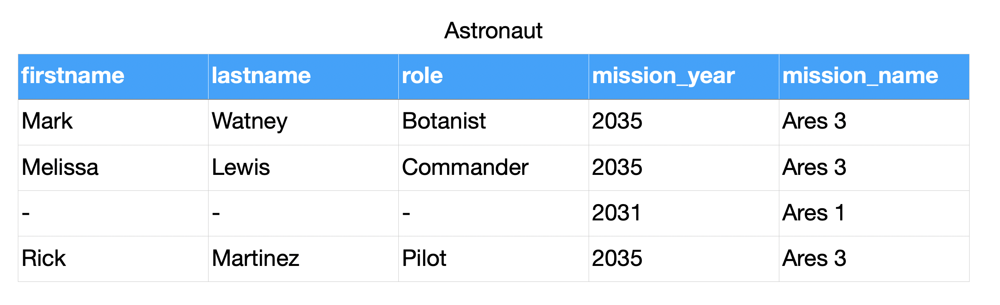
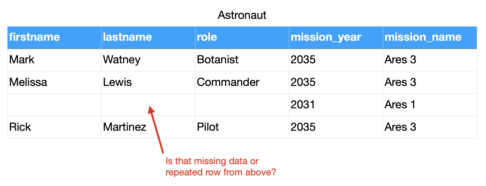
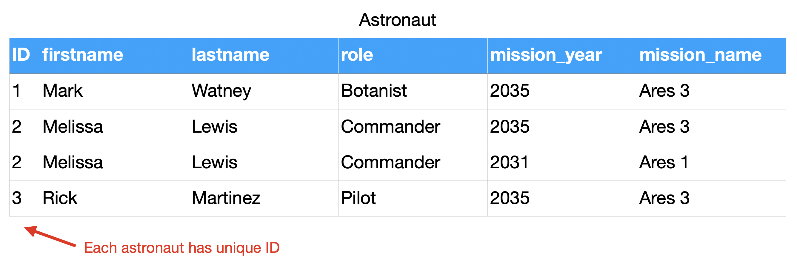
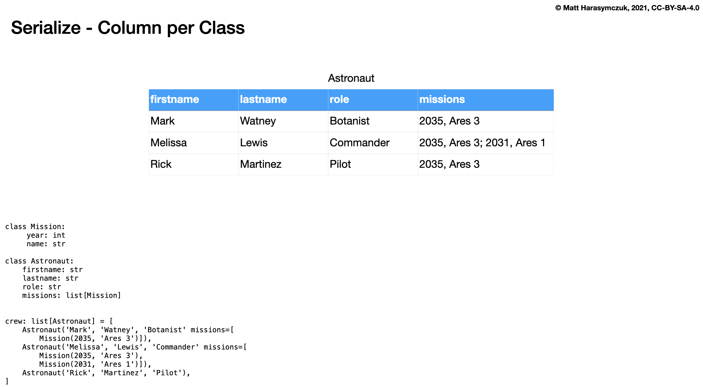
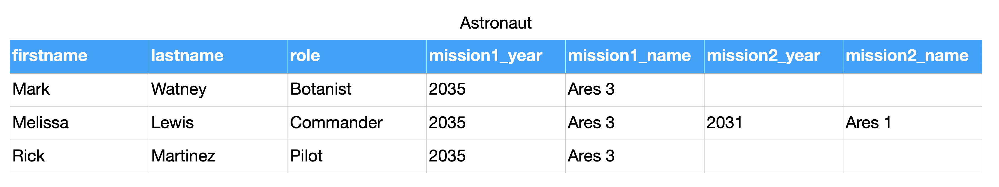
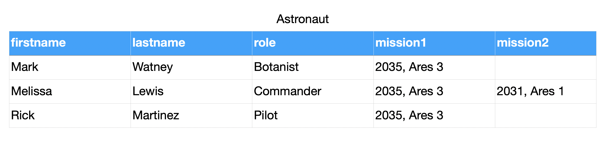
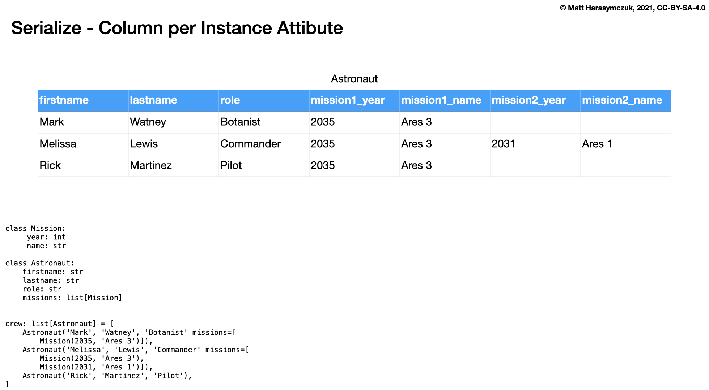

Relations
=========

Relations
---------
.. code-block:: python

    class Astronaut:
        def __init__(self, firstname, lastname, missions=()):
            self.firstname = firstname
            self.lastname = lastname
            self.missions = list(missions)

    class Mission:
        def __init__(self, year, name):
            self.year = year
            self.name = name

    DATA = [
        Astronaut('Jan', 'Twardowski', missions=[
            Mission('1967', 'Apollo 1'),
            Mission('1970', 'Apollo 13'),
            Mission('1973', 'Apollo 18')]),

        Astronaut('Ivan', 'Ivanovic', missions=[
            Mission('2023', 'Artemis 2'),
            Mission('2024', 'Artemis 3')]),

        Astronaut('Mark', 'Watney', missions=[
            Mission('2035', 'Ares 3')]),

        Astronaut('Melissa', 'Lewis'),
    ]

Serialization
-------------
* ``pickle`` - has relations
* ``json`` - has relations
* ``csv`` - non-relational format

.. figure:: img/oop-relations-flat-attrs.png
.. figure:: img/oop-relations-flat-norel.png

.. figure:: img/oop-relations-ffill-duplicate.png

.. figure:: img/oop-relations-rel-has.png
.. figure:: img/oop-relations-rel-m2m.png
.. figure:: img/oop-relations-rel-m2o.png

Assignments
-----------
.. literalinclude:: assignments/oop_relations_a.py
    :caption: :download:`Solution <assignments/oop_relations_a.py>`
    :end-before: # Solution

.. literalinclude:: assignments/oop_relations_b.py
    :caption: :download:`Solution <assignments/oop_relations_b.py>`
    :end-before: # Solution

.. literalinclude:: assignments/oop_relations_c.py
    :caption: :download:`Solution <assignments/oop_relations_c.py>`
    :end-before: # Solution

.. literalinclude:: assignments/oop_relations_d.py
    :caption: :download:`Solution <assignments/oop_relations_d.py>`
    :end-before: # Solution

.. literalinclude:: assignments/oop_relations_e.py
    :caption: :download:`Solution <assignments/oop_relations_e.py>`
    :end-before: # Solution
