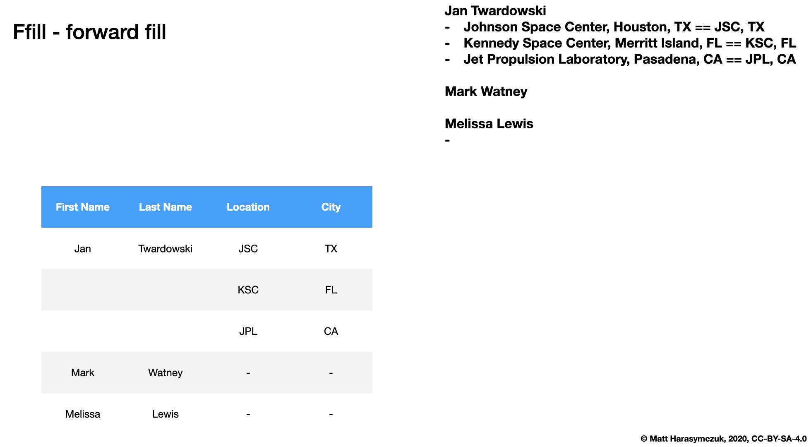
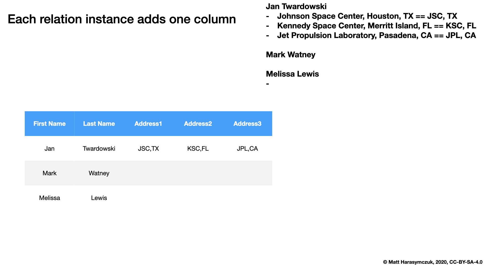

.. _OOP Relations:

*********
Relations
*********

Relations
=========
.. code-block:: python

    class Astronaut:
        def __init__(self, firstname, lastname, missions=()):
            self.firstname = firstname
            self.lastname = lastname
            self.missions = list(missions)

    class Mission:
        def __init__(self, year, name):
            self.year = year
            self.name = name

    DATA = [
        Astronaut('Jan', 'Twardowski', missions=[
            Mission('1967', 'Apollo 1'),
            Mission('1970', 'Apollo 13'),
            Mission('1973', 'Apollo 18')]),

        Astronaut('Ivan', 'Ivanovic', missions=[
            Mission('2023', 'Artemis 2'),
            Mission('2024', 'Artemis 3')]),

        Astronaut('Mark', 'Watney', missions=[
            Mission('2035', 'Ares 3')]),

        Astronaut('Melissa', 'Lewis'),
    ]

Serialization
=============
* ``pickle`` - has relations
* ``json`` - has relations
* ``csv`` - non-relational format

.. figure:: img/oop-relations-serialize-dbdump.png
    :scale: 30%
    :align: center

    Relational files or database dump

    Ffill - Forward fill

.. figure:: img/oop-relations-serialize-ffill2.png
    :scale: 30%
    :align: center

    Fill in specified columns

.. figure:: img/oop-relations-serialize-uniqid.png
    :scale: 30%
    :align: center

    Data duplication with unique ID

.. figure:: img/oop-relations-serialize-colattr.png
    :scale: 30%
    :align: center

    Each relations attribute adds one column

    Each relations instance adds one column

.. figure:: img/oop-relations-serialize-colcls.png
    :scale: 30%
    :align: center

    Each relations class adds one column

.. figure:: img/oop-relations-serialize-split.png
    :scale: 30%
    :align: center

    Relations attributes split into columns

.. figure:: img/oop-relations-serialize-hybrid.png
    :scale: 30%
    :align: center

    Hybrid compact and separate columns

Assignments
===========

.. literalinclude:: solution/oop_relations_model.py
    :caption: :download:`Solution <solution/oop_relations_model.py>`
    :end-before: # Solution

.. literalinclude:: solution/oop_relations_movable.py
    :caption: :download:`Solution <solution/oop_relations_movable.py>`
    :end-before: # Solution

.. literalinclude:: solution/oop_relations_flatten.py
    :caption: :download:`Solution <solution/oop_relations_flatten.py>`
    :end-before: # Solution

.. literalinclude:: solution/oop_relations_nested.py
    :caption: :download:`Solution <solution/oop_relations_nested.py>`
    :end-before: # Solution
