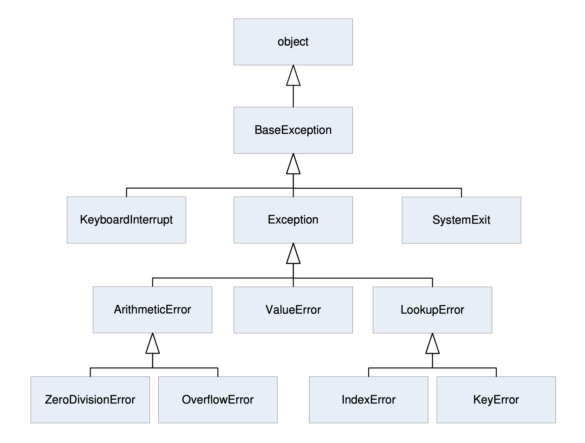

Exception Hierarchy
===================

    A small portion of the class hierarchy of Python's standard exceptions.
    This diagram omits 1 other standard class derived directly from
    ``BaseException`` and 56 other classes derived directly or indirectly
    from ``Exception``. Source [#Halterman2018]_

.. code-block:: text

    BaseException
     +-- SystemExit
     +-- KeyboardInterrupt
     +-- GeneratorExit
     +-- Exception
          +-- StopIteration
          +-- StopAsyncIteration
          +-- ArithmeticError
          |    +-- FloatingPointError
          |    +-- OverflowError
          |    +-- ZeroDivisionError
          +-- AssertionError
          +-- AttributeError
          +-- BufferError
          +-- EOFError
          +-- ImportError
          +-- LookupError
          |    +-- IndexError
          |    +-- KeyError
          +-- MemoryError
          +-- NameError
          |    +-- UnboundLocalError
          +-- OSError
          |    +-- BlockingIOError
          |    +-- ChildProcessError
          |    +-- ConnectionError
          |    |    +-- BrokenPipeError
          |    |    +-- ConnectionAbortedError
          |    |    +-- ConnectionRefusedError
          |    |    +-- ConnectionResetError
          |    +-- FileExistsError
          |    +-- FileNotFoundError
          |    +-- InterruptedError
          |    +-- IsADirectoryError
          |    +-- NotADirectoryError
          |    +-- PermissionError
          |    +-- ProcessLookupError
          |    +-- TimeoutError
          +-- ReferenceError
          +-- RuntimeError
          |    +-- NotImplementedError
          |    +-- RecursionError
          +-- SyntaxError
          |    +-- IndentationError
          |         +-- TabError
          +-- SystemError
          +-- TypeError
          +-- ValueError
          |    +-- UnicodeError
          |         +-- UnicodeDecodeError
          |         +-- UnicodeEncodeError
          |         +-- UnicodeTranslateError
          +-- Warning
               +-- DeprecationWarning
               +-- PendingDeprecationWarning
               +-- RuntimeWarning
               +-- SyntaxWarning
               +-- UserWarning
               +-- FutureWarning
               +-- ImportWarning
               +-- UnicodeWarning
               +-- BytesWarning
               +-- ResourceWarning

References
----------
.. [#Halterman2018] Halterman, R.L. Fundamentals of Python Programming. Publisher: Southern Adventist University. Year: 2018.
