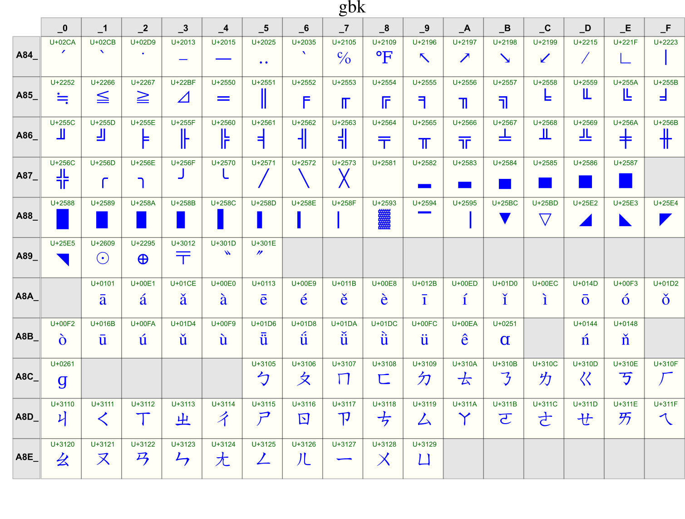

.. _Files Encoding:

*************
File Encoding
*************

Rationale
=========
.. highlights::
    * ``utf-8`` - a.k.a. Unicode - international standard (should be always used!)
    * ``iso-8859-1`` - ISO standard for Western Europe and USA
    * ``iso-8859-2`` - ISO standard for Central Europe (including Poland)
    * ``cp1250`` or ``windows-1250`` - Polish encoding on Windows
    * ``cp1251`` or ``windows-1251`` - Russian encoding on Windows
    * ``cp1252`` or ``windows-1252`` - Western European encoding on Windows
    * ``ASCII`` - ASCII characters only

.. figure:: img/files-windows2000-notepad-saveas.png
    :width: 33%
    :align: center

    Windows 2000 Notepad "Save As" window with possibility to select encoding. UTF-8 is not selected by default... Source: [windows2000]_

.. figure:: img/files-windows10-notepad-saveas.png
    :width: 50%
    :align: center

    Windows 10 Notepad "Save As" window with possibility to select encoding. Still in 2020 the UTF-8 is not selected by default... Source: [windows10]_

.. figure:: img/files-encoding-ascii2.jpg
    :width: 50%
    :align: center

    ASCII table. Source: [ascii2]_

    Unicode. Source: [unicode2]_

.. figure:: img/files-encoding-unicode3.png
    :width: 50%
    :align: center

    Unicode. Source: [unicode3]_

UTF-8
=====
.. code-block:: python

    FILE = r'/tmp/myfile.txt'

    with open(FILE, mode='w', encoding='utf-8') as file:
        file.write('Иван Иванович')

    with open(FILE, encoding='utf-8') as file:
        print(file.read())
    # Иван Иванович

.. figure:: img/files-encoding-utf.png
    :width: 50%
    :align: center

    UTF-8. Source: [unicode3]_

.. figure:: img/files-encoding-utf2.jpg
    :width: 50%
    :align: center

    UTF-8. Source: [unicode3]_

Unicode Encode Error
====================
.. code-block:: python

    FILE = r'/tmp/myfile.txt'

    with open(FILE, mode='w', encoding='cp1250') as file:
        file.write('Иван Иванович')
    # Traceback (most recent call last):
    #   ...
    # UnicodeEncodeError: 'charmap' codec can't encode characters in
    # position 0-3: character maps to <undefined>

Unicode Decode Error
====================
.. code-block:: python

    FILE = r'/tmp/myfile.txt'

    with open(FILE, mode='w', encoding='utf-8') as file:
        file.write('Иван Иванович')

    with open(FILE, encoding='cp1250') as file:
        print(file.read())
    # Traceback (most recent call last):
    #   ...
    # UnicodeDecodeError: 'charmap' codec can't decode byte 0x98 in position 1: character maps to <undefined>

Escape Characters
=================
.. highlights::
    * ``\r\n`` - is used on windows
    * ``\n`` - is used everywhere else

.. figure:: img/type-machine.jpg
    :width: 50%
    :align: center

    Why we have '\\r\\n' on Windows?

.. csv-table:: Frequently used escape characters
    :header: "Sequence", "Description"
    :widths: 15, 85

    "``\n``", "New line  (LF - Linefeed)"
    "``\r``", "Carriage Return (CR)"
    "``\t``", "Horizontal Tab (TAB)"
    "``\'``", "Single quote ``'``"
    "``\""``", "Double quote ``""``"
    "``\\``", "Backslash ``\``"

.. csv-table:: Less frequently used escape characters
    :header: "Sequence", "Description"
    :widths: 15, 85

    "``\a``", "Bell (BEL)"
    "``\b``", "Backspace (BS)"
    "``\f``", "New page (FF - Form Feed)"
    "``\v``", "Vertical Tab (VT)"
    "``\uF680``", "Character with 16-bit (2 bytes) hex value ``F680``"
    "``\U0001F680``", "Character with 32-bit (4 bytes) hex value ``0001F680``"
    "``\o755``", "ASCII character with octal value ``755``"
    "``\x1F680``", "ASCII character with hex value ``1F680``"

.. code-block:: python

    print('\U0001F680')     # 🚀

References
==========

.. [windows2000] redhotwords.com. Windows 2000 Notepad. http://redhotwords.com/assets/Uninotepadunicode.png

.. [windows10] digitalcitizen.life. Windows 10 Notepad. https://www.digitalcitizen.life/sites/default/files/gdrive/windows_notepad/notepad_10.png

.. [ascii2] Briana Spinall. Better Ascii Table. 2015. http://brianaspinall.com/wp-content/uploads/2015/11/better_ascii_table.jpg

.. [unicode2] http://www.gammon.com.au/unicode/gbk.svg.png

.. [unicode3] http://cdn.ilovefreesoftware.com/wp-content/uploads/2016/10/unicode-Character-list-1.png

.. [utf] https://camo.githubusercontent.com/7806142e30089cac76da9fe9fb1c5bbd0521cde6/68747470733a2f2f692e696d6775722e636f6d2f7a414d74436a622e706e67

.. [utf2] https://i.pinimg.com/736x/12/e2/37/12e237271c063313762fcafa1cf58e39--web-development-tools.jpg
