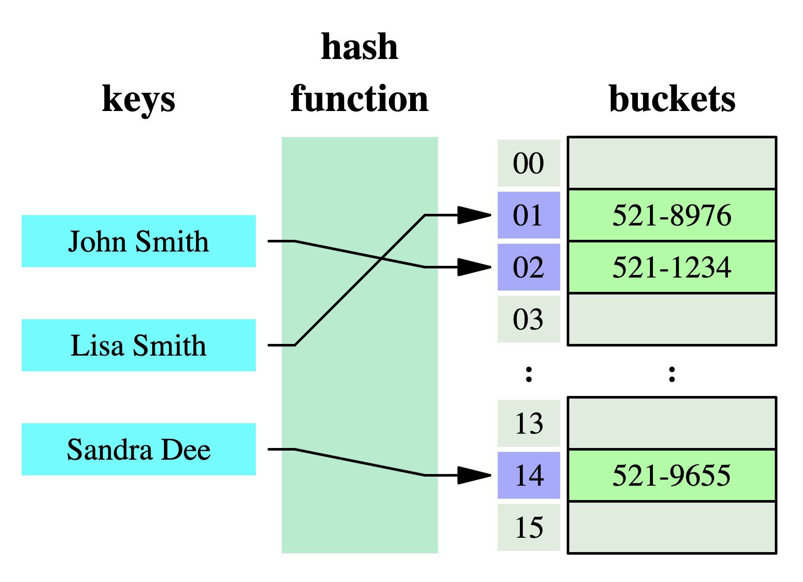

Mapping About
=============

How are dictionaries implemented in CPython? [#PyDocDictImpl]_

CPython's dictionaries are implemented as resizable hash tables. Compared
to B-trees, this gives better performance for lookup (the most common
operation by far) under most circumstances, and the implementation is
simpler.

Dictionaries work by computing a hash code for each key stored in the
dictionary using the ``hash()`` built-in function. The hash code varies
widely depending on the key and a per-process seed; for example, "Python"
could hash to -539294296 while "python", a string that differs by a single
bit, could hash to 1142331976. The hash code is then used to calculate
a location in an internal array where the value will be stored. Assuming
that you're storing keys that all have different hash values, this means
that dictionaries take constant time – O(1), in Big-O notation – to retrieve
a key.

Scalar
------
* Scalar

>>> 'Mark'  # doctest: +SKIP
>>> 'Watney'  # doctest: +SKIP
>>> 40  # doctest: +SKIP
>>> 185.5  # doctest: +SKIP
>>> 75.5  # doctest: +SKIP

Value
-----
* Identifier + scalar = value

>>> firstname = 'Mark'
>>> lastname = 'Watney'
>>> age = 40
>>> height = 185.5
>>> weight = 75.5

Data
----
* Value + relation = data

>>> astronaut = ('Mark', 'Watney', 40, 185.5, 75.5)

Information
-----------
* Data + context = information

>>> astronaut = {
...     'firstname': 'Mark',
...     'lastname': 'Watney',
...     'age': 40,
...     'height': 185.5,
...     'weight': 75.5,
... }

References
----------
.. [#PyDocDictImpl] van Rossum, G. et al. How are dictionaries implemented in CPython? Year: 2022. Retrieved: 2022-09-25. URL: https://docs.python.org/3/faq/design.html#why-must-dictionary-keys-be-immutable
