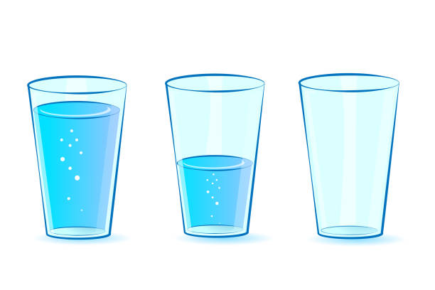

OOP Attribute About
===================
* Attributes are also known as "Properties" or "Fields"
* Attributes store information for instances
* Access field values using dot (``.``) notation

.. glossary::

    attribute
        Variable inside the class.
        In Python, methods also can be described as attributes,
        but justification for that is a bit more complex which will
        be introduced later in a book.

    field
        Variable inside the class.
        Can be used as a synonym of :term:`property` or :term:`state`.

    property
        Variable inside the class.
        Should not change during lifetime of an object.

    state
        Variable inside the class.
        Changes during lifetime of an object.
        Represents current state of an object.

    namespace
        Container for storing related data

About
-----
Class example with distinction of properties and state attributes.

An example "Glass with Water" can illustrate the distinction of properties
and state attributes:

Properties:

*  color
*  width
*  height
*  radius
*  capacity
*  net mass (without water)

State:

* volume  (how much water is currently in the glass)
* gross mass = net mass + water mass (water mass depends on its volume used))

    Source: [#glassimg]_

What are attributes?
--------------------
* Scalars creates values
* Identifiers and values creates variables
* Values with relations creates structures
* Structures with identifiers creates data
* Data with context and relations creates information

Scalars creates values:

>>> 'Mark'  # doctest: +SKIP
>>> 'Watney'  # doctest: +SKIP
>>> 40  # doctest: +SKIP

Identifiers and values creates variables:

>>> firstname = 'Mark'
>>> lastname = 'Watney'
>>> age = 40

Related values creates structures:

>>> astronaut = ['Mark', 'Watney', 40]

Structures with identifiers creates data:

>>> astronaut = {
...     'firstname': 'Mark',
...     'lastname': 'Watney',
...     'age': 40,
... }

Data with context creates classes:

>>> class Point:
...     firstname: str = 'Mark'
...     lastname: str = 'Watney'
...     age: int = 40

Classes with relations creates information:

>>> class Point:
...     firstname: str = 'Mark'
...     lastname: str = 'Watney'
...     age: int = 40

Namespace
---------
* Class creates space, in which names has meaning

Unrelated variables:

>>> firstname: str
>>> lastname: str
>>> age: int

Class creates space, in which names has meaning:

>>> class Point:
...     firstname: str
...     lastname: str
...     age: int

References
----------
.. [#glassimg] https://media.istockphoto.com/vectors/glasses-set-for-water-glasses-full-empty-halffilled-with-water-vector-vector-id905957960?k=6&m=905957960&s=612x612&w=0&h=DE0uCDCehEA_eDHzHW38jvhl3pYjNuoqXZ_6ZzHbz0M=

.. todo:: Assignments
