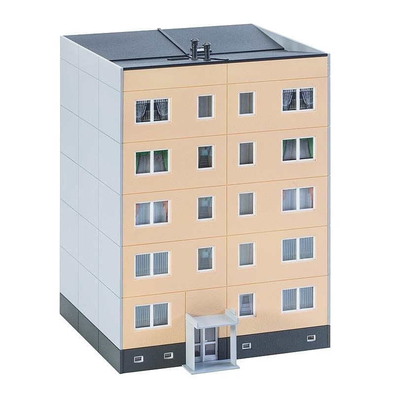

.. _OOP Classes and Instances:

*********************
Classes and Instances
*********************

Rationale
=========
.. highlights::
    * Object Oriented Paradigm
    * Model world as objects that interacts with each other

.. glossary::

    class
        Templates for objects.

    instance
    object
        Object created from class.

.. code-block:: python

    class MyClass:
        pass

    my = MyClass()

Classes
=======
.. highlights::
    * Capitalized ``CamelCase`` name convention
    * Classes are templates for objects

.. code-block:: python
    :caption: Defining class. Classes should have capitalized name

    class Astronaut:
        pass

.. code-block:: python
    :caption: Multi-word class names should use ``CamelCase``

    class AstronautPilot:
        pass

Instances
=========
.. highlights::
    * Instances are also known as Objects
    * Two newlines between class and code
    * ``snake_case`` names

.. code-block:: python
    :caption: One class and one instance

    class Astronaut:
        pass

    watney = Astronaut()

.. code-block:: python
    :caption: One class and three instances

    class Astronaut:
        pass

    watney = Astronaut()
    twardowski = Astronaut()
    jimenez = Astronaut()

.. code-block:: python
    :caption: Two classes and two instances

    class Astronaut:
        pass

    class Cosmonaut:
        pass

    mark = Astronaut()
    ivan = Cosmonaut()

.. code-block:: python
    :caption: Two classes and four instances (two instances of an ``Astronaut`` class, and two of a ``Cosmonaut`` class)

    class AstronautPilot:
        pass

    class CosmonautPilot:
        pass

    mark_watney = AstronautPilot()
    melissa_lewis = AstronautPilot()
    ivan_ivanovich = CosmonautPilot()
    jan_twardowski = CosmonautPilot()

Class vs Instance
=================

    Class. Source: [class]_

    Instances. Source: [instances]_

Convention
==========
.. highlights::
    * Never print in a class
    * One class per file - when classes are long
    * All classes in one file - when classes are short
    * You can mix classes and functions in one file

.. code-block:: python
    :caption: Classes and Objects

    class AstronautEngineer:
        pass

    class AstronautScientist:
        pass

    class AstronautPilot:
        pass

    mark_watney = AstronautScientist()
    melissa_lewis = AstronautScientist()
    jose_jimenez = AstronautEngineer()
    jan_twardowski = AstronautPilot()

.. code-block:: python

    def hello():
        pass

    class Astronaut:
        pass

    mark = Astronaut()
    jose = Astronaut()

Assignments
===========

OOP Class Iris
--------------
* Assignment: OOP Class Iris
* Filename: oop_class_iris.py
* Complexity: easy
* Lines of code to write: 5 lines
* Estimated time of completion: 3 min

English:
    #. Define class ``Iris``
    #. Create instance ``setosa`` of a class ``Iris``
    #. Create instance ``virginica`` of a class ``Iris``
    #. Create instance ``versicolor`` of a class ``Iris``
    #. Compare result with "Tests" section (see below)

Polish:
    #. Zdefiniuj klasę ``Iris``
    #. Stwórz instancję ``setosa`` klasy ``Iris``
    #. Stwórz instancję ``virginica`` klasy ``Iris``
    #. Stwórz instancję ``versicolor`` klasy ``Iris``
    #. Porównaj wyniki z sekcją "Tests" (patrz poniżej)

Tests:
    >>> from inspect import isclass
    >>> assert isclass(Iris)
    >>> assert isinstance(setosa, Iris)
    >>> assert isinstance(versicolor, Iris)
    >>> assert isinstance(virginica, Iris)

OOP Class Instance
------------------
* Assignment: OOP Class Instance
* Filename: oop_class_instance.py
* Complexity: easy
* Lines of code to write: 9 lines
* Estimated time of completion: 5 min

English:
    #. Define class ``Astronaut``
    #. Define class ``SpaceAgency``
    #. Create instance ``watney`` of a class ``Astronaut``
    #. Create instance ``nasa`` of a class ``SpaceAgency``
    #. Compare result with "Tests" section (see below)

Polish:
    #. Zdefiniuj klasę ``Astronaut``
    #. Zdefiniuj klasę ``SpaceAgency``
    #. Stwórz instancję ``watney`` klasy ``Astronaut``
    #. Stwórz instancję ``nasa`` klasy ``SpaceAgency``
    #. Porównaj wyniki z sekcją "Tests" (patrz poniżej)

Tests:
    .. code-block:: python

        >>> from inspect import isclass
        >>> assert isclass(Astronaut)
        >>> assert isclass(SpaceAgency)
        >>> assert isinstance(watney, Astronaut)
        >>> assert isinstance(nasa, SpaceAgency)

References
==========
.. [class] http://makieta.pl/12344-thickbox_default/faller-130803-blok-z-wielkiej-plyty-skala-h0.jpg
.. [instances] https://upload.wikimedia.org/wikipedia/commons/thumb/8/85/Os_Rusa_Poznań_RB1.jpg/1200px-Os_Rusa_Poznań_RB1.jpg
