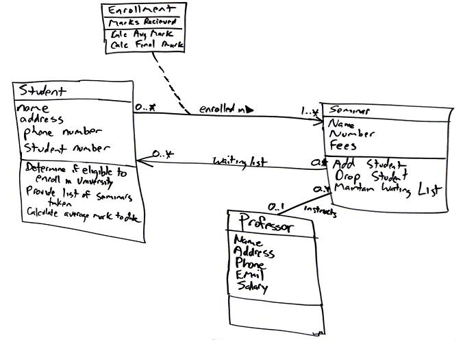
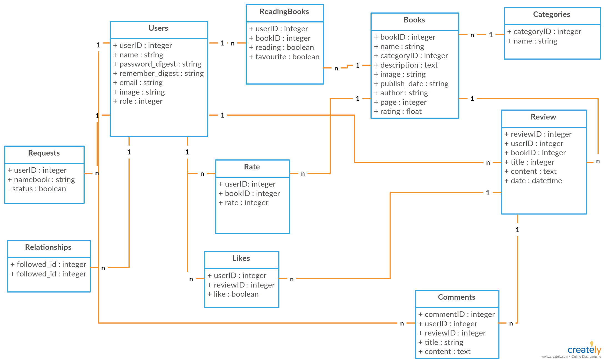
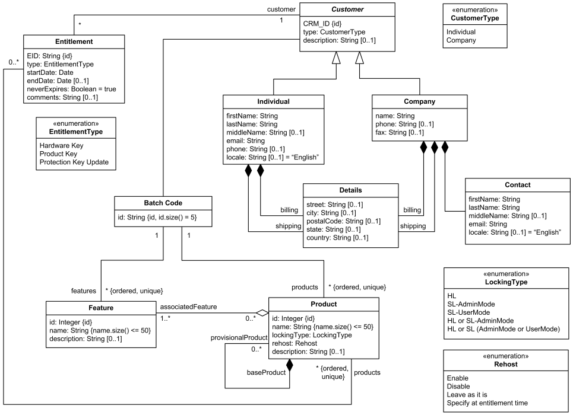
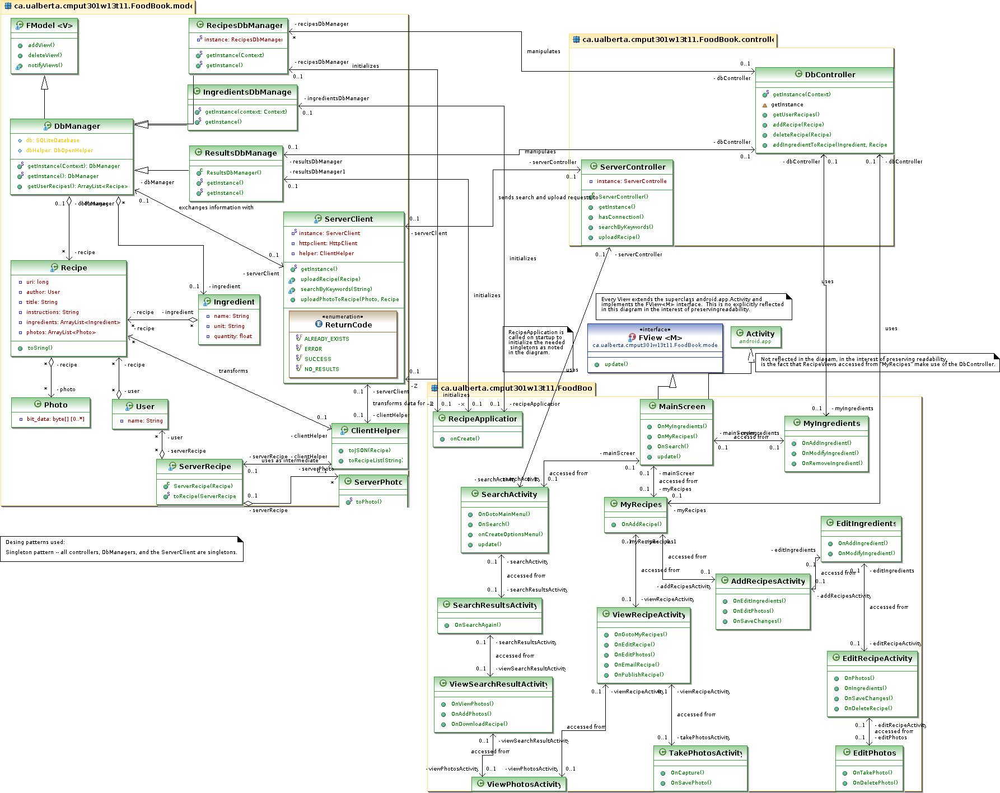
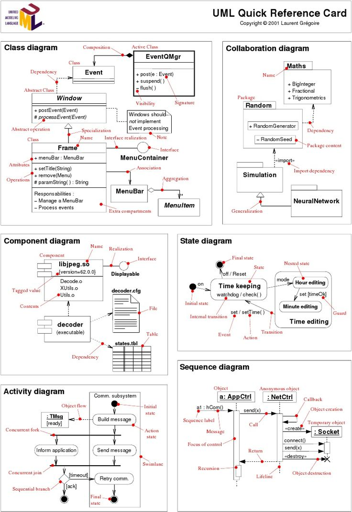

.. _OOP Classes and Instances:

*********************
Classes and Instances
*********************

Rationale
=========
.. highlights::
    * Object Oriented Paradigm
    * Model world as objects that interacts with each other

.. glossary::

    class
        Templates for objects.

    instance
    object
        Object created from class.

.. code-block:: text

    class <name>:
        pass

    <instance> = <name>()

.. code-block:: python

    class MyClass:
        pass

    my = MyClass()

Classes
=======
.. highlights::
    * Capitalized ``CamelCase`` name convention
    * Classes are templates for objects

.. code-block:: python
    :caption: Defining class. Classes should have capitalized name

    class Astronaut:
        pass

.. code-block:: python
    :caption: Multi-word class names should use ``CamelCase``

    class AstronautPilot:
        pass

Instances
=========
.. highlights::
    * Instances are also known as Objects
    * Two newlines between class and code
    * ``snake_case`` names

.. code-block:: python
    :caption: One class and one instance

    class Astronaut:
        pass

    watney = Astronaut()

.. code-block:: python
    :caption: One class and three instances

    class Astronaut:
        pass

    watney = Astronaut()
    twardowski = Astronaut()
    jimenez = Astronaut()

.. code-block:: python
    :caption: Two classes and two instances

    class Astronaut:
        pass

    class Cosmonaut:
        pass

    mark = Astronaut()
    ivan = Cosmonaut()

.. code-block:: python
    :caption: Two classes and four instances (two instances of an ``Astronaut`` class, and two of a ``Cosmonaut`` class)

    class AstronautPilot:
        pass

    class CosmonautPilot:
        pass

    mark_watney = AstronautPilot()
    melissa_lewis = AstronautPilot()
    ivan_ivanovich = CosmonautPilot()
    jan_twardowski = CosmonautPilot()

Class vs Instance
=================
.. figure:: img/blueprint.png
    :width: 50%
    :align: center

    Intuition definition: Class is a blueprint, instances are homes made from this plan. Image source: :cite:`FigureBlueprintHouse`

.. image:: img/uml-class-diagram-2.png
    :width: 20%
    :class: inline

.. image:: img/uml-class-diagram-3.png
    :width: 20%
    :class: inline

.. image:: img/uml-class-diagram-5.png
    :width: 20%
    :class: inline

.. image:: img/uml-class-diagram-6.png
    :width: 20%
    :class: inline

.. image:: img/uml-class-diagram-10.png
    :width: 20%
    :class: inline

Convention
==========
.. highlights::
    * Never print in a class
    * One class per file - when classes are long
    * All classes in one file - when classes are short
    * You can mix classes and functions in one file

.. code-block:: python
    :caption: Classes and Objects

    class AstronautEngineer:
        pass

    class AstronautScientist:
        pass

    class AstronautPilot:
        pass

    mark_watney = AstronautScientist()
    melissa_lewis = AstronautScientist()
    jose_jimenez = AstronautEngineer()
    jan_twardowski = AstronautPilot()

.. code-block:: python

    def hello():
        pass

    class Astronaut:
        pass

    mark = Astronaut()
    jose = Astronaut()

Assignments
===========

Example
-------
* Complexity level: easy
* Lines of code to write: 5 lines
* Estimated time of completion: 5 min
* Solution: :download:`solution/oop_class_example.py`

:English:
    #. Define class ``Iris``
    #. Create instance ``setosa`` of a class ``Iris``
    #. Create instance ``virginica`` of a class ``Iris``
    #. Create instance ``versicolor`` of a class ``Iris``

:Polish:
    #. Zdefiniuj klasę ``Iris``
    #. Stwórz instancję ``setosa`` klasy ``Iris``
    #. Stwórz instancję ``virginica`` klasy ``Iris``
    #. Stwórz instancję ``versicolor`` klasy ``Iris``

:Solution:
    .. literalinclude:: solution/oop_class_example.py
        :language: python

:The whys and wherefores:
    * :ref:`OOP Classes and Instances`

OOP Class Instantiation
-----------------------
* Complexity level: easy
* Lines of code to write: 9 lines
* Estimated time of completion: 3 min
* Solution: :download:`solution/oop_class_instance.py`

:English:
    #. Define class ``Astronaut``
    #. Define class ``SpaceAgency``
    #. Create instance ``twardowski`` of a class ``Astronaut``
    #. Create instance ``watney`` of a class ``Astronaut``
    #. Create instance ``nasa`` of a class ``SpaceAgency``
    #. Create instance ``esa`` of a class ``SpaceAgency``
    #. Create instance ``polsa`` of a class ``SpaceAgency``

:Polish:
    #. Zdefiniuj klasę ``Astronaut``
    #. Zdefiniuj klasę ``SpaceAgency``
    #. Stwórz instancję ``twardowski`` klasy ``Astronaut``
    #. Stwórz instancję ``watney`` klasy ``Astronaut``
    #. Stwórz instancję ``nasa`` klasy ``SpaceAgency``
    #. Stwórz instancję ``esa`` klasy ``SpaceAgency``
    #. Stwórz instancję ``polsa`` klasy ``SpaceAgency``

:The whys and wherefores:
    * :ref:`OOP Classes and Instances`
