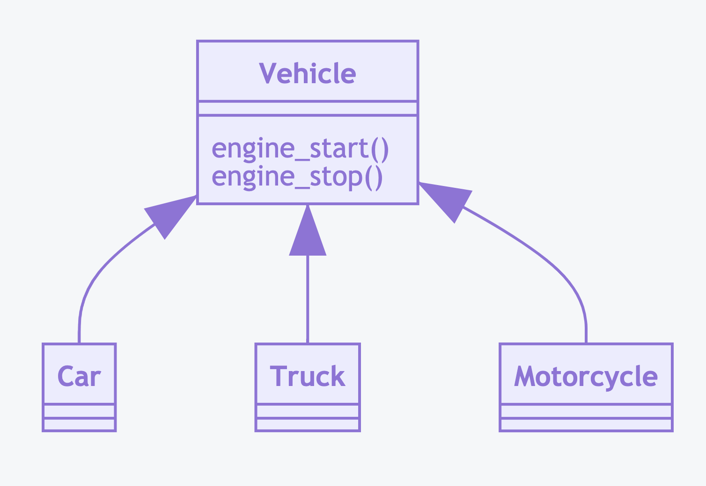

OOP Inheritance Problems
========================

No Inheritance
--------------
>>> class Car:
...     def engine_start(self): ...
...     def engine_stop(self): ...
>>>
>>> class Truck:
...     def engine_start(self): ...
...     def engine_stop(self): ...

Simple Inheritance
------------------
>>> class Vehicle:
...     def engine_start(self): ...
...     def engine_stop(self): ...
>>>
>>>
>>> class Car(Vehicle):
...     pass
>>>
>>> class Truck(Vehicle):
...     pass

Inheritance Problem
-------------------
>>> class Vehicle:
...     def engine_start(self): ...
...     def engine_stop(self): ...
>>>
>>>
>>> class Car(Vehicle):
...     pass
>>>
>>> class Truck(Vehicle):
...     pass
>>>
>>> class Motorcycle(Vehicle):
...     pass

Inheritance Problem:

>>> class Vehicle:
...     def engine_start(self): ...
...     def engine_stop(self): ...
>>>
>>>
>>> class Car(Vehicle):
...     def window_open(self): ...
...     def window_close(self): ...
>>>
>>>
>>> class Truck(Vehicle):
...     def window_open(self): ...
...     def window_close(self): ...
>>>
>>>
>>> class Motorcycle(Vehicle):
...     pass

Not Implemented Error
---------------------
>>> class Vehicle:
...     def engine_start(self): ...
...     def engine_stop(self): ...
...     def window_open(self): ...
...     def window_close(self): ...
>>>
>>>
>>> class Car(Vehicle):
...     pass
>>>
>>> class Truck(Vehicle):
...     pass
>>>
>>> class Motorcycle(Vehicle):
...     def windows_open(self): raise NotImplementedError
...     def windows_close(self): raise NotImplementedError

Multilevel Inheritance
----------------------
>>> class Vehicle:
...     def engine_start(self): ...
...     def engine_stop(self): ...
>>>
>>> class VehicleWithWindows(Vehicle):
...     def window_open(self): ...
...     def window_close(self): ...
>>>
>>>
>>> class Car(VehicleWithWindows):
...     pass
>>>
>>> class Truck(VehicleWithWindows):
...     pass
>>>
>>> class Motorcycle(Vehicle):
...     pass

.. figure:: img/uml-relations-inheritance-multilevel.png

Mixin Classes
-------------
>>> class Vehicle:
...     pass
>>>
>>> class HasEngine:
...     def engine_start(self): ...
...     def engine_stop(self): ...
>>>
>>> class HasWindows:
...     def window_open(self): ...
...     def window_close(self): ...
>>>
>>>
>>> class Car(Vehicle, HasEngine, HasWindows):
...     pass
>>>
>>> class Truck(Vehicle, HasEngine, HasWindows):
...     pass
>>>
>>> class Motorcycle(Vehicle, HasEngine):
...     pass

.. figure:: img/uml-relations-mixin.png
