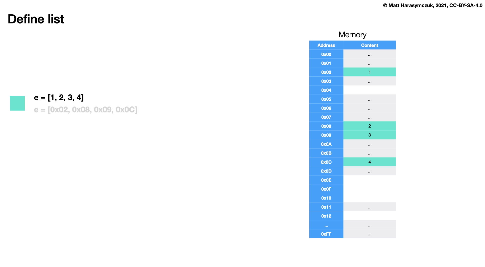

Sequence List
=============

Rationale
---------
* Mutable - can add, remove, and modify items

Definition
----------
Defining empty list with ``[]`` is used more often, but ``list()`` is more
explicit:

>>> data = list()
>>> data = []

Comma after last element is optional:

>>> data = [1]
>>> data = [1,]

Can store elements of any types:

>>> data = [1, 2, 3]
>>> data = [1.1, 2.2, 3.3]
>>> data = [True, False]
>>> data = ['a', 'b', 'c']
>>> data = ['a', 1, 2.2, True, None]

Brackets are required

>>> data = [1, 2, 3]

Type Casting
------------
Builtin function ``list()`` converts argument to ``list``

>>> data = 'abcd'
>>> list(data)
['a', 'b', 'c', 'd']

>>> data = ['a', 'b', 'c', 'd']
>>> list(data)
['a', 'b', 'c', 'd']

>>> data = ('a', 'b', 'c', 'd')
>>> list(data)
['a', 'b', 'c', 'd']

>>> list(1, 2, 3, 4)
Traceback (most recent call last):
TypeError: list expected at most 1 argument, got 4

GetItem
-------
* More information in `Sequence GetItem`
* More information in `Sequence Slice`

>>> data = ['a', 'b', 'c', 'd']
>>>
>>> data[0]
'a'
>>> data[1]
'b'
>>> data[2]
'c'
>>> data[3]
'd'

Set Item
--------
>>> data = ['a', 'b', 'c', 'd']
>>> data[0] = 'x'
>>>
>>> print(data)
['x', 'b', 'c', 'd']

>>> data = ['a', 'b', 'c', 'd']
>>> data[4] = 'x'
Traceback (most recent call last):
IndexError: list assignment index out of range

Del Item
--------
>>> data = ['a', 'b', 'c', 'd']
>>> del data[3]
>>>
>>> print(data)
['a', 'b', 'c']

>>> data = ['a', 'b', 'c', 'd']
>>> value = data.pop()
>>>
>>> data
['a', 'b', 'c']
>>> value
'd'

Append
------
* ``list + list``
* ``list += list``
* ``list.extend()``
* ``list.append()``

>>> [1, 2, 3] + [4, 5, 6]
[1, 2, 3, 4, 5, 6]

>>> [1, 2, 3] + 4
Traceback (most recent call last):
TypeError: can only concatenate list (not "int") to list

>>> [1, 2, 3] + [4]
[1, 2, 3, 4]

>>> data = [1, 2, 3]
>>> data = data + [4, 5, 6]
>>>
>>> print(data)
[1, 2, 3, 4, 5, 6]

>>> data = [1, 2, 3]
>>> data += [4, 5, 6]
>>>
>>> print(data)
[1, 2, 3, 4, 5, 6]

>>> data = [1, 2, 3]
>>> data.extend([4, 5, 6])
>>>
>>> print(data)
[1, 2, 3, 4, 5, 6]

>>> data = [1, 2, 3]
>>> data.append(4)
>>>
>>> print(data)
[1, 2, 3, 4]

>>> data = [1, 2, 3]
>>> data.append([4, 5, 6])
>>>
>>> print(data)
[1, 2, 3, [4, 5, 6]]

Insert
------
* Insert at specific position

>>> data = ['a', 'b', 'c', 'd']
>>> data.insert(0, 'x')
>>>
>>> print(data)
['x', 'a', 'b', 'c', 'd']

>>> data = ['a', 'b', 'c', 'd']
>>> data.insert(1, 'x')
>>>
>>> print(data)
['a', 'x', 'b', 'c', 'd']

Sort vs Sorted
--------------
Timsort is a hybrid stable sorting algorithm, derived from merge sort and
insertion sort, designed to perform well on many kinds of real-world data. It
was implemented by Tim Peters in 2002 for use in the Python programming
language. The algorithm finds subsequences of the data that are already
ordered (runs) and uses them to sort the remainder more efficiently. This is
done by merging runs until certain criteria are fulfilled. Timsort has been
Python's standard sorting algorithm since version 2.3. It is also used to
sort arrays of non-primitive type in Java SE 7, on the Android platform, in
GNU Octave, on V8, Swift, and Rust. [#timsort]_

* Worst-case performance: :math:`O(n\log{n})`
* Best-case performance: :math:`O(n)`
* Average performance: :math:`O(n\log{n})`
* Worst-case space complexity: :math:`O(n)`

* ``sorted()`` - Returns sorted list, do not modify the original
* ``list.sort()`` - Changes object permanently, returns ``None``

>>> data = [3, 1, 2]
>>> sorted(data)
[1, 2, 3]

>>> data = [3, 1, 2]
>>> data.sort()
>>> data
[1, 2, 3]

>>> data = ['a', 'c', 'b']
>>> sorted(data)
['a', 'b', 'c']

Method Chaining
---------------
>>> data = [3, 1, 2]
>>> data.sort()
>>> data.append(4)
>>>
>>> print(data)
[1, 2, 3, 4]

>>> data = [3, 1, 2]
>>>
>>> data.sort().append(4)
Traceback (most recent call last):
AttributeError: 'NoneType' object has no attribute 'append'

Built-in Functions
------------------
* ``min()`` - Minimal value
* ``max()`` - Maximal value
* ``sum()`` - Sum of elements
* ``len()`` - Length of a list

>>> data = [2, 0, 1]
>>>
>>> min(data)
0
>>> max(data)
2
>>> sum(data)
3
>>> len(data)
3

>>> data = ['a', 'c', 'b']
>>>
>>> min(data)
'a'
>>> max(data)
'c'
>>> sum(data)
Traceback (most recent call last):
TypeError: unsupported operand type(s) for +: 'int' and 'str'

Any, All
--------
* ``all()`` - All values are ``True``
* ``any()`` - Any values is ``True``

>>> data = [True, False, True]
>>>
>>> any(data)
True
>>> all(data)
False

Memory
------

    Memory representation for ``list``

References
----------
.. [#timsort] https://en.wikipedia.org/wiki/Timsort

Assignments
-----------
.. literalinclude:: assignments/sequence_list_a.py
    :caption: :download:`Solution <assignments/sequence_list_a.py>`
    :end-before: # Solution

.. literalinclude:: assignments/sequence_list_b.py
    :caption: :download:`Solution <assignments/sequence_list_b.py>`
    :end-before: # Solution

.. literalinclude:: assignments/sequence_list_c.py
    :caption: :download:`Solution <assignments/sequence_list_c.py>`
    :end-before: # Solution
