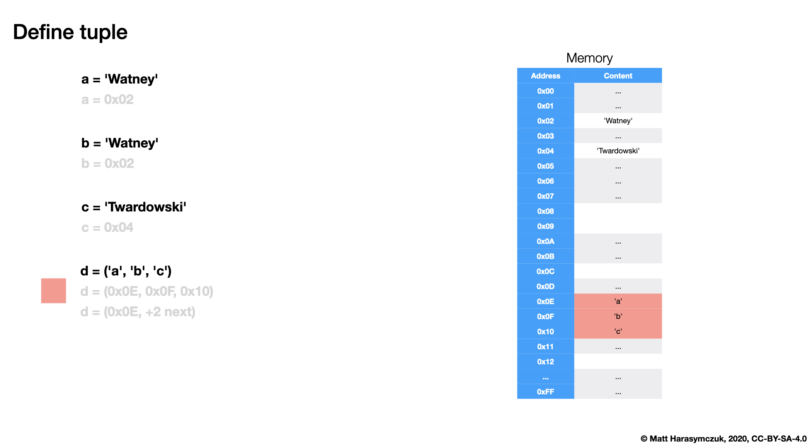
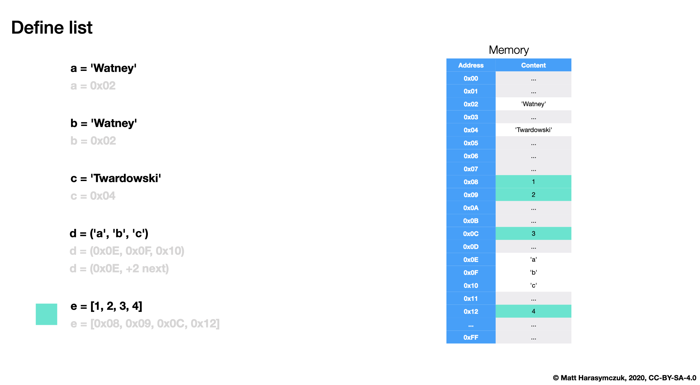
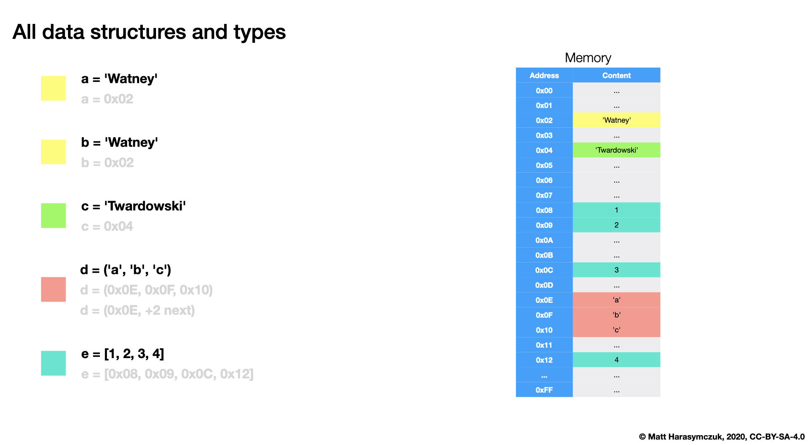

.. _Sequence Tuple:

**************
Sequence Tuple
**************

Rationale
=========
.. highlights::
    * Can store elements of any types
    * Immutable - cannot add, modify or remove items

Type Definition
===============
.. highlights::
    * ``()`` is used more often
    * ``tuple()`` is more readable
    * Single element ``tuple`` require comma at the end (**important!**)
    * Brackets are optional
    * Comma after last element of one element tuple is optional

.. code-block:: python

    data = ()
    data = tuple()

.. code-block:: python
    :caption: Single element ``tuple`` require comma at the end (**important!**)

    data = (1,)
    data = 1,

.. code-block:: python
    :caption: Brackets are optional and comma after last element of one element tuple is optional

    data = (1, 2, 3)
    data = (1.1, 2.2, 3.3)
    data = (True, False)
    data = ('a', 'b', 'c')
    data = ('a', 1, 2.2, True, None)

    data = 1, 2, 3
    data = 1.1, 2.2, 3.3
    data = True, False
    data = 'a', 'b', 'c'
    data = 'a', 1, 2.2, True, None

Type Casting
============
.. highlights::
    * ``tuple()`` converts argument to ``tuple``

.. code-block:: python

    data = 'abcd'
    tuple(data)
    # ('a', 'b', 'c', 'd')

.. code-block:: python

    data = ['a', 'b', 'c', 'd']
    tuple(data)
    # ('a', 'b', 'c', 'd')

.. code-block:: python

    data = ('a', 'b', 'c', 'd')
    tuple(data)
    # ('a', 'b', 'c', 'd')

.. code-block:: python

    data = {1, 2, 3}
    tuple(data)
    # ('a', 'b', 'c', 'd')

.. code-block:: python

    data = frozenset({'a', 'b', 'c', 'd'})
    tuple(data)
    # ('a', 'b', 'c', 'd')

GetItem
=======
.. highlights::
    * More information in :ref:`Sequence GetItem` and :ref:`Sequence Slice`

.. code-block:: python

    data = ('a', 'b', 'c', 'd')

    data[0]         # 'a'
    data[1]         # 'b'
    data[2]         # 'c'
    data[3]         # 'd'

Tuple or Int, Float, Str
=========================
.. code-block:: python

    data = 1
    type(data)
    # <class 'int'>

    data = 1,
    type(data)
    # <class 'tuple'>

    data = 1.
    type(data)
    # <class 'float'>

.. code-block:: python

    type(1.2)        # <class 'float'>
    type(1,2)        # <class 'tuple'>

.. code-block:: python

    type(1.2,)       # <class 'tuple'>
    type(1,2.3)      # <class 'tuple'>

    type(1.)         # <class 'float'>
    type(1,)         # <class 'tuple'>
    type(1.,)        # <class 'tuple'>
    type(.2)         # <class 'float'>
    type(.2,)        # <class 'tuple'>
    type(1.2)        # <class 'float'>
    type(1)          # <class 'int'>

    type(1.,1.)      # <class 'tuple'>
    type(.2,.2)      # <class 'tuple'>
    type(1.,.2)      # <class 'tuple'>

    type('foo')      # <class 'str'>
    type('foo',)     # <class 'tuple'>
    type('foo'.)     # SyntaxError: invalid syntax

Tuple or List
=============
Both:

    * ordered
    * possible to getitem and slice
    * elements can be duplicated
    * elements of any types

Tuple:

    * immutable
    * one contingent block of data in memory

List:

    * mutable
    * implemented in memory as list of pointers to objects
    * objects are scattered in memory

.. code-block:: python

    from sys import getsizeof

    a = [1, 2, 3]
    b = (1, 2, 3)

    getsizeof(a)
    # 120

    getsizeof(b)
    # 64

    Define tuple

    Define list

    Define str, tuple and list

Assignments
===========

.. literalinclude:: solution/sequence_tuple_create.py
    :caption: :download:`Solution <solution/sequence_tuple_create.py>`
    :end-before: # Solution

.. literalinclude:: solution/sequence_tuple_select.py
    :caption: :download:`Solution <solution/sequence_tuple_select.py>`
    :end-before: # Solution

.. literalinclude:: solution/sequence_tuple_mean.py
    :caption: :download:`Solution <solution/sequence_tuple_mean.py>`
    :end-before: # Solution
