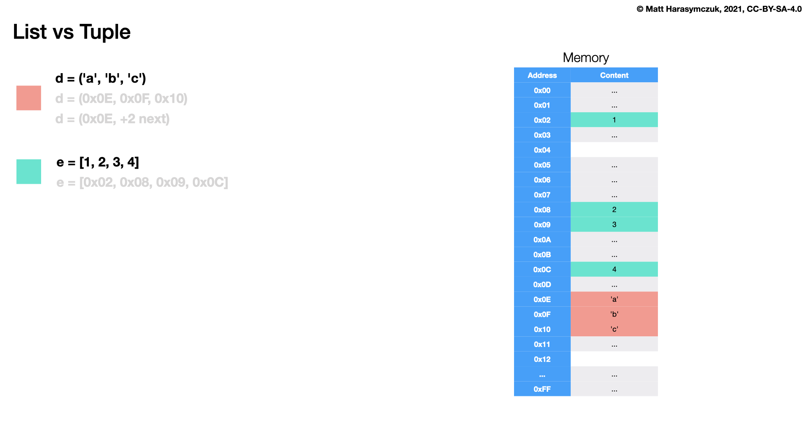

Sequence Comparison
===================
* ``tuple`` - fast and memory efficient
* ``list`` - extensible and flexible
* ``set`` - unique elements, fast lookup

Why are there separate tuple and list data types? [#PyDocTupleList]_

Lists and tuples, while similar in many respects, are generally used in
fundamentally different ways. Tuples can be thought of as being similar
to Pascal records or C structs; they're small collections of related data
which may be of different types which are operated on as a group. For
example, a Cartesian coordinate is appropriately represented as a tuple
of two or three numbers.

Lists, on the other hand, are more like arrays in other languages. They
tend to hold a varying number of objects all of which have the same type
and which are operated on one-by-one. For example, os.listdir('.') returns
a list of strings representing the files in the current directory. Functions
which operate on this output would generally not break if you added another
file or two to the directory.

Tuples are immutable, meaning that once a tuple has been created, you can't
replace any of its elements with a new value. Lists are mutable, meaning
that you can always change a list's elements. Only immutable elements can
be used as dictionary keys, and hence only tuples and not lists can be used
as keys.

Tuple
-----
* Immutable - cannot add, modify or remove items
* Stores elements of any type
* Keeps order of inserting elements
* Possible to getitem and slice
* Elements can duplicate
* One contingent block of data in memory

List
----
* Mutable - can add, remove, and modify items
* Stores elements of any type
* Keeps order of inserting elements
* Possible to getitem and slice
* Elements can duplicate
* Implemented in memory as list of references to objects
* Objects are scattered in memory

Set
---
* Mutable - can add, remove, and modify items
* Stores only **hashable** elements (int, float, bool, None, str, tuple)
* Does not keep order of inserting elements
* It is not possible to getitem and slice
* Elements cannot duplicate
* Set is unordered data structure and do not record element position or insertion

Memory Footprint
----------------
>>> from sys import getsizeof
>>>
>>>
>>> getsizeof( (1,2,3) )
64
>>>
>>> getsizeof( [1,2,3] )  # doctest: +SKIP
120
>>>
>>> getsizeof( {1,2,3} )
216

Memory
------

    Memory representation for ``list`` and ``tuple``

Performance
-----------
* ``O(n)`` - lookup (contains) in list and tuple
* ``O(1)`` - lookup (contains) in set
* [#pywikiTimeComplexity]_

>>> %%timeit -r 10_000 -n 10_000  # doctest: +SKIP
... 0 in (1, 2, 3)
...
48 ns ± 6.57 ns per loop (mean ± std. dev. of 10000 runs, 10,000 loops each)
>>>
>>> %%timeit -r 10_000 -n 10_000  # doctest: +SKIP
... 0 in [1, 2, 3]
...
49.1 ns ± 6.39 ns per loop (mean ± std. dev. of 10000 runs, 10,000 loops each)
>>>
>>> %%timeit -r 10_000 -n 10_000  # doctest: +SKIP
... 0 in {1, 2, 3}
...
27.2 ns ± 3.97 ns per loop (mean ± std. dev. of 10000 runs, 10,000 loops each)

>>> %%timeit -r 10_000 -n 10_000  # doctest: +SKIP
... 0 in (1, 2, 3, 4, 5, 6, 7, 8, 9)
...
99.2 ns ± 12.2 ns per loop (mean ± std. dev. of 10000 runs, 10,000 loops each)
>>>
>>> %%timeit -r 10_000 -n 10_000  # doctest: +SKIP
... 0 in [1, 2, 3, 4, 5, 6, 7, 8, 9]
...
98.5 ns ± 12.2 ns per loop (mean ± std. dev. of 10000 runs, 10,000 loops each)
>>>
>>> %%timeit -r 10_000 -n 10_000  # doctest: +SKIP
... 0 in {1, 2, 3, 4, 5, 6, 7, 8, 9}
...
27.8 ns ± 4.21 ns per loop (mean ± std. dev. of 10000 runs, 10,000 loops each)

References
----------
.. [#pywikiTimeComplexity] https://wiki.python.org/moin/TimeComplexity

.. [#PyDocTupleList] van Rossum, G. et al. Why are there separate tuple and list data types? Python documentation. Year: 2022. Retrieved: 2022-09-25. URL: https://docs.python.org/3/faq/design.html#why-are-there-separate-tuple-and-list-data-types

.. todo:: Assignments
