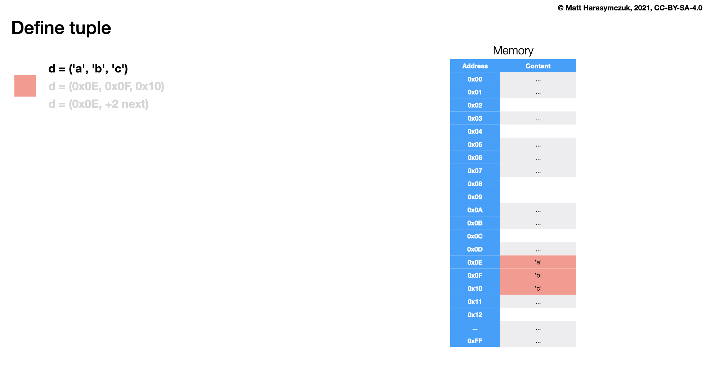

Sequence Tuple
==============
* Immutable - cannot add, modify or remove items
* Stores elements of any type

Syntax
------
* ``data = ()`` - empty tuple
* ``data = (1, 2.2, 'abc')`` - tuple with values
* ``data = ()`` is faster than ``data = tuple()``

Defining ``tuple()`` is more explicit, however empty tuple with ``()`` is used
more often and it's also faster:

>>> data = ()
>>> data = tuple()

Can store elements of any type:

>>> data = (1, 2, 3)
>>> data = (1.1, 2.2, 3.3)
>>> data = (True, False)
>>> data = ('a', 'b', 'c')
>>> data = ('a', 1, 2.2, True, None)

Performance:

>>> %%timeit -r 10_000 -n 1000  # doctest: +SKIP
... data = ()
...
14.9 ns ± 3.28 ns per loop (mean ± std. dev. of 10000 runs, 1,000 loops each)

>>> %%timeit -r 10_000 -n 1000  # doctest: +SKIP
... data = tuple()
...
28.1 ns ± 8.17 ns per loop (mean ± std. dev. of 10000 runs, 1,000 loops each)

Type Casting
------------
* ``tuple()`` - will convert its argument to ``tuple``
* Takes one iterable as an argument
* Multiple arguments are not allowed

Builtin function ``tuple()`` converts argument to ``tuple``

>>> text = 'hello'
>>> tuple(text)
('h', 'e', 'l', 'l', 'o')

>>> colors = ['red', 'green', 'blue']
>>> tuple(colors)
('red', 'green', 'blue')

>>> colors = ('red', 'green', 'blue')
>>> tuple(colors)
('red', 'green', 'blue')

>>> tuple('red', 'green', 'blue')
Traceback (most recent call last):
TypeError: tuple expected at most 1 argument, got 3

Optional Brackets
-----------------
* ``data = (1)`` - int
* ``data = (1.)`` - float
* ``data = (1,)`` - tuple

Brackets are optional, but it's a good practice to always write them:

>>> data = (1, 2, 3)
>>> data = 1, 2, 3

Single element ``tuple`` require comma at the end (**important!**):

>>> data = (1,)
>>> type(data)
<class 'tuple'>

>>> data = (1)
>>> type(data)
<class 'int'>

Comma after last element of multi value tuple is optional:

>>> data = (1, 2)
>>> type(data)
<class 'tuple'>

>>> data = (1, 2,)
>>> type(data)
<class 'tuple'>

Tuple or Int, Float, Str
------------------------
* ``data = 1.5`` - float
* ``data = 1,5`` - tuple
* ``data = (1)`` - int
* ``data = (1.)`` - float
* ``data = (1,)`` - tuple

>>> x = 1           # int
>>> x = 1.          # float
>>> x = 1,          # tuple

>>> x = (1)         # int
>>> x = (1.)        # float
>>> x = (1,)        # tuple

>>> x = 'one'       # str
>>> x = 'one',      # tuple
>>> x = 'one'.
Traceback (most recent call last):
SyntaxError: invalid syntax

>>> x = (12)        # int
>>> x = (1.2)       # float
>>> x = (1,2)       # tuple
>>> x = 1.,1.       # tuple
>>> x = 1.,.1       # tuple
>>> x = .1,1.       # tuple

Get Item
--------
* Returns a value at given index
* Note, that Python start counting at zero (zero based indexing)
* Raises ``IndexError`` if the index is out of range
* More information in `Sequence GetItem`
* More information in `Sequence Slice`

>>> colors = ('red', 'green', 'blue')
>>>
>>>
>>> colors[0]
'red'
>>>
>>> colors[1]
'green'
>>>
>>> colors[2]
'blue'

Index
-----
* ``tuple.index()`` - position at which something is in the tuple
* Note, that Python start counting at zero (zero based indexing)
* Raises ``ValueError`` if the value is not present

>>> colors = ('red', 'green', 'blue')
>>> result = colors.index('blue')
>>>
>>> print(result)
2

Count
-----
* ``tuple.count()`` - number of occurrences of value

>>> colors = ('red', 'green', 'blue', 'red', 'blue', 'red')
>>> result = colors.count('red')
>>>
>>> print(result)
3

Reverse
-------
* ``reversed()`` - Return a reverse iterator over the values of the given sequence

>>> values = (1, 2, 3)
>>> result = reversed(values)
>>>
>>> tuple(result)
(3, 2, 1)

Sort
----
* ``sorted()`` - return a new list containing all items from the iterable in ascending order
* Note, that the result will be a ``list``, so we need to type cast
* Reverse flag can be set to request the result in descending order

>>> values = (3, 1, 2)
>>> result = sorted(values)
>>>
>>> tuple(result)
(1, 2, 3)

Length
------
* ``len()`` - Return the number of items in a container

>>> values = (1, 2, 3)
>>> result = len(values)
>>>
>>> print(result)
3

Built-in Functions
------------------
* ``min()`` - Minimal value
* ``max()`` - Maximal value
* ``sum()`` - Sum of elements
* ``len()`` - Length of a tuple
* ``all()`` - All values are ``True``
* ``any()`` - Any values is ``True``

List with numeric values:

>>> data = (3, 1, 2)
>>>
>>> len(data)
3
>>> min(data)
1
>>> max(data)
3
>>> sum(data)
6

List with string values:

>>> data = ('a', 'c', 'b')
>>>
>>> len(data)
3
>>> min(data)
'a'
>>> max(data)
'c'
>>> sum(data)
Traceback (most recent call last):
TypeError: unsupported operand type(s) for +: 'int' and 'str'

List with boolean values:

>>> data = (True, False, True)
>>>
>>> any(data)
True
>>> all(data)
False

Memory
------
* Tuple is immutable (cannot be modified)
* Whole tuple must be defined at once
* Uses one consistent block of memory

>>> import sys
>>>
>>>
>>> data = (1, 2, 3)
>>> sys.getsizeof(data)
64

    Memory representation for ``tuple``

Recap
-----
* Immutable - cannot add, modify or remove items
* Stores elements of any type
* Fast and memory efficient

Assignments
-----------
.. literalinclude:: assignments/sequence_tuple_a.py
    :caption: :download:`Solution <assignments/sequence_tuple_a.py>`
    :end-before: # Solution

.. literalinclude:: assignments/sequence_tuple_b.py
    :caption: :download:`Solution <assignments/sequence_tuple_b.py>`
    :end-before: # Solution

.. literalinclude:: assignments/sequence_tuple_c.py
    :caption: :download:`Solution <assignments/sequence_tuple_c.py>`
    :end-before: # Solution
