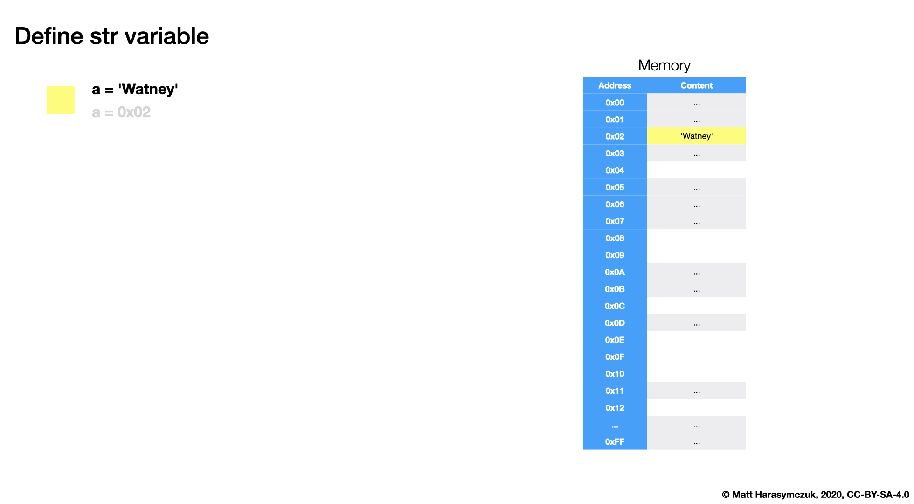

.. _Type Str Methods:

****************
Type Str Methods
****************

String Immutability
===================
How many string are there in a memory?

>>> firstname = 'Jan'
>>> lastname = 'Twardowski'
>>>
>>> firstname + ' ' + lastname
'Jan Twardowski'

>>> firstname = 'Jan'
>>> lastname = 'Twardowski'
>>>
>>> f'{firstname} {lastname}'
'Jan Twardowski'

>>> firstname = 'Jan'
>>> lastname = 'Twardowski'
>>> age = 42
>>>
>>> 'Hello ' + firstname + ' ' + lastname + ' ' + str(age) + '!'
'Hello Jan Twardowski 42!'

>>> firstname = 'Jan'
>>> lastname = 'Twardowski'
>>> age = 42
>>>
>>> f'Hello {firstname} {lastname} {age}!'
'Hello Jan Twardowski 42!'

    Define str

.. figure:: img/memory-str-2.png

    Define another str with the same value

.. figure:: img/memory-str-3.png

    Define another str with different value

Rationale
=========
* ``str`` is immutable
* ``str`` methods create a new modified ``str``

>>> a = 'Python'
>>> a.replace('P', 'C')
'Cython'
>>> print(a)
Python

>>> a = 'Python'
>>> b = a.replace('P', 'C')
>>>
>>> print(a)
Python
>>> print(b)
Cython

>>> a = 'Python'
>>> a = a.replace('P', 'C')
>>>
>>> print(a)
Cython

Strip Whitespace
================
>>> name = '\tAngus MacGyver    \n'
>>>
>>> name.strip()
'Angus MacGyver'
>>> name.rstrip()
'\tAngus MacGyver'
>>> name.lstrip()
'Angus MacGyver    \n'

Change Case
===========
* Unify data format before analysis

>>> name = 'Angus MacGyver III'
>>>
>>> name.upper()
'ANGUS MACGYVER III'
>>> name.lower()
'angus macgyver iii'
>>> name.title()
'Angus Macgyver Iii'
>>> name.capitalize()
'Angus macgyver iii'

Replace
=======
>>> name = 'Angus MacGyver Iii'
>>>
>>> name.replace('Iii', 'III')
'Angus MacGyver III'

Starts With
===========
>>> name = 'Angus MacGyver III'
>>> name.startswith('Angus')
True

>>> PREFIX = ('vir', 'ver')
>>>
>>> 'virginica'.startswith(PREFIX)
True
>>> 'versicolor'.startswith(PREFIX)
True
>>> 'setosa'.startswith(PREFIX)
False

Ends With
=========
>>> name = 'Angus MacGyver Iii'
>>>
>>> name.endswith('III')
False

>>> DOMAINS = ('@nasa.gov', '@esa.int')
>>>
>>> email = 'mark.watney@nasa.gov'
>>> email.endswith(DOMAINS)
True
>>> email = 'ivan.ivanovich@roscosmos.ru'
>>> email.endswith(DOMAINS)
False

Split by Line
=============
>>> DATA = """First Line
... Second Line
... Third Line
... """
>>> DATA.splitlines()
['First Line', 'Second Line', 'Third Line']

Split by Character
==================
* No argument - any number of whitespaces

>>> setosa = '5.1,3.5,1.4,0.2,setosa'
>>>
>>> setosa.split(',')
['5.1', '3.5', '1.4', '0.2', 'setosa']

>>> text = 'We choose to go to the Moon'
>>>
>>> text.split(' ')
['We', 'choose', 'to', 'go', 'to', 'the', 'Moon']
>>> text.split()
['We', 'choose', 'to', 'go', 'to', 'the', 'Moon']

>>> text = '10.13.37.1      nasa.gov esa.int roscosmos.ru'
>>>
>>> text.split(' ')
['10.13.37.1', '', '', '', '', '', 'nasa.gov', 'esa.int', 'roscosmos.ru']
>>> text.split()
['10.13.37.1', 'nasa.gov', 'esa.int', 'roscosmos.ru']

Join by Character
=================
>>> text = ['We', 'choose', 'to', 'go', 'to', 'the', 'Moon']
>>> ' '.join(text)
'We choose to go to the Moon'

>>> setosa = ['5.1', '3.5', '1.4', '0.2', 'setosa']
>>> ','.join(setosa)
'5.1,3.5,1.4,0.2,setosa'

>>> crew = ['Mark Watney', 'Jan Twardowski', 'Melissa Lewis']
>>>
>>> '\n'.join(crew)
'Mark Watney\nJan Twardowski\nMelissa Lewis'

>>> TEXT = ['We choose to go to the Moon!',
...        'We choose to go to the Moon in this decade and do the other things,',
...        'not because they are easy, but because they are hard;',
...        'because that goal will serve to organize and measure the best of our energies and skills,',
...        'because that challenge is one that we are willing to accept, one we are unwilling to postpone,',
...        'and one we intend to win, and the others, too.']
...
>>> print('\n'.join(TEXT))
We choose to go to the Moon!
We choose to go to the Moon in this decade and do the other things,
not because they are easy, but because they are hard;
because that goal will serve to organize and measure the best of our energies and skills,
because that challenge is one that we are willing to accept, one we are unwilling to postpone,
and one we intend to win, and the others, too.

Is Whitespace
=============
>>> text = ''
>>> text.isspace()
False
>>> text = ' '
>>> text.isspace()
True
>>> text = '\t'
>>> text.isspace()
True
>>> text = '\n'
>>> text.isspace()
True

.. figure:: img/iss.jpg

    ISS - International Space Station.
    Credits: NASA/Crew of STS-132 (img: s132e012208).

Is Alphabet Characters
======================
>>> text = 'hello'
>>> text.isalpha()
True
>>> text = 'hello1'
>>> text.isalpha()
False

Is Numeric
==========
* https://docs.python.org/library/stdtypes.html#str.isdecimal
* https://docs.python.org/library/stdtypes.html#str.isdigit
* https://docs.python.org/library/stdtypes.html#str.isnumeric
* https://docs.python.org/library/stdtypes.html#str.isalnum

>>> '1'.isdecimal()
True
>>> '+1'.isdecimal()
False
>>> '-1'.isdecimal()
False
>>> '1.'.isdecimal()
False
>>> '1,'.isdecimal()
False
>>> '1.0'.isdecimal()
False
>>> '1,0'.isdecimal()
False
>>> '1_0'.isdecimal()
False
>>> '10'.isdecimal()
True

>>> '1'.isdigit()
True
>>> '+1'.isdigit()
False
>>> '-1'.isdigit()
False
>>> '1.'.isdigit()
False
>>> '1,'.isdigit()
False
>>> '1.0'.isdigit()
False
>>> '1,0'.isdigit()
False
>>> '1_0'.isdigit()
False
>>> '10'.isdigit()
True

>>> '1'.isnumeric()
True
>>> '+1'.isnumeric()
False
>>> '-1'.isnumeric()
False
>>> '1.'.isnumeric()
False
>>> '1.0'.isnumeric()
False
>>> '1,0'.isnumeric()
False
>>> '1_0'.isnumeric()
False
>>> '10'.isnumeric()
True

>>> '1'.isalnum()
True
>>> '+1'.isalnum()
False
>>> '-1'.isalnum()
False
>>> '1.'.isalnum()
False
>>> '1,'.isalnum()
False
>>> '1.0'.isalnum()
False
>>> '1,0'.isalnum()
False
>>> '1_0'.isalnum()
False
>>> '10'.isalnum()
True

Find Sub-String Position
========================
>>> text = 'We choose to go to the Moon'
>>>
>>> text.find('M')
23
>>> text.find('Moo')
23
>>> text.find('x')
-1

Contains
========
>>> 'Monty' in 'Python'
False
>>> 'Py' in 'Python'
True
>>> 'py' in 'Python'
False

Count Occurrences
=================
>>> text = 'Moon'
>>>
>>> text.count('o')
2
>>> text.count('Moo')
1
>>> text.count('x')
0

Remove Prefix or Suffix
=======================
* Since Python 3.9: :pep:`616` -- String methods to remove prefixes and suffixes

>>> filename = '1969-apollo11.txt'
>>>
>>> filename.removeprefix('1969-')
'apollo11.txt'
>>> filename.removesuffix('.txt')
'1969-apollo11'
>>> filename.removeprefix('1969-').removesuffix('.txt')
'apollo11'

Method Chaining
===============
>>> a = 'Python'
>>>
>>> a = a.upper()
>>> a = a.replace('P', 'C')
>>> a = a.title()
>>>
>>> print(a)
Cython

>>> a = 'Python'
>>> a = a.upper().replace('P', 'C').title()
>>>
>>> print(a)
Cython

>>> a = 'Python'
>>> a.upper().replace('P', 'C').title()
'Cython'

How it works:

    #. a -> 'Python'
    #. 'Python'.upper() -> 'PYTHON'
    #. 'PYTHON'.replace('P', 'C') -> 'CYTHON'
    #. 'CYTHON'.title() -> 'Cython'

>>> a = 'Python'
>>> a = a.upper().startswith('P').replace('P', 'C')
Traceback (most recent call last):
AttributeError: 'bool' object has no attribute 'replace'

Note, that there cannot be any char, not even space after ``\`` character:

>>> a = 'Python'
>>> a = a.upper() \
...      .replace('P', 'C') \
...      .title()
>>>
>>> print(a)
Cython

>>> a = 'Python'
>>> a = (a.upper()
...       .replace('P', 'C')
...       .title())
>>>
>>> print(a)
Cython

Cleaning User Input
===================
* 80% of machine learning and data science is cleaning data
* Is This the Same Address?
* This is a dump of distinct records of a single address
* Which one of the below is a true address?

Numbers:

>>> number = 1
>>> number = 1.0
>>> number = 1.00
>>>
>>> number = '1'
>>> number = '1.0'
>>> number = '1.00'

Addresses:

>>> street = 'ul. Jana III Sobieskiego'
>>> street = 'ul Jana III Sobieskiego'
>>> street = 'ul.Jana III Sobieskiego'
>>> street = 'ulicaJana III Sobieskiego'
>>> street = 'Ul. Jana III Sobieskiego'
>>> street = 'UL. Jana III Sobieskiego'
>>> street = 'ulica Jana III Sobieskiego'
>>> street = 'Ulica. Jana III Sobieskiego'
>>>
>>> street = 'os. Jana III Sobieskiego'
>>>
>>> street = 'Jana 3 Sobieskiego'
>>> street = 'Jana 3ego Sobieskiego'
>>> street = 'Jana III Sobieskiego'
>>> street = 'Jana Iii Sobieskiego'
>>> street = 'Jana IIi Sobieskiego'
>>> street = 'Jana lll Sobieskiego'  # three small letters 'L'

Address prefix (street, road, court, place, etc.):

>>> prefix = 'ul'
>>> prefix = 'ul.'
>>> prefix = 'Ul.'
>>> prefix = 'UL.'
>>> prefix = 'ulica'
>>> prefix = 'Ulica'
>>>
>>> prefix = 'os'
>>> prefix = 'os.'
>>> prefix = 'Os.'
>>> prefix = 'osiedle'
>>> prefix = 'oś'
>>> prefix = 'oś.'
>>> prefix = 'Oś.'
>>> prefix = 'ośedle'
>>>
>>> prefix = 'pl'
>>> prefix = 'pl.'
>>> prefix = 'Pl.'
>>> prefix = 'plac'
>>>
>>> prefix = 'al'
>>> prefix = 'al.'
>>> prefix = 'Al.'
>>> prefix = 'aleja'
>>> prefix = 'aleia'
>>> prefix = 'alei'
>>> prefix = 'aleii'
>>> prefix = 'aleji'

House and apartment number:

>>> address = 'Ćwiartki 3/4'
>>> address = 'Ćwiartki 3 / 4'
>>> address = 'Ćwiartki 3 m. 4'
>>> address = 'Ćwiartki 3 m 4'
>>> address = 'Brighton Beach 1st apt 2'
>>> address = 'Brighton Beach 1st apt. 2'
>>> address = 'Myśliwiecka 3/5/7'
>>>
>>> address = 'Jana Twardowskiego 180f/8f'
>>> address = 'Jana Twardowskiego 180f/8'
>>> address = 'Jana Twardowskiego 180/8f'
>>>
>>> address = 'Jana Twardowskiego III 3 m. 3'
>>> address = 'Jana Twardowskiego 13d bud. A piętro II sala 3'

Phone Numbers:

>>> phone = '+48 (12) 355 5678'
>>> phone = '+48 123 555 678'
>>>
>>> phone = '123 555 678'
>>> phone = '123555678'
>>> phone = '+48123555678'
>>> phone = '+48 12 355 5678'
>>> phone = '+48 123-555-678'
>>> phone = '+48 123 555 6789'
>>> phone = '+1 (123) 555-6789'
>>> phone = '+1 (123).555.6789'
>>>
>>> phone = '+1 800-python'
>>> phone = '+1 800-798466'
>>>
>>> phone = '+48 123 555 678 wew. 1337'
>>> phone = '+48 123555678,1'
>>> phone = '+48 123555678,1,,2'

Assignments
===========

.. literalinclude:: assignments/type_str_normalize.py
    :caption: :download:`Solution <assignments/type_str_normalize.py>`
    :end-before: # Solution

.. literalinclude:: assignments/type_str_clean.py
    :caption: :download:`Solution <assignments/type_str_clean.py>`
    :end-before: # Solution
