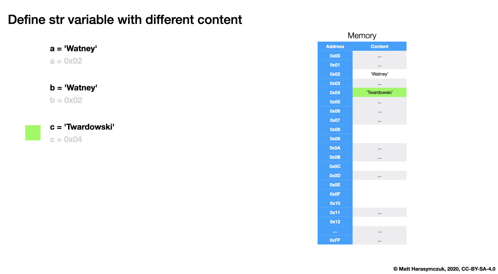

String Immutable
================

Important
---------
* ``str`` is immutable
* ``str`` methods create a new modified ``str``

>>> a = 'Python'
>>> a.replace('P', 'C')
'Cython'
>>> print(a)
Python

>>> a = 'Python'
>>> b = a.replace('P', 'C')
>>>
>>> print(a)
Python
>>> print(b)
Cython

>>> a = 'Python'
>>> a = a.replace('P', 'C')
>>>
>>> print(a)
Cython

Memory
------
.. figure:: img/str-memory-1.png
.. figure:: img/str-memory-2.png

.. figure:: img/str-immutable.png

Value Check
-----------
This is valid way to check str value:

>>> name = 'Mark Watney'
>>> name == 'Mark Watney'
True

The following code will produce SyntaxWarning due to the invalid operand
``<input>:1: SyntaxWarning: "is" with a literal. Did you mean "=="?``:

>>> name = 'Mark Watney'
>>> name is 'Mark Watney'
False

Length
------
>>> len('hello')
5

Concatenation
-------------
* Preferred string concatenation is using ``f-string`` formatting

>>> 'a' + 'b'
'ab'

>>> 'a' 'b'
'ab'

>>> data = 'one' \
...        'two' \
...        'three'
>>>
>>> data
'onetwothree'

Concat Problem
--------------
>>> 'Mark' + 'Watney'
'MarkWatney'

>>> 'Mark' + ' ' + 'Watney'
'Mark Watney'

>>> 'Mark Watney'
'Mark Watney'

>>> firstname = 'Mark'
>>> lastname = 'Watney'
>>>
>>> firstname + lastname
'MarkWatney'
>>>
>>> firstname + ' ' + lastname
'Mark Watney'
>>>
>>> f'{firstname} {lastname}'
'Mark Watney'

Concat Numbers
--------------
>>> 1 + 2
3
>>>
>>> '1' + '2'
'12'
>>>
>>> '1' + 2
Traceback (most recent call last):
TypeError: can only concatenate str (not "int") to str
>>>
>>> 1 + '2'
Traceback (most recent call last):
TypeError: unsupported operand type(s) for +: 'int' and 'str'

>>> name = 'Mark Watney'
>>> age = 44
>>>
>>> 'Astronaut ' + name + ' is ' + age + ' years old.'
Traceback (most recent call last):
TypeError: can only concatenate str (not "int") to str
>>>
>>> 'Astronaut ' + name + ' is ' + str(age) + ' years old.'
'Astronaut Mark Watney is 44 years old.'
>>>
>>> f'Astronaut {name} is {age} years old.'
'Astronaut Mark Watney is 44 years old.'

Concat Multiply
---------------
>>> '*' * 10
'**********'

>>> text = 'Hello world'
>>> print(text + '\n' + '!'*len(text))
Hello world
!!!!!!!!!!!

Use Case - 0x01
---------------
>>> firstname = 'Mark'
>>> lastname = 'Watney'
>>>
>>> 'Hello ' + firstname + ' ' + lastname + '!'
'Hello Mark Watney!'

>>> firstname = 'Mark'
>>> lastname = 'Watney'
>>>
>>> f'Hello {firstname} {lastname}!'
'Hello Mark Watney!'

.. todo:: Assignments
