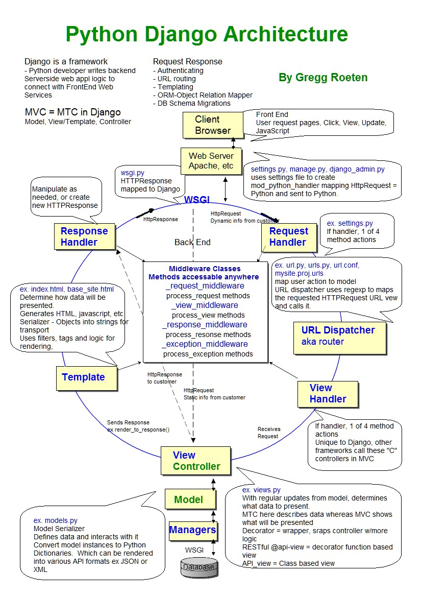

*************************
Instalacja i uruchamianie
*************************

Instalacja
==========
.. code-block:: console

    $ pip install django

Starting new project
====================
.. code-block:: console

    $ django-admin startproject apollo

    $ python manage.py migrate

    $ python manage.py createsuperuser
    Username (leave blank to use 'admin'): jose.jimenez
    Email address: jose.jimenez@nasa.gov
    Password:
    Password (again):
    Superuser created successfully.

    $ python manage.py runserver
    Performing system checks...

    System check identified no issues (0 silenced).
    July 21, 1969 - 14:56:15
    Django version 2.1.0, using settings 'apollo.settings'
    Starting development server at http://127.0.0.1:8000/
    Quit the server with CONTROL-C.

Sprawdź w przeglądarce strony:

* ``http://127.0.0.1:8000/``
* ``http://localhost:8000/admin/``

Starting new app
================
.. code-block:: console

    $ cd apollo

    $ django-admin startapp lem

Architektura aplikacji Django
=============================
.. figure:: img/django-architecture-stack.png
    :scale: 75%
    :align: center

    django-architecture-stack

    django-request-response-flow

IDE Support
===========

Runserver
---------

Debugging
---------

Database Explorer
-----------------

Mark as Sources Root
--------------------

Podpowiadanie składni
---------------------
- Template
- templatetags
- filters
