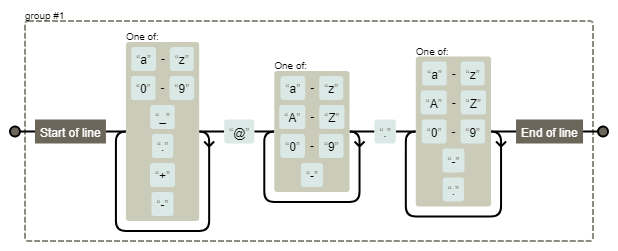

*******************
Wyrażenia regularne
*******************

Konstruowanie wyrażeń
=====================

Wyciąganie parametrów (zmiennych)
=================================

.. code-block:: python

    def sprwadzie_ciagow():
        REGEX_IMIE_I_NAZWISKO = r"(?P<first_name>\w+) (?P<last_name>\w+)"

        imie_i_nazwisko = re.compile(REGEX_IMIE_I_NAZWISKO)
        m = imie_i_nazwisko.match('Malcolm Reynolds')

        m.group('first_name')
        'Malcolm'
        m.group('last_name')
        'Reynolds'
        m.group()
        'Malcolm Reynolds'

Najczęściej wykorzystywane funkcje
==================================

``match()``
-----------
.. literalinclude:: src/re-match.py
    :name: listing-re-match
    :language: python
    :caption: Usage of ``re.match()``

``search()``
------------

.. literalinclude:: src/re-search.py
    :name: listing-re-search()
    :language: python
    :caption: Usage of ``re.search()``

``findall()`` i ``finditer()``
------------------------------
.. literalinclude:: src/re-find.py
    :name: listing-re-find
    :language: python
    :caption: Usage of ``re.findall()`` and ``re.finditer()``

``compile()``
-------------

MULTILINE
---------

.. literalinclude:: src/re-multiline.py
    :name: listing-re-regexp
    :language: python
    :caption: Usage of regexp

Greedy search
=============

Przykład
========

.. code-block:: python

    import re

    TEKST = """Lorem ipsum dolor sit amet, consectetur adipiscing elit, sed do eiusmod tempor incididunt ut labore et dolore magna aliqua. Ut enim ad minim veniam, quis nostrud exercitation ullamco laboris nisi ut aliquip ex ea commodo consequat. Duis aute irure dolor in reprehenderit in voluptate velit esse cillum dolore eu fugiat nulla pariatur. Excepteur sint occaecat cupidatat non proident, sunt in culpa qui officia deserunt mollit anim id est laborum. -- Section 1.10.32 of "de Finibus Bonorum et Malorum", written by Cicero in 45 BC"""

    SLOWA_ZAWIERAJACE_IS = r'[a-zA-Z0-9]*is[a-zA-Z0-9]*'
    wynik = re.findall(SLOWA_ZAWIERAJACE_IS, TEKST)
    print(wynik)

    SLOWA_ZAWIERAJACE_IS = re.compile(r'[a-zA-Z0-9]*is[a-zA-Z0-9]*')
    SLOWA_ZAWIERAJACE_IS.findall(TEKST)
    print(wynik)

Wizualizacja regexpów
---------------------
https://regexper.com/

Zadania kontrolne
=================

Walidacja PESEL
---------------

Za pomocą wyrażeń regularnych sprawdź:

* czy pesel jest poprawny
* jaka jest data urodzenia? (podaj obiekt ``datetime.date``
* płeć użytkownika który podał PESEL

:Z gwiazdką:
    * sprawdź walidację numerów PESEL dla osób urodzonych po 2000 roku.
    * sprawdź sumę kontrolną
