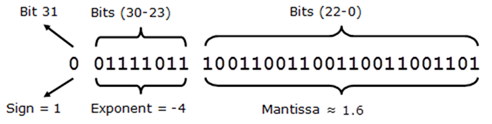

*******************
Numerical Precision
*******************

Problem
=======
.. code-block:: python

    0.1 + 0.2
    # 0.30000000000000004

.. code-block:: python

    0.1 + 0.2 == 0.3
    # False

``float`` anatomy
=================

What is ``float``
-----------------
.. figure:: img/float-anatomy.png
    :scale: 100%
    :align: center

    What is ``float``

Points chart
------------
.. figure:: img/float-expression.png
    :scale: 50%
    :align: center

    Points chart

How computer store ``float``?
-----------------------------
.. figure:: img/float-mantissa-1.png
    :scale: 50%
    :align: center

    How computer store ``float``?

How to read/write ``float`` from/to memory?
-------------------------------------------

    How to read/write ``float`` from/to memory?

Normalized Line
---------------
.. figure:: img/float-normalized.png
    :scale: 50%
    :align: center

    Normalized Line

doctests
========
.. code-block:: python

    def add_numbers(a, b):
        """
        >>> add_numbers(2.5, 1.2)
        3.7

        >>> add_numbers(0.1, 0.2)
        0.30000000000000004

        >>> add_numbers(0.1, 0.2)
        0.1 + 0.2 == 0.3000...
        """
        return a + b

``decimal``
===========
.. code-block:: python

    from decimal import Decimal

    a = Decimal('0.1')
    b = Decimal('0.2')

    a + b
    # Decimal('0.3')

.. code-block:: python

    from decimal import Decimal

    a = Decimal('0.3')

    float(a)
    # 0.3
