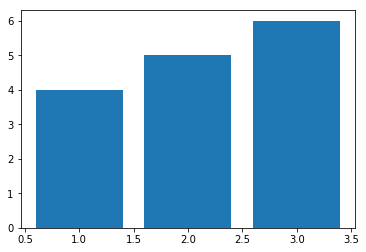

**********
Matplotlib
**********

What is matplotlib
==================
Pyplot's state-machine environment behaves similarly to MATLAB and should be most familiar to users with MATLAB experience.

Installing and using ``matplotlib``
===================================
.. code-block:: console

    $ pip install matplotlib

.. code-block:: python

    import matplotlib.pyplot as plt

Embedding matplotlib charts in Jupyter
--------------------------------------
* ``%matplotlib inline``

Running matplotlib in PyCharm
-----------------------------
* Scientific Mode

Running matplotlib in standalone scripts
----------------------------------------
* Scale
* Export to image
* Reposition
* Other options

.. code-block:: python

    x = [1,2,3]
    y = [4,5,6]

    plt.plot(x, y)

    plt.show()

Charts Gallery
--------------
* https://matplotlib.org/gallery/index.html

``pandas`` structures for ``matplotlib``
----------------------------------------
* All of plotting functions expect ``np.array`` or ``np.ma.masked_array`` as input
* Classes that are 'array-like' such as ``pandas`` data objects and ``np.matrix`` may or may not work as intended
* It is best to convert these to ``np.array`` objects prior to plotting
* Convert a ``pandas.DataFrame``:

    .. code-block:: python

        a = pandas.DataFrame(np.random.rand(4,5), columns = list('abcde'))
        a_asndarray = a.values

* Covert a ``np.matrix``:

    .. code-block:: python

        b = np.matrix([[1,2],[3,4]])
        b_asarray = np.asarray(b)

Backends
--------

=============   ============   ================================================
Renderer        Filetypes      Description
=============   ============   ================================================
:term:`AGG`     :term:`png`    :term:`raster graphics` -- high quality images
                               using the `Anti-Grain Geometry`_ engine
PS              :term:`ps`     :term:`vector graphics` -- Postscript_ output
                :term:`eps`
PDF             :term:`pdf`    :term:`vector graphics` --
                               `Portable Document Format`_
SVG             :term:`svg`    :term:`vector graphics` --
                               `Scalable Vector Graphics`_
:term:`Cairo`   :term:`png`    :term:`raster graphics` and
                :term:`ps`     :term:`vector graphics` -- using the
                :term:`pdf`    `Cairo graphics`_ library
                :term:`svg`
=============   ============   ================================================

How to understand charts?
=========================

Figure anatomy
--------------
.. figure:: img/matplotlib-figure-anatomy.png
    :scale: 50%
    :align: center

    Figure Anatomy

Axes
----
* A given figure can contain many Axes, but a given Axes object can only be in one Figure
* Data limits can be controlled via ``set_xlim()`` and ``set_ylim()`` methods
* Each Axes has a title (set via ``set_title()``), an x-label (set via ``set_xlabel()``), and a y-label (set via ``set_ylabel()``)

Axis
----
* These are the number-line-like objects

Artist
------
* Everything you can see on the figure is an artist (even the Figure, Axes, and Axis objects)
* This includes Text objects, Line2D objects, collection objects, Patch objects, etc
* Most Artists are tied to an Axes; such an Artist cannot be shared by multiple Axes, or moved from one to another

Simple examples
===============

Simple figures
--------------
.. code-block:: python

    import matplotlib.pyplot as plt

    fig = plt.figure()  # an empty figure with no axes
    fig.suptitle('No axes on this figure')  # Add a title so we know which it is

    fig, ax_lst = plt.subplots(2, 2)  # a figure with a 2x2 grid of Axes

Exponential functions
---------------------
.. code-block:: python

    x = np.linspace(0, 2, 100)

    plt.plot(x, x, label='linear')
    plt.plot(x, x**2, label='quadratic')
    plt.plot(x, x**3, label='cubic')

    plt.xlabel('x label')
    plt.ylabel('y label')

    plt.title("Simple Plot")

    plt.legend()

    plt.show()

.. figure:: img/matplotlib-exponentials.png
    :scale: 50%
    :align: center

    Exponential functions

Sin wave
--------
.. code-block:: python

    x = np.arange(0, 10, 0.2)
    y = np.sin(x)
    fig, ax = plt.subplots()
    ax.plot(x, y)
    plt.show()

.. figure:: img/matplotlib-sin-wave.png
    :scale: 50%
    :align: center

    Sin wave

Labels and Legend
=================

Axis naming
-----------
.. code-block:: python

    x = [1,2,3]
    y = [4,5,6]

    plt.xlabel('X axis')
    plt.ylabel('Y axis')

    plt.plot(x, y)
    plt.show()

Title
-----
.. code-block:: python

    x = [1,2,3]
    y = [4,5,6]

    plt.title('This is my chart')

    plt.plot(x, y)
    plt.show()

.. code-block:: python

    x = [1,2,3]
    y = [4,5,6]

    plt.title('This is my chart\nSecond line')

    plt.plot(x, y)
    plt.show()

Legend
------
* Good practice: always have labels

.. code-block:: python

    x1 = [1,2,3]
    y1 = [4,5,6]

    x2 = [1,2,3]
    y2 = [10,11,12]

    plt.plot(x1, y1, label='first line')
    plt.plot(x2, y2, label='second line')

    plt.legend()
    plt.show()

Colors
------
* first color name letter (not recommended):

    * ``r`` - red
    * ``g`` - green
    * ``b`` - blue
    * ``c`` - cyan
    * ``m`` - magenta
    * ``y`` - yellow
    * ``k`` - karmin
    * ``w`` - white

* color names (X11/CSS4):

    * red
    * green
    * blue
    * cyan
    * magenta
    * yellow
    * karmin
    * white
    * https://en.wikipedia.org/wiki/X11_color_names#Color_name_chart

* hexadecimal code (RGB or RGBA):

    * ``#FF0000`` - red
    * ``#00FF00`` - green
    * ``#0000FF`` - blue
    * ``#FF000033`` - semi-transparent red

* tuple (RGB or RGBA):

    * ``(0.1, 0.2, 0.5)``
    * ``(0.1, 0.2, 0.5, 0.3)``

.. code-block:: python

    plt.bar(x1, y1, label='Bars 1', color='blue')
    plt.bar(x2, y2, label='Bars 2', color='red')

Line styles
-----------
.. figure:: img/matplotlib-line-style.png
    :scale: 100%
    :align: center

    Line styles

.. code-block:: python

    pylab.plot(x, y, color="red", linestyle='--')

``fmt`` parameters
------------------
.. csv-table::
    :header-rows: 1

    "Character", "Description"
    "``-``",  "solid line style"
    "``--``", "dashed line style"
    "``-.``", "dash-dot line style"
    "``:``",  "dotted line style"
    "``.``",  "point marker"
    "``,``",  "pixel marker"
    "``o``",  "circle marker"
    "``v``",  "triangle_down marker"
    "``^``",  "triangle_up marker"
    "``<``",  "triangle_left marker"
    "``>``",  "triangle_right marker"
    "``1``",  "tri_down marker"
    "``2``",  "tri_up marker"
    "``3``",  "tri_left marker"
    "``4``",  "tri_right marker"
    "``s``",  "square marker"
    "``p``",  "pentagon marker"
    "``*``",  "star marker"
    "``h``",  "hexagon1 marker"
    "``H``",  "hexagon2 marker"
    "``+``",  "plus marker"
    "``x``",  "x marker"
    "``D``",  "diamond marker"
    "``d``",  "thin_diamond marker"
    "``|``",  "vline marker"
    "``_``",  "hline marker"

Charts
======

Bars
----
* used to display single values

.. code-block:: python

    x = [1,2,3]
    y = [4,5,6]

    plt.bar(x, y, label='Bars1')

.. code-block:: python

    x1 = [2,4,6,8,10]
    y1 = [6,7,8,2,4]

    x2 = [1,3,5,7,9]
    y2 = [7,8,2,4,2]

    plt.bar(x1, y1, label='Bars 1', color='blue')
    plt.bar(x2, y2, label='Bars 2', color='red')

    plt.xlabel('x')
    plt.ylabel('y')
    plt.title('This is my chart')
    plt.legend()
    plt.show()

    Bars

Histogram
---------
* used to display number of elements in specific groups

.. code-block:: python

    ages = np.random.randint(size=50, low=0, high=130)

    # age groups
    bins = [0, 10, 20, 30, 40, 50, 60, 70, 80, 100, 110, 120, 130]

    plt.hist(ages, bins, histtype='bar', rwidth=0.8)

.. figure:: img/matplotlib-plt-hist.png
    :scale: 100%
    :align: center

    Histogram

Scatter plot
------------
* Used to show correlation

.. code-block:: python

    x = [1,2,3,4,5,6,7,8]
    y = [4,7,6,2,7,4,5,2]

    plt.scatter(x, y)

.. code-block:: python

    x = [1,2,3,4,5,6,7,8]
    y = [4,7,6,2,7,4,5,2]

    plt.scatter(x, y, marker='*', color='red')
    plt.scatter(y, x, marker='o', color='blue')

.. figure:: img/matplotlib-plt-scatter.png
    :scale: 100%
    :align: center

    Scatter plot

Additional info
===============

Trend line
----------
.. literalinclude:: src/matplotlib-trendline.py
    :language: python
    :caption: Trend line

.. figure:: img/matplotlib-trendline.png
    :scale: 100%
    :align: center

    Trend line

Error bars
----------
.. literalinclude:: src/matplotlib-plt-errorbar.py
    :language: python
    :caption: Error bars

.. figure:: img/matplotlib-plt-errorbar.png
    :scale: 100%
    :align: center

    Error bars
