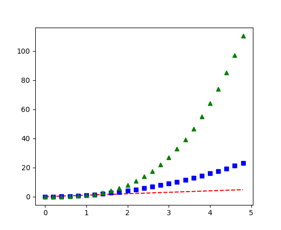
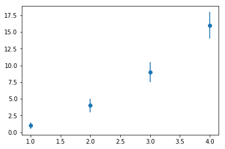
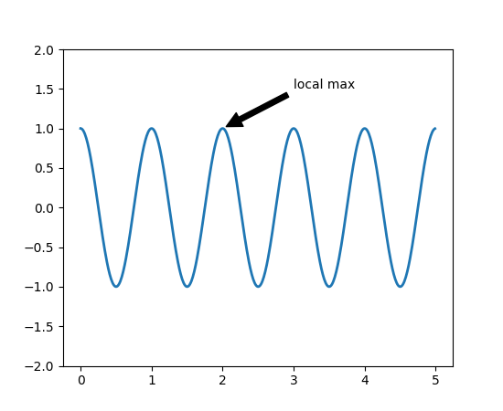
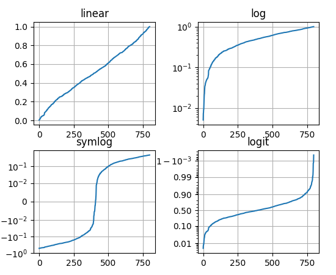

.. _Matplotlib:

**********
Matplotlib
**********

Glossary
========
.. glossary::

    agg
    cairo
    eps
    pdf
    png
    ps
    svg
    raster graphics
    vector graphics

What is matplotlib
==================
Pyplot's state-machine environment behaves similarly to MATLAB and should be most familiar to users with MATLAB experience.

Installing and using ``matplotlib``
===================================
.. code-block:: console

    $ pip install matplotlib

.. code-block:: python

    import matplotlib.pyplot as plt

Embedding matplotlib charts in Jupyter
--------------------------------------
* ``%matplotlib inline``

Running matplotlib in PyCharm
-----------------------------
* Scientific Mode

Running matplotlib in standalone scripts
----------------------------------------
* Scale
* Export to image
* Reposition
* Other options

.. code-block:: python

    x = [1,2,3]
    y = [4,5,6]

    plt.plot(x, y)

    plt.show()

.. code-block:: python

    x = [1,2,3]
    y = [4,5,6]

    plt.plot(x, y)

    plt.savefig('my_file.png')

Charts Gallery
--------------
* https://matplotlib.org/gallery/index.html

``pandas`` and ``matplotlib``
-----------------------------
* All of plotting functions expect ``np.array`` or ``np.ma.masked_array`` as input
* Classes that are 'array-like' such as ``pandas`` data objects and ``np.matrix`` may or may not work as intended
* It is best to convert these to ``np.array`` objects prior to plotting
* Convert a ``pandas.DataFrame``:

    .. code-block:: python

        a = pandas.DataFrame(np.random.rand(4,5), columns = list('abcde'))
        a_asndarray = a.values

* Covert a ``np.matrix``:

    .. code-block:: python

        b = np.matrix([[1,2],[3,4]])
        b_asarray = np.asarray(b)

Opening files
-------------
* ``with open('filename.csv')`` - context manager
* ``numpy.loadtxt('filename.csv', delimeter=',', unpack=True)``
* ``csv.DictReader()``

.. code-block:: python

    import pandas as pd

    url = 'https://raw.githubusercontent.com/scikit-learn/scikit-learn/master/sklearn/datasets/data/iris.csv'
    columns = ['Sepal length', 'Sepal width', 'Petal length', 'Petal width', 'Species']
    species = {0: 'setosa', 1: 'versicolor', 2: 'virginica'}

    data = pd.read_csv(url, skiprows=1, names=columns)

    # Change column Species values
    data.Species.replace(to_replace=species, inplace=True)

    # Shuffle columns and reset indexes
    data.sample(frac=1).reset_index(drop=True, inplace=True)
    #      Sepal length  Sepal width     ...      Petal width     Species
    # 0             5.0          2.0     ...              1.0  versicolor
    # 1             6.4          2.7     ...              1.9   virginica
    # 2             5.6          3.0     ...              1.5  versicolor
    # 3             5.7          2.6     ...              1.0  versicolor
    # 4             6.4          3.1     ...              1.8   virginica
    # 5             4.6          3.6     ...              0.2      setosa
    # 6             5.9          3.0     ...              1.5  versicolor

Backends
--------

=============   ============   ================================================
Renderer        Filetypes      Description
=============   ============   ================================================
:term:`AGG`     :term:`png`    :term:`raster graphics` -- high quality images
                               using the Anti-Grain Geometry engine
PS              :term:`ps`     :term:`vector graphics` -- Postscript output
                :term:`eps`
PDF             :term:`pdf`    :term:`vector graphics` --
                               Portable Document Format
SVG             :term:`svg`    :term:`vector graphics` --
                               Scalable Vector Graphics
:term:`Cairo`   :term:`png`    :term:`raster graphics` and
                :term:`ps`     :term:`vector graphics` -- using the
                :term:`pdf`    Cairo graphics library
                :term:`svg`
=============   ============   ================================================

How to understand charts?
=========================

Figure anatomy
--------------
.. figure:: img/matplotlib-figure-anatomy.png
    :scale: 75%
    :align: center

    Figure Anatomy

Axes
----
* A given figure can contain many Axes, but a given Axes object can only be in one Figure
* Data limits can be controlled via ``set_xlim()`` and ``set_ylim()`` methods
* Each Axes has a title (set via ``set_title()``), an x-label (set via ``set_xlabel()``), and a y-label (set via ``set_ylabel()``)

Axis
----
* These are the number-line-like objects
* Axis can be integers

.. code-block:: python

    import matplotlib.pyplot as plt
    from matplotlib.ticker import MaxNLocator

    x = np.linspace(0, 2, 100)

    ax = plt.figure().gca()  # ``gca`` - get current axes

    ax.plot(x, x, label='linear')
    ax.plot(x, x**2, label='quadratic')
    ax.plot(x, x**3, label='cubic')

    ax.xaxis.set_major_locator(MaxNLocator(integer=True))

Artist
------
* Everything you can see on the figure is an artist (even the Figure, Axes, and Axis objects)
* This includes Text objects, Line2D objects, collection objects, Patch objects, etc
* Most Artists are tied to an Axes; such an Artist cannot be shared by multiple Axes, or moved from one to another

Simple examples
===============

Exponential functions
---------------------
.. code-block:: python

    x = np.linspace(0, 2, 100)

    plt.plot(x, x, label='linear')
    plt.plot(x, x**2, label='quadratic')
    plt.plot(x, x**3, label='cubic')

    plt.title('Exponential functions')
    plt.xlabel('x')
    plt.ylabel('y')

    plt.legend()
    plt.show()

.. figure:: img/matplotlib-exponentials.png
    :scale: 100%
    :align: center

    Exponential functions

Sin wave
--------
.. code-block:: python

    x = np.arange(0, 10, 0.2)
    y = np.sin(x)
    fig, ax = plt.subplots()
    ax.plot(x, y)
    plt.show()

.. figure:: img/matplotlib-sin-wave.png
    :scale: 75%
    :align: center

    Sin wave

Multiple lines on one chart
---------------------------
.. code-block:: python

    import numpy as np
    import matplotlib.pyplot as plt

    # evenly sampled time at 200ms intervals
    t = np.arange(0., 5., 0.2)

    # red dashes, blue squares and green triangles
    plt.plot(t, t, 'r--', t, t**2, 'bs', t, t**3, 'g^')
    plt.show()

    Multiple lines on one chart

Labels and Legend
=================

Axis naming
-----------
.. code-block:: python

    x = [1,2,3]
    y = [4,5,6]

    plt.xlabel('X axis')
    plt.ylabel('Y axis')

    plt.plot(x, y)
    plt.show()

Title
-----
.. code-block:: python

    x = [1,2,3]
    y = [4,5,6]

    plt.title('This is my chart')

    plt.plot(x, y)
    plt.show()

.. code-block:: python

    x = [1,2,3]
    y = [4,5,6]

    plt.title('This is my chart\nSecond line')

    plt.plot(x, y)
    plt.show()

Legend
------
* Good practice: always have labels

.. code-block:: python

    x1 = [1,2,3]
    y1 = [4,5,6]

    x2 = [1,2,3]
    y2 = [10,11,12]

    plt.plot(x1, y1, label='first line')
    plt.plot(x2, y2, label='second line')

    plt.legend()
    plt.show()

Colors
------
* first color name letter (not recommended):

    * ``r`` - red
    * ``g`` - green
    * ``b`` - blue
    * ``c`` - cyan
    * ``m`` - magenta
    * ``y`` - yellow
    * ``k`` - karmin
    * ``w`` - white

* color names (X11/CSS4):

    * red
    * green
    * blue
    * cyan
    * magenta
    * yellow
    * karmin
    * white
    * https://en.wikipedia.org/wiki/X11_color_names#Color_name_chart

* hexadecimal code (RGB or RGBA):

    * ``#FF0000`` - red
    * ``#00FF00`` - green
    * ``#0000FF`` - blue
    * ``#FF000033`` - semi-transparent red

* tuple (RGB or RGBA):

    * ``(0.1, 0.2, 0.5)``
    * ``(0.1, 0.2, 0.5, 0.3)``

.. code-block:: python

    plt.bar(x1, y1, label='Bars 1', color='blue')
    plt.bar(x2, y2, label='Bars 2', color='red')

Line styles
-----------
.. figure:: img/matplotlib-line-style.png
    :scale: 100%
    :align: center

    Line styles

.. code-block:: python

    pylab.plot(x, y, color="red", linestyle='--')

``fmt`` parameters
------------------
.. csv-table::
    :header-rows: 1

    "Character", "Description"
    "``-``",  "solid line style"
    "``--``", "dashed line style"
    "``-.``", "dash-dot line style"
    "``:``",  "dotted line style"
    "``.``",  "point marker"
    "``,``",  "pixel marker"
    "``o``",  "circle marker"
    "``v``",  "triangle_down marker"
    "``^``",  "triangle_up marker"
    "``<``",  "triangle_left marker"
    "``>``",  "triangle_right marker"
    "``1``",  "tri_down marker"
    "``2``",  "tri_up marker"
    "``3``",  "tri_left marker"
    "``4``",  "tri_right marker"
    "``s``",  "square marker"
    "``p``",  "pentagon marker"
    "``*``",  "star marker"
    "``h``",  "hexagon1 marker"
    "``H``",  "hexagon2 marker"
    "``+``",  "plus marker"
    "``x``",  "x marker"
    "``D``",  "diamond marker"
    "``d``",  "thin_diamond marker"
    "``|``",  "vline marker"
    "``_``",  "hline marker"

Line2D parameters
-----------------

======================  ==================================================
Property                Value Type
======================  ==================================================
alpha                   float
animated                [True | False]
antialiased or aa       [True | False]
clip_box                a matplotlib.transform.Bbox instance
clip_on                 [True | False]
clip_path               a Path instance and a Transform instance, a Patch
color or c              any matplotlib color
contains                the hit testing function
dash_capstyle           [``'butt'`` | ``'round'`` | ``'projecting'``]
dash_joinstyle          [``'miter'`` | ``'round'`` | ``'bevel'``]
dashes                  sequence of on/off ink in points
data                    (np.array xdata, np.array ydata)
figure                  a matplotlib.figure.Figure instance
label                   any string
linestyle or ls         [ ``'-'`` | ``'--'`` | ``'-.'`` | ``':'`` | ``'steps'`` | ...]
linewidth or lw         float value in points
lod                     [True | False]
marker                  [ ``'+'`` | ``','`` | ``'.'`` | ``'1'`` | ``'2'`` | ``'3'`` | ``'4'`` ]
markeredgecolor or mec  any matplotlib color
markeredgewidth or mew  float value in points
markerfacecolor or mfc  any matplotlib color
markersize or ms        float
markevery               [ None | integer | (startind, stride) ]
picker                  used in interactive line selection
pickradius              the line pick selection radius
solid_capstyle          [``'butt'`` | ``'round'`` | ``'projecting'``]
solid_joinstyle         [``'miter'`` | ``'round'`` | ``'bevel'``]
transform               a matplotlib.transforms.Transform instance
visible                 [True | False]
xdata                   np.array
ydata                   np.array
zorder                  any number
======================  ==================================================

Basic customizations
====================
* figure object is implied
* explicit assignment is needed when customizing

.. code-block:: python

    fig = plt.figure()

Size
----
Local:

    .. code-block:: python

        plt.figure(figsize=(3,4))

Global:
    .. code-block:: python

        import matplotlib.pyplot as plt

        plt.rcParams["figure.figsize"] = (20,10)

    .. code-block:: python

        import matplotlib

        matplotlib.rc('figure', figsize=(20,10))

Font
----
* ``'serif'``
* ``'sans-serif'``
* ``'cursive'``
* ``'fantasy'``
* ``'monospace'``

.. code-block:: python

    import matplotlib
    import matplotlib.pyplot as plt

    matplotlib.rc('font', family='Serif', weight='bold', size=8)

    x = [1, 2, 3, 4, 5]
    y = [1, 2, 3, 4, 5]

    plt.plot(x, y)
    plt.grid(True)
    plt.show()

Subplots
--------
.. code-block:: python

    fig = plt.figure()

    ax1 = plt.subplot2grid(shape=(1,1), loc=(0,0)) # ``loc`` = Location to place axis within grid.

    plt.subplot_adjust(left=0.9, bottom=0.16)  # set margins

Additional info
===============

Lablel rotation
---------------
.. literalinclude:: src/matplotlib-tick-rotation.py
    :language: python
    :caption: Lablel rotation

.. figure:: img/matplotlib-tick-rotation.png
    :scale: 100%
    :align: center

    Lablel rotation

Grid
----
.. literalinclude:: src/matplotlib-grid-simple.py
    :language: python
    :caption: Grid Simple

.. figure:: img/matplotlib-grid-simple.png
    :scale: 100%
    :align: center

    Grid Simple

.. literalinclude:: src/matplotlib-grid-extra.py
    :language: python
    :caption: Grid Extra

.. figure:: img/matplotlib-grid-extra.png
    :scale: 100%
    :align: center

    Grid Extra

Trend line
----------
.. literalinclude:: src/matplotlib-trendline.py
    :language: python
    :caption: Trend line

.. figure:: img/matplotlib-trendline.png
    :scale: 100%
    :align: center

    Trend line

Error bars
----------
.. literalinclude:: src/matplotlib-plt-errorbar.py
    :language: python
    :caption: Error bars

    Error bars

Colorbar
--------
.. literalinclude:: src/matplotlib-colorbar.py
    :language: python
    :caption: Colorbar

.. figure:: img/matplotlib-colorbar.png
    :scale: 100%
    :align: center

    Colorbar

Changing colors
---------------
.. code-block:: python

    ax.spines['bottom'].set_color('#dddddd')
    ax.spines['top'].set_color('#dddddd')
    ax.spines['right'].set_color('red')
    ax.spines['left'].set_color('red')

.. code-block:: python

    ax.tick_params(axis='x', colors='red')
    ax.tick_params(axis='y', colors='red')

.. code-block:: python

    ax.yaxis.label.set_color('red')
    ax.xaxis.label.set_color('red')

.. code-block:: python

    ax.title.set_color('red')

Working with multiple figures and axes
======================================
.. code-block:: python

    import numpy as np
    import matplotlib.pyplot as plt

    def f(t):
        return np.exp(-t) * np.cos(2*np.pi*t)

    t1 = np.arange(0.0, 5.0, 0.1)
    t2 = np.arange(0.0, 5.0, 0.02)

    plt.figure(1)
    plt.subplot(211)
    plt.plot(t1, f(t1), 'bo', t2, f(t2), 'k')

    plt.subplot(212)
    plt.plot(t2, np.cos(2*np.pi*t2), 'r--')
    plt.show()

.. figure:: img/matplotlib-plt-subplot.png
    :scale: 100%
    :align: center

    Working with multiple figures and axes

Working with text
=================
.. code-block:: python

    import numpy as np
    import matplotlib.pyplot as plt

    # Fixing random state for reproducibility
    np.random.seed(19680801)

    mu, sigma = 100, 15
    x = mu + sigma * np.random.randn(10000)

    # the histogram of the data
    n, bins, patches = plt.hist(x, 50, normed=1, facecolor='g', alpha=0.75)

    plt.xlabel('Smarts')
    plt.ylabel('Probability')
    plt.title('Histogram of IQ')
    plt.text(60, .025, r'$\mu=100,\ \sigma=15$')
    plt.axis([40, 160, 0, 0.03])
    plt.grid(True)
    plt.show()

.. figure:: img/matplotlib-plt-hist-text.png
    :scale: 100%
    :align: center

    Working with text

Using mathematical expressions in text
--------------------------------------
.. code-block:: python

    plt.title(r'$\sigma_i=15$')

Annotating text
---------------
.. code-block:: python

    import numpy as np
    import matplotlib.pyplot as plt

    ax = plt.subplot(111)

    t = np.arange(0.0, 5.0, 0.01)
    s = np.cos(2*np.pi*t)
    line, = plt.plot(t, s, lw=2)

    plt.annotate('local max', xy=(2, 1), xytext=(3, 1.5),
                arrowprops=dict(facecolor='black', shrink=0.05),
                )

    plt.ylim(-2,2)
    plt.show()

    Annotating text

Logarithmic and other nonlinear axes
====================================
.. code-block:: python

    plt.xscale('log')

.. code-block:: python

    import numpy as np
    import matplotlib.pyplot as plt
    from matplotlib.ticker import NullFormatter  # useful for `logit` scale

    # Fixing random state for reproducibility
    np.random.seed(19680801)

    # make up some data in the interval ]0, 1[
    y = np.random.normal(loc=0.5, scale=0.4, size=1000)
    y = y[(y > 0) & (y < 1)]
    y.sort()
    x = np.arange(len(y))

    # plot with various axes scales
    plt.figure(1)

    # linear
    plt.subplot(221)
    plt.plot(x, y)
    plt.yscale('linear')
    plt.title('linear')
    plt.grid(True)

    # log
    plt.subplot(222)
    plt.plot(x, y)
    plt.yscale('log')
    plt.title('log')
    plt.grid(True)

    # symmetric log
    plt.subplot(223)
    plt.plot(x, y - y.mean())
    plt.yscale('symlog', linthreshy=0.01)
    plt.title('symlog')
    plt.grid(True)

    # logit
    plt.subplot(224)
    plt.plot(x, y)
    plt.yscale('logit')
    plt.title('logit')
    plt.grid(True)
    # Format the minor tick labels of the y-axis into empty strings with
    # `NullFormatter`, to avoid cumbering the axis with too many labels.
    plt.gca().yaxis.set_minor_formatter(NullFormatter())
    # Adjust the subplot layout, because the logit one may take more space
    # than usual, due to y-tick labels like "1 - 10^{-3}"
    plt.subplots_adjust(top=0.92, bottom=0.08, left=0.10, right=0.95, hspace=0.25,
                        wspace=0.35)

    plt.show()

    Logarithmic and other nonlinear axes

``plt.plot()`` vs ``ax.plot()``
===============================
* https://stackoverflow.com/questions/43482191/matplotlib-axes-plot-vs-pyplot-plot

.. code-block:: python

    fig = plt.figure()
    plt.plot(data)
    fig.show()

#. Takes the current figure and axes (if none exists it will create a new one) and plot into them:

    .. code-block:: python

        line = plt.plot(data)

#. In your case, the behavior is same as before with explicitly stating the axes for plot:

    .. code-block:: python

        ax = plt.axes()
        line = ax.plot(data)

#. This approach of using ``ax.plot(...)`` is a must, if you want to plot into multiple axes (possibly in one figure). For example when using a subplots. Explicitly creates new figure - you will not add anything to previous one. Explicitly creates a new axes with given rectangle shape and the rest is the same as with 2:

    .. code-block:: python

        fig = plt.figure()
        ax = fig.add_axes([0,0,1,1])
        line = ax.plot(data)

    possible problem using ``figure.add_axes`` is that it may add a new axes object to the figure, which will overlay the first one (or others). This happens if the requested size does not match the existing ones.

Assignment
==========

Trigonometry
------------
* Filename: ``matplotlib_trigonometry.py``
* Lines of code to write: 15 lines
* Estimated time of completion: 20 min

#. Dla ``x`` z przedziału od 0.0 do 1.0 z próbkowaniem co 0.01 przedstaw przebiegi funkcji ``sin``, ``cos`` dla parametrów ``2 * np.pi * x``
#. Stwórz dwa osobne obrazki (figure):

    * Każdy z przebiegów na osobnym subplot
    * Na jednym plot dwa przebiegi funkcji

#. Wykresy (``subplot``) mają być jeden nad drugim
#. Wykresy podpisz nazwą funkcji trygonometrycznej
#. Tekst etykiety osi ``y`` ustaw na "Wartość funkcji"
#. Pokoloruj nazwy thicków ``x`` dla wykresu ``sin`` na czerwono
#. Pokoloruj nazwę (label) dla ``cos`` na kolor zielony
#. Na obu wykresach pokaż grid
#. Narysuj drugi obrazek z nałożonymi na jeden plot wykresami obu funkcji

:Hint:
    * ``np.sin()``
    * ``np.cos()``

Iris scatter
------------
* Filename: ``matplotlib_iris.py``
* Lines of code to write: 20 lines
* Estimated time of completion: 20 min
* Input data: https://raw.githubusercontent.com/AstroMatt/book-python/master/data-vizualization/data/iris.csv

#. Z podanego powyżej adresu URL pobierz dane
#. Dla każdego gatunku
#. Dane stosunku ``sepal_length`` do ``sepal_width`` zwizualizuj w formie ``scatter`` za pomocą ``matplotlib``
#. Każdy gatunek powinien mieć inny kolor

:Hint:
    * ``pd.groupby()``

