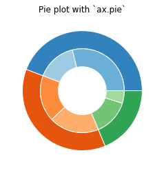

*****************
Matplotlib Charts
*****************

Bars
====
* used to display single values

.. code-block:: python

    x = [1,2,3]
    y = [4,5,6]

    plt.bar(x, y, label='Bars1')

.. code-block:: python

    x1 = [2,4,6,8,10]
    y1 = [6,7,8,2,4]

    x2 = [1,3,5,7,9]
    y2 = [7,8,2,4,2]

    plt.bar(x1, y1, label='Bars 1', color='blue')
    plt.bar(x2, y2, label='Bars 2', color='red')

    plt.xlabel('x')
    plt.ylabel('y')
    plt.title('This is my chart')
    plt.legend()
    plt.show()

.. figure:: img/matplotlib-plt-bars.png
    :scale: 100%
    :align: center

    Bars

Histogram
=========
* used to display number of elements in specific groups

.. code-block:: python

    ages = np.random.randint(size=50, low=0, high=130)

    # age groups
    bins = [0, 10, 20, 30, 40, 50, 60, 70, 80, 100, 110, 120, 130]

    plt.hist(ages, bins, histtype='bar', rwidth=0.8)

.. figure:: img/matplotlib-plt-hist.png
    :scale: 100%
    :align: center

    Histogram

Scatter plot
============
* Used to show correlation

.. code-block:: python

    x = [1,2,3,4,5,6,7,8]
    y = [4,7,6,2,7,4,5,2]

    plt.scatter(x, y)

.. code-block:: python

    x = [1,2,3,4,5,6,7,8]
    y = [4,7,6,2,7,4,5,2]

    plt.scatter(x, y, marker='*', color='red', s=500)   # ``s`` = size
    plt.scatter(y, x, marker='o', color='blue')

.. figure:: img/matplotlib-plt-scatter.png
    :scale: 100%
    :align: center

    Scatter plot

Stack plot
==========
* Display sections in whole group

.. code-block:: python

    days = [1, 2, 3, 4, 5]
    labels = ['To Do', 'In Progress', 'In Test', 'In Review', 'Done']

    # how many issues were in each status on given day
    todo = [10, 8, 6, 4, 2]
    in_progress = [2, 3, 4, 3, 2]
    in_test = [7, 8, 7, 2, 2]
    in_review = [8, 5, 7, 8, 1]
    done = [0, 2, 4, 6, 12]

    fig, ax = plt.subplots()
    ax.stackplot(days, todo,in_progress,in_test,in_review,done, labels=labels)
    ax.legend(loc='upper left')
    plt.show()

.. figure:: img/matplotlib-plt-stackplot.png
    :scale: 100%
    :align: center

    Stack plot

Pie chart
=========
* Display sections in whole group
* Automaticly calculate percentage
* optional features:

    * slice labels
    * auto-labeling the percentage
    * offsetting a slice with "explode"
    * drop-shadow
    * custom start angle

.. code-block:: python

    import matplotlib.pyplot as plt

    # Pie chart, where the slices will be ordered and plotted counter-clockwise:
    labels = 'Frogs', 'Hogs', 'Dogs', 'Logs'
    sizes = [15, 30, 45, 10]
    explode = (0, 0.1, 0, 0)  # only "explode" the 2nd slice (i.e. 'Hogs')

    fig1, ax1 = plt.subplots()

    ax1.pie(sizes,
            explode=explode,
            labels=labels,
            autopct='%1.1f%%',  # auto percentage
            shadow=True,
            startangle=90)  # at what angle first element starts

    ax1.axis('equal')  # Equal aspect ratio ensures that pie is drawn as a circle.
    plt.show()

.. figure:: img/matplotlib-plt-pie.png
    :scale: 100%
    :align: center

    Pie chart

Nested Pie Chart
================
.. code-block:: python

    fig, ax = plt.subplots()

    size = 0.3
    vals = np.array([[60., 32.], [37., 40.], [29., 10.]])

    cmap = plt.get_cmap("tab20c")
    outer_colors = cmap(np.arange(3)*4)
    inner_colors = cmap(np.array([1, 2, 5, 6, 9, 10]))

    ax.pie(vals.sum(axis=1), radius=1, colors=outer_colors,
           wedgeprops=dict(width=size, edgecolor='w'))

    ax.pie(vals.flatten(), radius=1-size, colors=inner_colors,
           wedgeprops=dict(width=size, edgecolor='w'))

    ax.set(aspect="equal", title='Pie plot with `ax.pie`')
    plt.show()

    Pie chart

3D
==

3D Sphere
---------
.. literalinclude:: src/matplotlib-3d-sphere.py
    :language: python
    :caption: 3D Sphere

3D Surface
----------
.. literalinclude:: src/matplotlib-3d-surface.py
    :language: python
    :caption: 3D Surface

Assignments
===========

Trigonometry
------------
#. Na jednym obrazku przedstaw przebiegi funkcji ``sin``, ``cos``, ``tan``
#. Oś x ma nazywać się jak funkcja
#. Tekst etykiety osi y ("Wartość funkcji") ma być inny dla każdej funkcji
#. Każdy z przebiegów ma być na innym subplot
#. Na drugim wykresie nałóż wszytkie przebiegi na jeden rysunek

Color graph
-----------
#. Dokonano pomiarów z urządzeń temperatury
#. Wygeneruj listę ``dict`` z datami z ostatniego miesiąca oraz wartością pomiarów losowo 10-15 plus szum na poziomie 0.5 stopnia celsiusza (wykrzystaj ``np.gauss()``)
#. Mając do dyspozycji szereg czasowy, gdzie dla każdego dnia wykonano pomiar temperatury
#. Przedstaw na wykresie dane szeregu czasowego
#. Oś z datami przedstaw przekrzywioną o 45 stopni
#. Na osi y przedstawiaj tylko pełne ``int``
#. Dodaj Colorbar ze skalą temperatur zimno-ciepło
#. Użyj kolorów niebieski (zimno), czerwony (ciepło)
#. Wykres ma mieć grid
