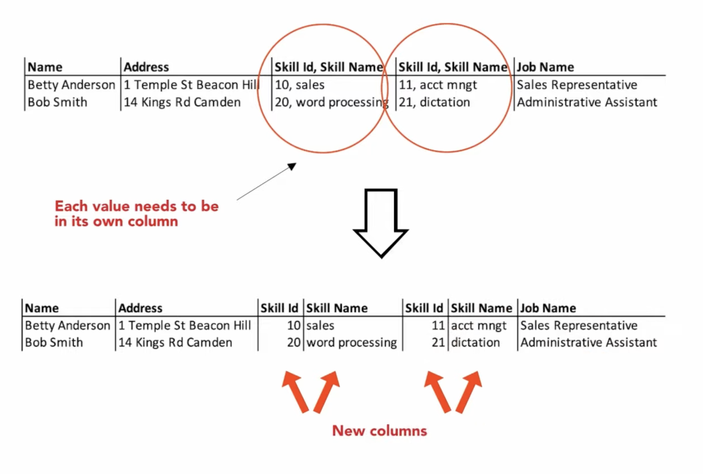
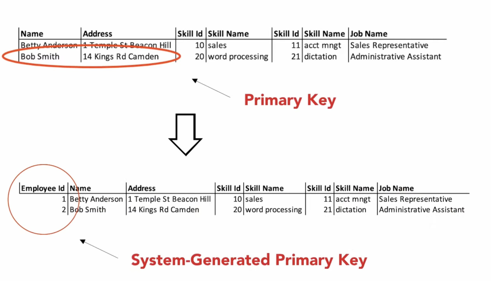
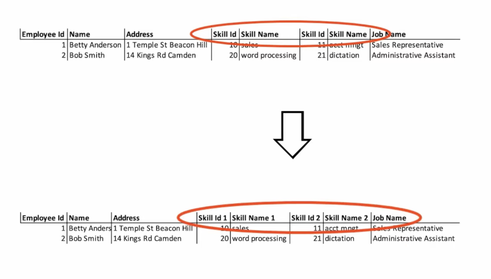
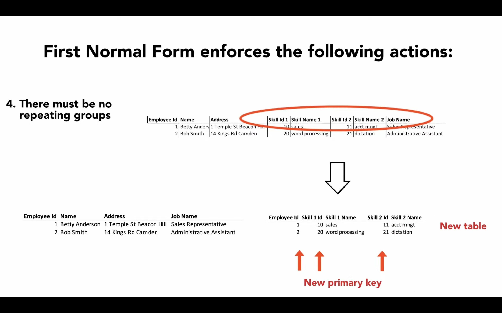
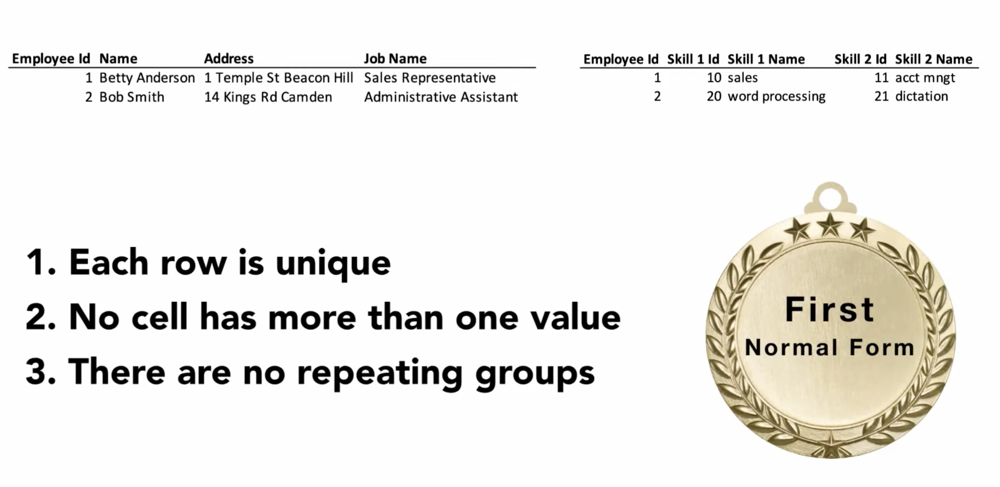

1st Normal Form
===============
* Atomic Values
* Unique Identifiers (rows uniquely identified by ``PRIMARY KEY``)
* Entries in a column are same type

1st Normal Form
---------------
* A cell must never contain more than one value
* Each row must be unique
* Each column name must be unique
* There must be no repeating groups

Atomic Values
-------------
* Cell with single values
* A cell must never contain more than one value
* Each value needs to be in its own column

.. csv-table:: Assignments (problem)
   :header: name, role

   Melissa Lewis, Commander
   Mark Watney, Botanist
   Rick Martinez, Pilot

Note that in this example astronaut's firstname and lastname is in the
same column (name).

.. csv-table:: Assignments (solution)
   :header: firstname, lastname, role

   Melissa, Lewis, Commander
   Mark, Watney, Botanist
   Rick, Martinez, Pilot

    A cell must never contain more than one value
    (each value needs to be in its own column)
    Image credits: [#Lowgren2021]_

Unique Rows
-----------
* Each row must be unique
* One column, or combination of columns must uniquely identify a row
* Also known as ``PRIMARY KEY``

.. csv-table:: assignments (problem)
   :header: firstname, lastname

   Melissa, Lewis
   Mark, Watney
   Mark, Watney

Note, that this in problematic example we can have duplicate names,
for example there could be more than one Mark Watney in the world.

.. csv-table:: assignments (solution)
   :header: id (PK), firstname, lastname

   1, Melissa, Lewis
   2, Mark, Watney
   3, Mark, Watney

Now, even if we have two Mark Watneys, each of them will have a unique
identifier (id).

    Each row must be unique (one column, or combination of columns must
    uniquely identify a row also known as ``PRIMARY KEY``).
    Image credits: [#Lowgren2021]_

Unique Column Names
-------------------
* Each Column Name Must be unique

.. csv-table:: assignments (problem)
   :header: name, year, name

   Melissa Lewis, 2035, Ares3
   Mark Watney, 2035, Ares3
   Rick Martinez, 2035, Ares3

Some column names are very (such as ``name``) to the point, that there
could be several independent columns which we can call by ``name``.
Each column should have unique name.

.. csv-table:: assignments (solution)
   :header: astronaut, year, mission

   Melissa Lewis, 2035, Ares3
   Mark Watney, 2035, Ares3
   Rick Martinez, 2035, Ares3

    Each column name must be unique. Image credits: [#Lowgren2021]_

No Repeating Groups
-------------------
* There must be no repeating groups

.. csv-table:: Assignments (problem)
   :header: astronaut, year1, mission1, year2, mission2

   Melissa Lewis, 2031, Ares1, 2035, Ares3
   Mark Watney, 2031, Ares1, 2035, Ares3
   Rick Martinez, 2031, Ares1, 2035, Ares3

    There must be no repeating groups. Image credits: [#Lowgren2021]_

Recap
-----

    If both Atomic Values and Unique Identifiers rules are applied
    the database achieved 1st Normal Form. Image credits: [#Lowgren2021]_

References
----------
.. [#Lowgren2021]
   Lowgren, Jesper.
   Database Normalization 1NF 2NF 3NF.
   Year: 2021.
   Retrieved: 2022-02-05.
   URL: https://www.youtube.com/watch?v=SK4H5tTT6-M
