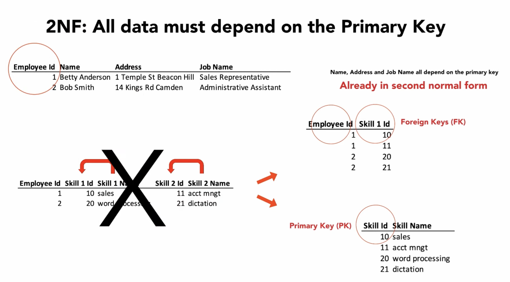

2nd Normal Form
===============
* All data must depend on the Primary Key
* All attributes (non-key columns) dependent on the key (PK)

Problem
-------
.. csv-table:: assignments
    :header: id (PK), firstname, lastname, year, mission

    1, Melissa, Lewis, 2035, Ares3
    2, Mark, Watney, 2035, Ares3
    3, Rick, Martinez, 2035, Ares3

Solution
--------
.. csv-table:: astronauts
    :header: id (PK), firstname, lastname

    1, Melissa, Lewis
    2, Mark, Watney
    3, Rick, Martinez

.. csv-table:: missions
    :header: id (PK), year, mission

    1, 2031, Ares1
    2, 2033, Ares2
    3, 2035, Ares3

.. csv-table:: assignments
    :header: id (PK), astronaut_id (FK), mission_id (FK)

    1, 1, 3
    1, 2, 3
    1, 3, 3

    All data must depend on the Primary Key.
    Image credit: [#Lowgren2021]_

Recap
-----
.. figure:: img/normalform-2nd-summary.png

    If all data depend on the Primary Key the database achieved
    2nd Normal Form.

References
----------
.. [#Lowgren2021]
   Lowgren, Jesper.
   Database Normalization 1NF 2NF 3NF.
   Year: 2021.
   Retrieved: 2022-02-05.
   URL: https://www.youtube.com/watch?v=SK4H5tTT6-M
