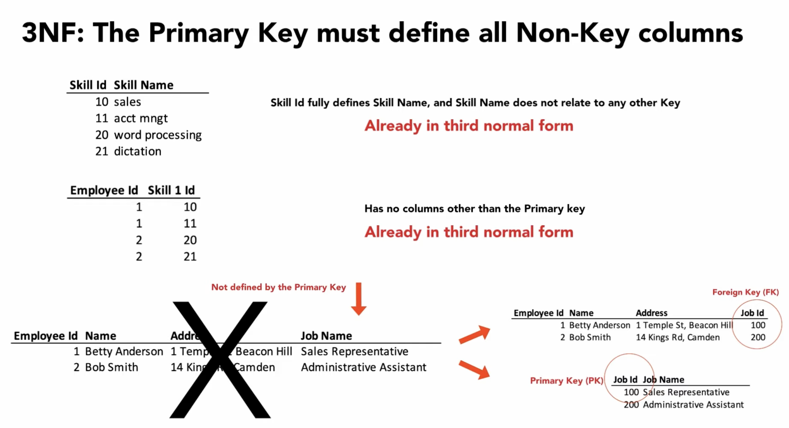
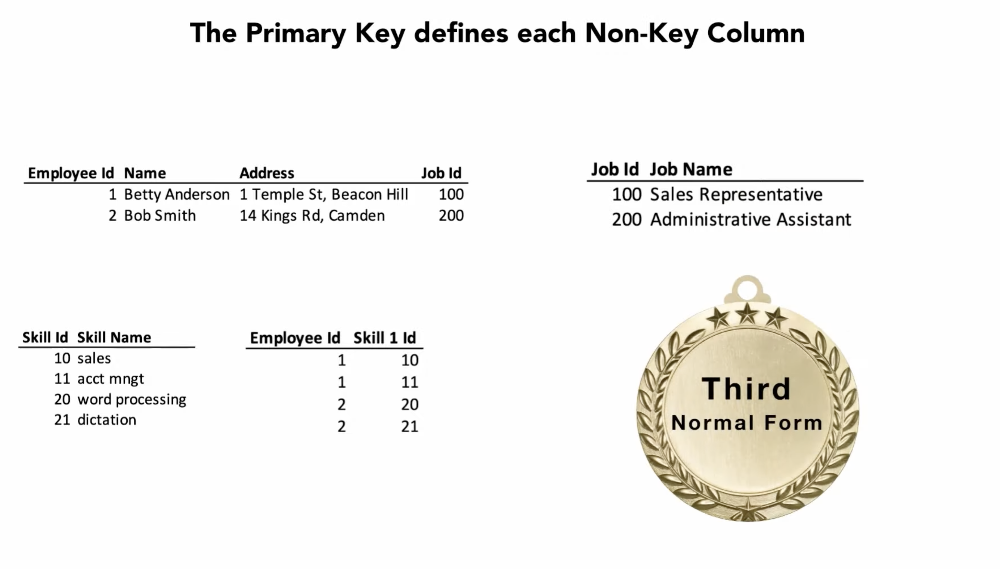

3rd Normal Form
===============
* The Primary Key must fully define all Non-Key columns
* Non-Key columns must not depend on any other Key
* All fields (columns) can be determined only by the key in the table and no other column

Problem
-------
.. csv-table:: assignments
    :header: id (PK), firstname, lastname, year, mission

    1, Melissa, Lewis, 2035, Ares3
    2, Mark, Watney, 2035, Ares3
    3, Rick, Martinez, 2035, Ares3

Note that pair (2035, Ares3) repeats several times. Knowing the mission
name we can determine the year. This should be replaced with a relation (FK)
to the database which would store this pair at given primary key. The
important fact here is that, if we want to change year of a Ares3 mission,
let say it was delayed due to the budget constraints, we have to change it
in several places. Leaving one record unmodified will lead to data
inconsistency.

Solution
--------
.. csv-table:: assignments
    :header: id (PK), firstname, lastname, mission_id (FK)

    1, Melissa, Lewis, 3
    2, Mark, Watney, 3
    3, Rick, Martinez, 3

.. csv-table:: missions
    :header: id (PK), year, mission

    1, 2031, Ares1
    2, 2032, Ares2
    3, 2035, Ares3

Now changing a year for a mission would result in changing it for all
astronauts.

    The Primary Key must fully define all Non-Key columns
    Image credit: [#Lowgren2021]_

Recap
-----

    If Primary Key fully defines all Non-Key columns and Non-Key columns
    does not depend on any other Key, the database achieved 3rd Normal Form.
    Image credit: [#Lowgren2021]_

References
----------
.. [#Lowgren2021]
   Lowgren, Jesper.
   Database Normalization 1NF 2NF 3NF.
   Year: 2021.
   Retrieved: 2022-02-05.
   URL: https://www.youtube.com/watch?v=SK4H5tTT6-M
