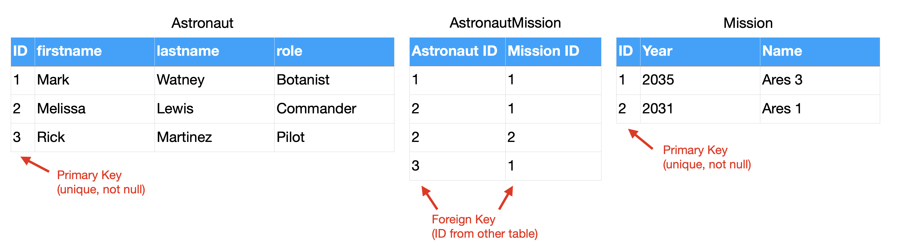

Theory Relations
================

.. glossary::

    relation
        In relational database theory, a relation, as originally defined by
        E. F. Codd, [#Codd1972]_ is a set of tuples (d1, d2, ..., dn), where
        each element dj is a member of Dj, a data domain. Codd's original
        definition notwithstanding, and contrary to the usual definition in
        mathematics, there is no ordering to the elements of the tuples of a
        relation. Instead, each element is termed an attribute value. An
        attribute is a name paired with a domain (nowadays more commonly
        referred to as a type or data type). An attribute value is an
        attribute name paired with an element of that attribute's domain,
        and a tuple is a set of attribute values in which no two distinct
        elements have the same name. Thus, in some accounts, a tuple is
        described as a function, mapping names to values.
        [#WikipediaRelation]_

    retention
        Data retention defines the policies of persistent data and records
        management for meeting legal and business data archival requirements.
        In the field of telecommunications, data retention generally refers
        to the storage of call detail records (CDRs) of telephony and
        internet traffic and transaction data (IPDRs) by governments and
        commercial organisations. In the case of government data retention,
        the data that is stored is usually of telephone calls made and
        received, emails sent and received, and websites visited. Location
        data is also collected. [#WikipediaDataRetention]_

    consistency
        Consistency (or Correctness) in database systems refers to the
        requirement that any given database transaction must change affected
        data only in allowed ways. Any data written to the database must be
        valid according to all defined rules, including constraints,
        cascades, triggers, and any combination thereof. This does not
        guarantee correctness of the transaction in all ways the application
        programmer might have wanted (that is the responsibility of
        application-level code) but merely that any programming errors
        cannot result in the violation of any defined database constraints.
        [#Date2012]_ [#WikipediaConsistency]_

    integrity
        Data integrity is the maintenance of, and the assurance of, data
        accuracy and consistency over its entire life-cycle and is a
        critical aspect to the design, implementation, and usage of any
        system that stores, processes, or retrieves data. The term is broad
        in scope and may have widely different meanings depending on the
        specific context – even under the same general umbrella of
        computing. It is at times used as a proxy term for data quality,
        while data validation is a prerequisite for data integrity. Data
        integrity is the opposite of data corruption. The overall intent of
        any data integrity technique is the same: ensure data is recorded
        exactly as intended (such as a database correctly rejecting mutually
        exclusive possibilities). Moreover, upon later retrieval, ensure the
        data is the same as when it was originally recorded. In short, data
        integrity aims to prevent unintentional changes to information. Data
        integrity is not to be confused with data security, the discipline
        of protecting data from unauthorized parties. [#Boritz2011]_
        [#WikipediaDataIntegrity]_

    DBA
        DataBase Administrator

Base
----
>>> from dataclasses import dataclass
>>>
>>>
>>> @dataclass
... class Astronaut:
...     firstname: str
...     lastname: str
>>>
>>>
>>> CREW = [
...     Astronaut('Mark', 'Watney'),
...     Astronaut('Melissa', 'Lewis'),
...     Astronaut('Rick', 'Martinez')]

.. figure:: img/oop-relations-base.png

Extend
------
>>> from dataclasses import dataclass
>>>
>>>
>>> @dataclass
... class Astronaut:
...     firstname: str
...     lastname: str
...     role: str
>>>
>>>
>>> CREW = [
...     Astronaut('Mark', 'Watney', 'Botanist'),
...     Astronaut('Melissa', 'Lewis', 'Commander'),
...     Astronaut('Rick', 'Martinez', 'Pilot')]

.. figure:: img/oop-relations-extend1.png

>>> from dataclasses import dataclass
>>>
>>>
>>> @dataclass
... class Astronaut:
...     firstname: str
...     lastname: str
...     role: str
...     mission_year: int
...     missions_name: str
>>>
>>>
>>> CREW = [
...     Astronaut('Mark', 'Watney', 'Botanist', 2035, 'Ares 3'),
...     Astronaut('Melissa', 'Lewis', 'Commander', 2035, 'Ares 3'),
...     Astronaut('Rick', 'Martinez', 'Pilot', 2035, 'Ares 3')]

.. figure:: img/oop-relations-extend2.png

Boolean Vector
--------------
>>> from dataclasses import dataclass
>>>
>>>
>>> @dataclass
... class Mission:
...     year: int
...     name: str
>>>
>>>
>>> @dataclass
... class Astronaut:
...     firstname: str
...     lastname: str
...     role: str
...     missions: list[Mission]
>>>
>>>
>>> CREW = [
...     Astronaut('Mark', 'Watney', 'Botanist', missions=[
...         Mission(2035, 'Ares 3')]),
...     Astronaut('Melissa', 'Lewis', 'Commander', missions=[
...         Mission(2035, 'Ares 3'),
...         Mission(2031, 'Ares 1')]),
...     Astronaut('Rick', 'Martinez', 'Pilot', missions=[])]

.. figure:: img/oop-relations-boolvector.png

FFill
-----
>>> from dataclasses import dataclass
>>>
>>>
>>> @dataclass
... class Mission:
...     year: int
...     name: str
>>>
>>>
>>> @dataclass
... class Astronaut:
...     firstname: str
...     lastname: str
...     role: str
...     missions: list[Mission]
>>>
>>>
>>> CREW = [
...     Astronaut('Mark', 'Watney', 'Botanist', missions=[
...         Mission(2035, 'Ares 3')]),
...     Astronaut('Melissa', 'Lewis', 'Commander', missions=[
...         Mission(2035, 'Ares 3'),
...         Mission(2031, 'Ares 1')]),
...     Astronaut('Rick', 'Martinez', 'Pilot', missions=[])]

.. figure:: img/oop-relations-ffill-empty.png
.. figure:: img/oop-relations-ffill-dash.png
.. figure:: img/oop-relations-ffill-duplicate.png
.. figure:: img/oop-relations-ffill-uniqid.png

Relations
---------
>>> from dataclasses import dataclass
>>>
>>>
>>> @dataclass
... class Mission:
...     year: int
...     name: str
>>>
>>>
>>> @dataclass
... class Astronaut:
...     firstname: str
...     lastname: str
...     role: str
...     missions: list[Mission]
>>>
>>>
>>> CREW = [
...     Astronaut('Mark', 'Watney', 'Botanist', missions=[
...         Mission(2035, 'Ares 3')]),
...     Astronaut('Melissa', 'Lewis', 'Commander', missions=[
...         Mission(2035, 'Ares 3'),
...         Mission(2031, 'Ares 1')]),
...     Astronaut('Rick', 'Martinez', 'Pilot', missions=[])]

.. figure:: img/oop-relations-rel-m2o.png

Serialization
-------------
>>> from dataclasses import dataclass
>>>
>>>
>>> @dataclass
... class Mission:
...     year: int
...     name: str
>>>
>>>
>>> @dataclass
... class Astronaut:
...     firstname: str
...     lastname: str
...     role: str
...     missions: list[Mission]
>>>
>>>
>>> CREW = [
...     Astronaut('Mark', 'Watney', 'Botanist', missions=[
...         Mission(2035, 'Ares 3')]),
...     Astronaut('Melissa', 'Lewis', 'Commander', missions=[
...         Mission(2035, 'Ares 3'),
...         Mission(2031, 'Ares 1')]),
...     Astronaut('Rick', 'Martinez', 'Pilot', missions=[])]

.. figure:: img/oop-relations-serialize-cls.png
.. figure:: img/oop-relations-serialize-obj.png
.. figure:: img/oop-relations-serialize-objattr.png
.. figure:: img/oop-relations-serialize-clsattr.png

Normal forms
------------
* UNF: Unnormalized form
* 1NF: First normal form
* 2NF: Second normal form
* 3NF: Third normal form
* EKNF: Elementary key normal form
* BCNF: Boyce–Codd normal form
* 4NF: Fourth normal form
* ETNF: Essential tuple normal form
* 5NF: Fifth normal form
* DKNF: Domain-key normal form
* 6NF: Sixth normal form

Recap
-----
* DBA and Programmers use different data format than Data Scientists
* Data Scientists prefer flat formats, without relations and joins
* DBA and Programmers prefer relational data
* For DBA and Programmers flat data formats represents data duplication
* Normalization make data manipulation more consistent
* Normalization uses less space and makes UPDATEs easier
* Normalization causes a lot of SELECT and JOINs, which requires computation
* In XXI century storage is cheap, computing power cost money
* Currently SELECTs are far more common than INSERTs and UPDATEs (let say
  80%-15%-5% - just a rough estimate, please don't quote this number)
* Normalization does not work at large (big-data) scale
* Big data requires simplified approach, and typically without any relations
* Data consistency then is achieved by business logic

References
----------
.. [#WikipediaDatabaseNormalization] Database normalization. https://en.wikipedia.org/wiki/Database_normalization
.. [#WikipediaSQL] SQL. Wikipedia. Year: 2021. Retrieved: 2021-12-16. URL: https://en.wikipedia.org/wiki/SQL
.. [#RFC6922] Shafranovich, Y. The application/sql Media Type. Internet Engineering Task Force (IETF). Retrieved: 2021-12-16. Year: 2013. URL: https://datatracker.ietf.org/doc/html/rfc6922
.. [#Codd1972] Codd, E. F. Further Normalization of the Data Base Relational Model. (Presented at Courant Computer Science Symposia Series 6, Data Base Systems, New York City, May 24–25, 1971.) IBM Research Report RJ909 (August 31, 1971). Republished in Randall J. Rustin (ed.), Data Base Systems: Courant Computer Science Symposia Series 6. Prentice-Hall, 1972.
.. [#WikipediaDataRetention] Data retention. Wikipedia. Year: 2021. Retrieved: 2021-12-16. URL: https://en.wikipedia.org/wiki/Data_retention
.. [#WikipediaRelation] Relation (database). Wikipedia. Year: 2021. Retrieved: 2021-12-16. URL: https://en.wikipedia.org/wiki/Relation_(database)
.. [#WikipediaConsistency] Consistency. Wikipedia. Year: 2021. Retrieved: 2021-12-16. URL: https://en.wikipedia.org/wiki/Consistency_(database_systems)
.. [#WikipediaDataIntegrity] Data Integrity.  Wikipedia. Year: 2021. Retrieved: 2021-12-16. URL: https://en.wikipedia.org/wiki/Data_integrity
.. [#Boritz2011] Boritz, J. IS Practitioners' Views on Core Concepts of Information Integrity. International Journal of Accounting Information Systems. Elsevier. Year: 2011. Retrieved: 2011-08-12.
.. [#Date2012] Date, C. J. SQL and Relational Theory: How to Write Accurate SQL Code 2nd edition, O'reilly Media, Inc., 2012, pg. 180.

Assignments
-----------
.. literalinclude:: assignments/oop_relations_a.py
    :caption: :download:`Solution <assignments/oop_relations_a.py>`
    :end-before: # Solution

.. literalinclude:: assignments/oop_relations_b.py
    :caption: :download:`Solution <assignments/oop_relations_b.py>`
    :end-before: # Solution

.. literalinclude:: assignments/oop_relations_c.py
    :caption: :download:`Solution <assignments/oop_relations_c.py>`
    :end-before: # Solution

.. literalinclude:: assignments/oop_relations_d.py
    :caption: :download:`Solution <assignments/oop_relations_d.py>`
    :end-before: # Solution

.. literalinclude:: assignments/oop_relations_e.py
    :caption: :download:`Solution <assignments/oop_relations_e.py>`
    :end-before: # Solution

.. literalinclude:: assignments/oop_relations_f.py
    :caption: :download:`Solution <assignments/oop_relations_f.py>`
    :end-before: # Solution
