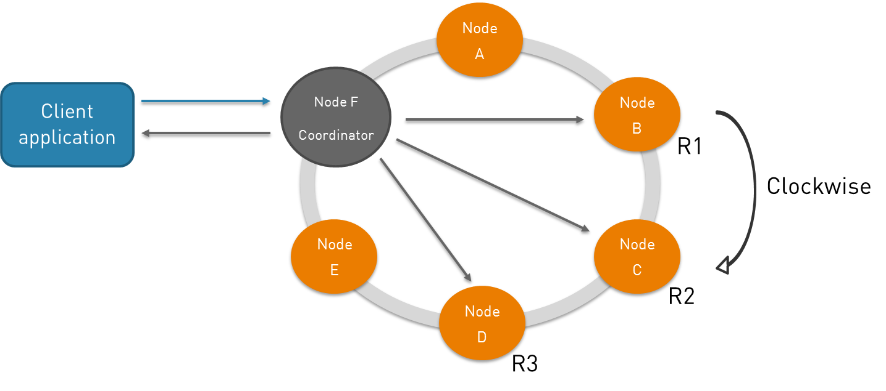
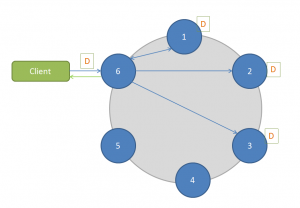
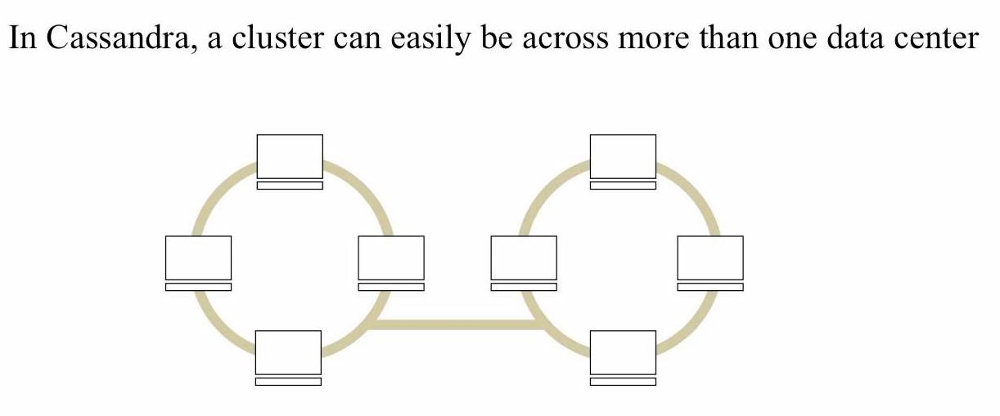

NoSQL Column-Oriented
=====================
* Amazon DynamoDB
* Apache Accumulo
* Azure Cosmos DB
* Bigtable
* Cassandra
* Druid
* Google Cloud Datastore
* HBase
* Hypertable
* ScyllaDB

Model
-----
.. figure:: img/nosql-column-cassandra-01.jpg

