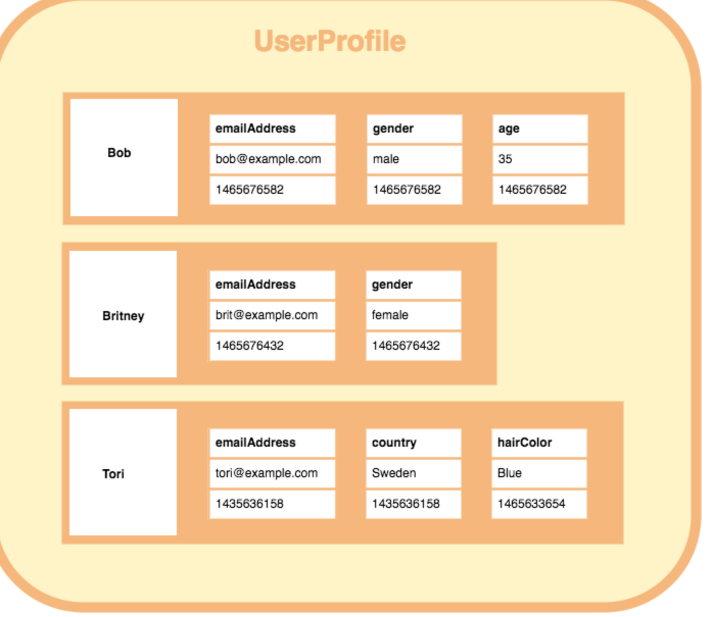

NoSQL Document
==============
* ArangoDB
* Azure Cosmos DB
* BaseX
* Clusterpoint
* CouchDB
* Couchbase
* DocumentDB
* Elasticsearch
* IBM Domino
* MarkLogic
* MongoDB
* OrientDB
* Qizx
* RethinkDB
* eXist-db

Model
-----

.. figure:: img/nosql-document-02.jpg

MongoDB
-------
* https://motor.readthedocs.io/en/stable/
* https://roman-right.github.io/beanie/tutorial/relations/
