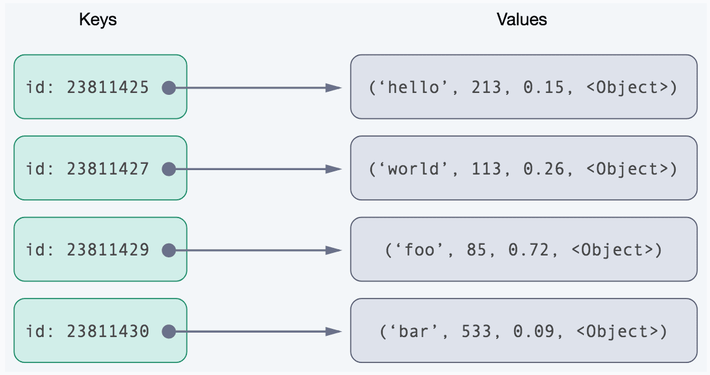

NoSQL Key-Value
===============
* Key–Value Store
* Key-Value Cache

Model
-----

Key–Value Store
---------------
* Aerospike
* Amazon DynamoDB
* ArangoDB
* Azure Cosmos DB
* BigTable
* Couchbase
* FoundationDB
* InfinityDB
* LMDB
* LocalStorage (web browser + JS)
* MemcacheDB
* Oracle NoSQL Database
* Project Voldemort
* Redis
* Riak
* SessionStorage (web browser + JS)
* Voldemort

Key-Value Cache
---------------
* Apache Ignite
* Coherence
* Couchbase
* Hazelcast
* Infinispan
* Memcached
* Oracle Coherence
* Redis
* Velocity
* eXtreme Scale
