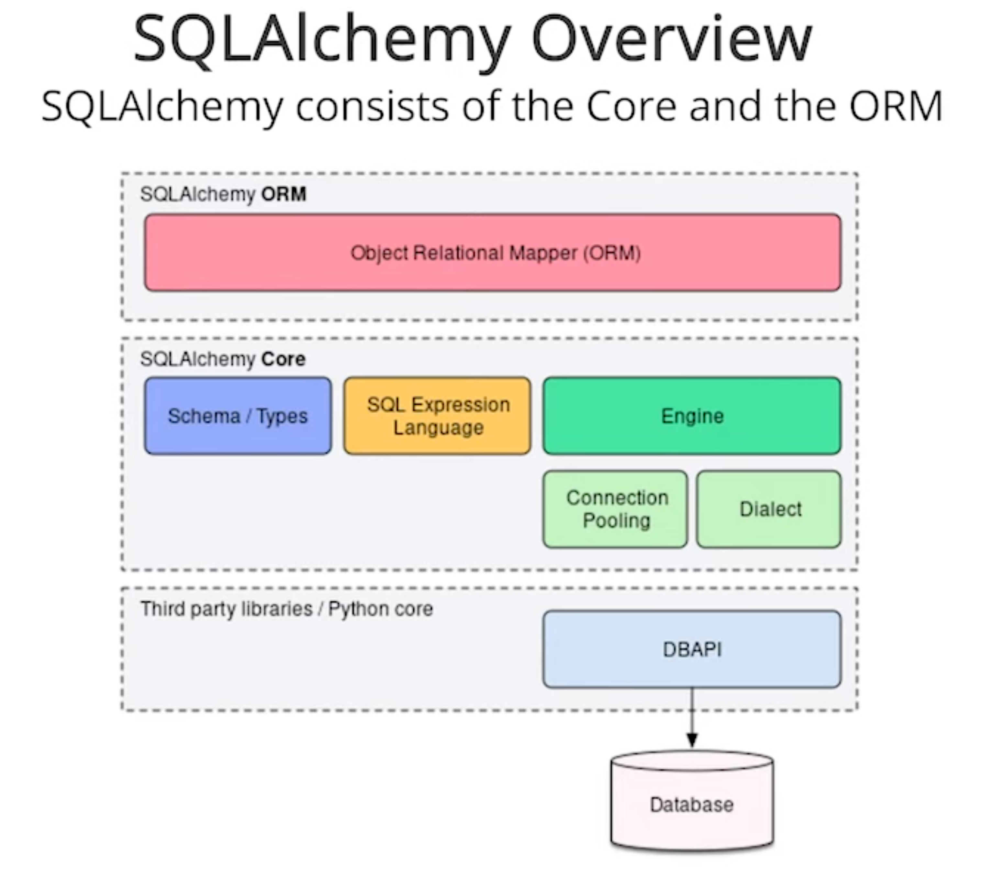
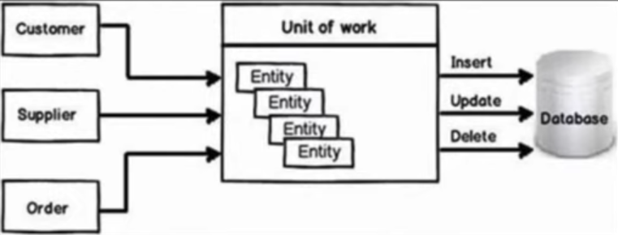

SQLAlchemy About
================

.. epigraph::

    It's not because you don't know how to write the query,
    it is because at the large scale you have to automate.
    It is about scaling up something which is very repetitive to do it by hand.

    -- Mike Bayer, SQLAlchemy creator [#ytSQLAlchemy20TalkPython]_

Rationale
---------
* Converts Python objects to database rows
* Converts database rows to Python objects
* Provides abstraction over database layer
* Allows for object like interaction with database
* Provides ability to migrate database schema
* Most frequently used database ORM in Python [#PythonDeveloperSurvey2020]_

ORM Pros
--------
* Support for database switching with minimal effort
* Refactoring support (embedded SQL is not easily refactorable)
* 1-to-1 relation of Python class to database table
* Historical migration and change history

ORM Cons
--------
* Some queries could be

Database Support
----------------
* SQLite3
* PostgreSQL
* Oracle
* MySQL
* MSSQL

Installation
------------
.. code-block:: console

    $ pip install sqlalchemy

>>> import sqlalchemy
>>>
>>>
>>> sqlalchemy.__version__ > '1.4'
True

Architecture
------------
* Core
* ORM
* Plugin structure with injection points

    SQLAlchemy architecture [#ytSQLAlchemy20]_

.. figure:: img/sqlalchemy-onion.png

    SQLAlchemy onion chart depicts layers [#ytSQLAlchemy20]_

    Unit of Work design pattern [#Laskar2021]_

.. figure:: img/sqlalchemy-architecture-unitofwork-2.png

    Unit of Work design pattern [#Phan2019]_

1.x vs 2.x
----------
* ``future=True`` flag to ``create_engine()``

For SQLAlchemy 1.4, the ``RemovedIn20Warning`` deprecation class is emitted
only when an environment variable ``SQLALCHEMY_WARN_20`` is set to either of
``true`` or ``1``.

.. code-block:: console

    SQLALCHEMY_WARN_20=1 python -W always::DeprecationWarning myfile.py

Good Practices
--------------
* Project Structure
* What is the SQLAlchemy project layout
* Where to store configuration (host, port, schema, username, password)

Alternatives
------------
* SQLModel [#SQLModel]_
* Django ORM [#DjangoORM]_
* Raw SQL
* SQLObject
* Peewee
* Tortoise ORM
* PonyORM
* Dejavu

.. figure:: img/sqlalchemy-about-alternatives.png

    ORM software popularity in Python community [#PythonDeveloperSurvey2020]_

.. figure:: img/sqlalchemy-about-databases.png

    Database popularity in Python community [#PythonDeveloperSurvey2020]_

Extensions
----------
Schema Migration:

    * https://alembic.sqlalchemy.org

Database rows versioning:

    * https://sqlalchemy-continuum.readthedocs.io/

Further Reading
---------------
* https://github.com/dahlia/awesome-sqlalchemy

References
----------
.. [#ytSQLAlchemy20] Bayer, Mike. SQLAlchemy 2.0 - The One-Point-Four-Ening 2021. Year: 2022. Retrieved: 2022-01-26. URL: https://www.youtube.com/watch?v=1Va493SMTcY
.. [#ytSQLAlchemy20TalkPython] Kennedy, Michael and Bayer, Mike. Year: 2021. Retrieved: 2022-01-30. URL: https://www.youtube.com/watch?v=q5Iv6RUxKC8
.. [#PythonDeveloperSurvey2020] JetBrains s.r.o. https://www.jetbrains.com/lp/python-developers-survey-2020/#FrameworksLibraries
.. [#SQLModel] https://sqlmodel.tiangolo.com
.. [#DjangoORM] https://docs.djangoproject.com/en/stable/topics/db/
.. [#Phan2019] Phan, Manh. Unit of Work Pattern. Year: 2019. Retrieved: 2022-01-30. URL: https://ducmanhphan.github.io/
.. [#Laskar2021] Ashif Iqbal Laskar. Unit-of-Work-Design-Pattern. Year: 2021. Retrieved: 2022-01-30. URL: http://www.ashifiqbal.com/technology/entity-framework/unit-of-work-design-pattern/
