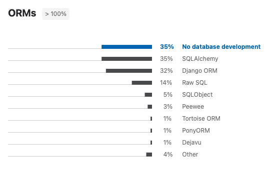
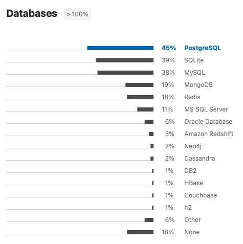

SQLAlchemy Extensions
=====================

Schema Versioning
-----------------
* Alembic [#docsAlembic]_
* Alembic-utils

Data Versioning
---------------
* Papertrail
* Sqlalchemy-continuum [#docsSqlalchemyContinuum]_

Data Types
----------
* sqlalchemy-enum (Enum support is already in SQLAlchemy)

Forms
-----
* formalchemy

GIS and Spacial Data
--------------------
* GeoAlchemy
* GeoAlchemy2

Profiling
---------
* SQLtap
* nplusone

Further Reading
---------------
* https://github.com/dahlia/awesome-sqlalchemy

Alternative ORMs
----------------
* Django ORM + Django Migrations [#DjangoORM]_
* SQLModel [#SQLModel]_
* Raw SQL
* SQLObject
* Peewee
* Tortoise ORM
* PonyORM
* Dejavu

    ORM software popularity in Python community [#PythonDeveloperSurvey2020]_

    Database popularity in Python community [#PythonDeveloperSurvey2020]_

References
----------
.. [#SQLModel] https://sqlmodel.tiangolo.com
.. [#DjangoORM] https://docs.djangoproject.com/en/stable/topics/db/
.. [#docsAlembic] https://alembic.sqlalchemy.org
.. [#docsSqlalchemyContinuum] https://sqlalchemy-continuum.readthedocs.io/
