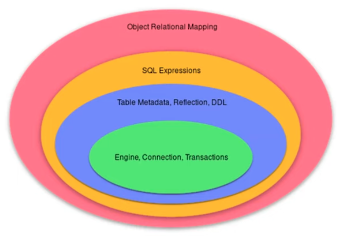
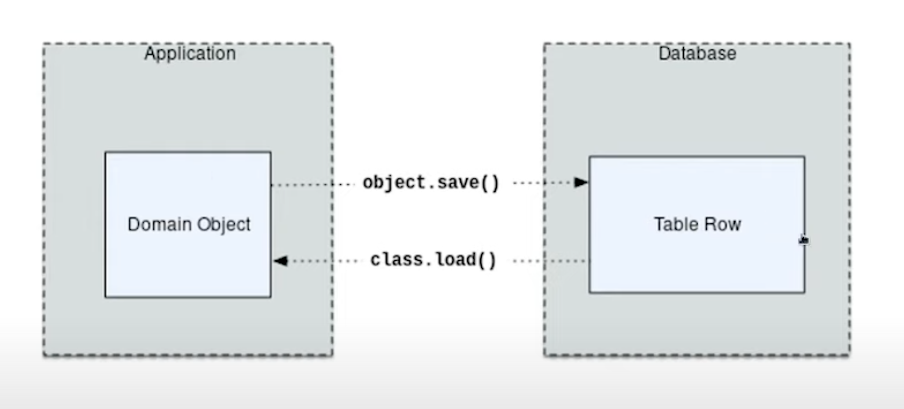
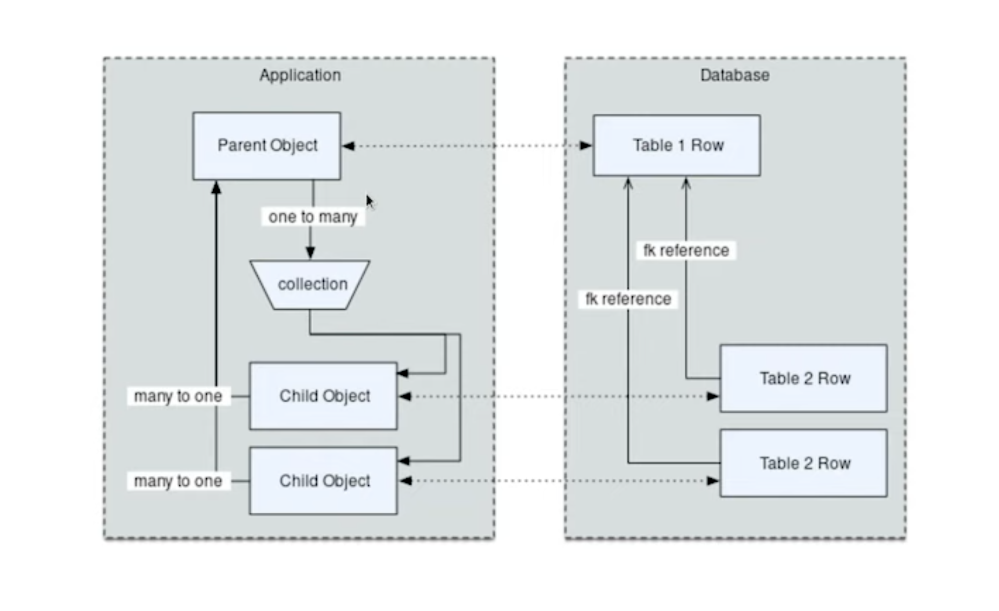

.. testsetup::

    # doctest: +SKIP_FILE

ORM About
=========
* ORM - Object Relational Mapping
* Process of associating object oriented classes with database tables
* Set of object oriented classes is a domain model (business model)
* The most basic task is to translate between domain object and a table row
* Any tool which takes database row and converts this to an object is an ORM
* ORM represents basic compositions: one-to-many, many-to-one using foreign key
* ORM allows to querying the database in terms of the domain model structure
* Some ORM can represent class inheritance hierarchies using variety of schemes
* Some ORMs can handle 'sharding' of data, i.e. storing a domain model across multiple schemas or databases
* Provide various patterns for concurrency, including row versioning
* Provide patterns for data validation and coercion

Source: [#ytSQLAlchemy20]_

Flavors
-------
* Active Record or Data Mapper
* Declarative or Imperative style configuration

Active Record
-------------
* Active Record has domain objects handle their own persistence
* Every object is a row in a table
* Notion of objects working in a transaction is a secondary notion

Create an object:

>>> # doctest: +SKIP
... astro = Astronaut(firstname='Mark', lastname='Watney')
... astro.save()

Usage:

>>> # doctest: +SKIP
... astro = User.query(firstname='Mark', lastname='Watney').fetch()
... astro.firstname = 'Melissa'
... astro.lastname = 'Lewis'
... astro.save()

Data Mapper
-----------
* Tries to keep the details of persistence separate from the object being persisted
* It is more explicit
* Does not use globals and threaded locals
* Always create connection, transaction and explicitly say when to commit

Create an object:

>>> # doctest: +SKIP
... with Session.begin() as session:
...     astro = Astronaut(firstname='Mark', lastname='Watney')
...     session.add(astro)

Usage:

>>> # doctest: +SKIP
... query = (
...     select(Astronaut).
...     where(Astronaut.firstname == 'Mark').
...     where(Astronaut.lastname == 'Watney').
...     scalars().
...     first())
...
... with Session.begin() as session:
...     astro = session.execute()
...     astro.firstname = 'Melissa'
...     astro.lastname = 'Lewis'

Declarative Style Configuration
-------------------------------
* Classes and attributes
* Attributes names columns in a database

ORMs may also provide different configuration patterns. Most use an
'all-at-once' style where class and table information is together. SQLAlchemy
calls this *declarative style* [#ytSQLAlchemy20]_.

>>> # doctest: +SKIP
... class Astronaut(Base):
...     __tablename__ = 'astronaut'
...     id = Column(Integer, primary_key=True)
...     firstname = Column(String(length=100))
...     lastname = Column(String(length=100))
...
...
... class Mission(Base):
...     __tablename__ = 'mission'
...     id = Column(Integer, primary_key=True)
...     astronaut_id = Column(ForeignKey('astronaut.id'))
...     year = Column(Integer, nullable=False)
...     name = Column(String(length=50), nullable=False)

Imperative Style Configuration
------------------------------
* There was a plan to remove Imperative Style from SQLAlchemy 2.0, but stayed
* The class is not completely agnostic, because mapper heavily influence design

This other way is to keep the declaration of domain model and table metadata
separate. SQLAlchemy calls this *imperative style* [#ytSQLAlchemy20]_.

Class is declared without any awareness of database:

>>> # doctest: +SKIP
... class Astronaut:
...     def __init__(self, firstname, lastname):
...         self.firstname = firstname
...         self.lastname = lastname

Then it is associated with a database table:

>>> # doctest: +SKIP
... registry.mapper(
...     Astronaut,
...     Table('astronaut', metadata,
...         Column('id', Integer, primary_key=True),
...         Column('firstname', String(50)),
...         Column('lastname', String(50)),
...     )
... )

SQLAlchemy ORM
--------------
* SQLAlchemy ORM is essentially a data mapper style ORM
* Most users use declarative configuration style
* Imperative style and a range of variants in between are supported as well
* Extends SQLAlchemy Core, in particular extending the SQL Expression language
* Designed to work with domain classes as well as table constructs
* Key features: Unit of Work, Identity Map, Lazy / Eager loading
* Unit of Work - accumulates INSERT/UPDATE/DELETE statements and transparently sends it to the database in batch
* Identity Map - objects are kept unique in memory based on their primary key identity
* Lazy / Eager loading - related attributes and collections can be loaded either on-demand (lazy) or upfront (eager)
* Source: [#ytSQLAlchemy20]_

ORM
---
* SQLAlchemy mappings in 1.4/2.0 start with a central object known as 'registry'
* Has a collection of metadata inside it
* Traditional Declarative Base uses Python metaclass
* This gets in a way, when you want to uses metaclass on your own
* In such case you can use mapper registry decorator

Using the registry, we can map classes in various ways, below illustrated
using its 'mapped' decorator. In this form, we arrange class attributes in
terms of ``Column`` objects to be mapped to a ``Table``, which is named based
on attribute ``__tablename__`` [#ytSQLAlchemy20]_.

First create an instance of a Mapper Registry object:

>>> from sqlalchemy.orm import registry
>>>
>>> mapper_registry = registry()

The Mapper object mediates the relationship between model and a ``Table``
object. This mapper is generally behind the scence and accessible.

Then specify the class using mapper registry decorator:

>>> from sqlalchemy import Column, Integer, String
>>> from sqlalchemy.orm import registry
>>>
>>>
>>> Models = registry()
>>>
>>> @Models.mapped
... class Astronaut:
...     __tablename__ = 'astronaut'
...     id = Column(Integer, primary_key=True)
...     firstname = Column(String(length=100))
...     lastname = Column(String(length=100))
...
...     def __repr__(self):
...         firstname = self.firstname
...         lastname = self.lastname
...         return f'Astronaut({firstname=}, {lastname=})'

The ``Astronaut`` class has now a ``Table`` object associated with it.

>>> Astronaut.__table__
Table('astronaut', MetaData(), Column('id', Integer(), table=<astronaut>, primary_key=True, nullable=False), Column('firstname', String(length=100), table=<astronaut>), Column('lastname', String(length=100), table=<astronaut>), schema=None)

>>> from sqlalchemy import select
>>>
>>>
>>> query = select(Astronaut)
>>>
>>> print(query)
SELECT astronaut.id, astronaut.firstname, astronaut.lastname
FROM astronaut

If you do not specify the constructor, it will be automatically generated
for you based on the attributes (id, firstname, lastname) making them
an optional keyword parameters. All parameters are optional, because some of
them can be autogenerated, for example: ``id`` [#ytSQLAlchemy20]_.

>>> astro = Astronaut(firstname='Mark', lastname='Watney')
>>> astro
Astronaut(firstname='Mark', lastname='Watney')

Using our registry (``Models``), we can create a database schema for this
class using a ``MetaData`` object that is path of the registry:

>>> from sqlalchemy import create_engine
>>>
>>>
>>> engine = create_engine('sqlite:///:memory:')
>>>
>>> with engine.begin() as db:
...     Models.metadata.create_all(db)

To persists and load ``Astronaut`` objects from the database, we use a
``Session`` object, illustrated here from a factory called ``sessionmaker``.
The ``Session`` objects makes use of a connection factory (i.e. an ``Engine``)
and will handle the job of connecting, committing and releasing connections
to this engine. Flag ``future=True`` in SQLAlchemy 1.4 will turn on 2.0
compatibility mode. This behavior will be default in 2.0 and flag will be
deprecated.

>>> from sqlalchemy.orm import sessionmaker
>>>
>>>
>>> Session = sessionmaker(bind=engine, future=True)
>>> session = Session()

Creating a session does not implies connection. This is done lazily and
will simply create an object and do nothing. Sessions will always delay
database connection to the last possible moment, but it will also ensure
that this will eventually happen.

Object Statuses
---------------
* Transient - object created, but not yet added to the session
* Pending - object added to a session but not yet stored in database
* Persistent - represent an active row in a database (object is stored)
* Detached
* Pending Delete

Adding Objects
--------------
Let's create an transient object (object not yet added to the session):

>>> astro = Astronaut(firstname='Mark', lastname='Watney')

New objects are placed into the Session using ``add()``

>>> session.add(astro)

This did not modify the database, however the object is now known as 'pending'.
We can see the 'pending' objects by looking at the ``session.new`` attribute.

>>> session.new
IdentitySet([Astronaut(firstname='Mark', lastname='Watney')])

We can now query for this 'pending' row, by emitting a ``SELECT`` statement
that will refer to ``Astronaut`` entities. This will first ``autoflush`` the
pending changes, then ``SELECT`` the row we requested.

>>> from sqlalchemy import select
>>>
>>>
>>> query = (
...     select(Astronaut).
...     where(firstname=='Mark'))
>>>
>>> result = session.execute(query)

Session will autoflush before making queries, that is it will store all the
pending objects before querying it. Session will delay this to the last
possible moment. You can turn this behavior off by specifying a keyword
argument ``autoflush=False`` to the ``sessionmaker`` factory.

We can get the data back from the result, in this case using the ``.scalar()``
method which will return the first column of the first row.

>>> mark = result.scalar()
>>> mark
Astronaut(firstname='Mark', lastname='Watney')

The ``Astronaut`` object we've inserted now has a value for ``.id`` attribute.

>>> mark.id
1

The ``Session`` maintains a 'unique' object per identity. So ``astro`` and
``mark`` are the same object.

>>> mark is astro
True

Identity Map - if you query the database table for the object with for example
``id==1`` you will get the same object every time, as long as this object is
in the memory. We can look at it on the ``Session``.

>>> session.identity_map.items()
[((__main__.Astronaut, (1,), None), Astronaut(firstname='Mark', lastname='Watney'))]

Making Changes
--------------
* Add more objects to be pending for flush
* ``.add_all()`` is the same as ``.add()``, but adds a list of objects

>>> session.add_all([
...     Astronaut(firstname='Melissa', lastname='Lewis'),
...     Astronaut(firstname='Rick', lastname='Martinez'),
... ])

Modify ``astro`` - the object is now marked as 'dirty'

>>> astro.firstname = 'Alex'
>>> astro.lastname = 'Vogel'

Nothing changed and no actions were performed to the database yet. If you
inspect database current transactions you will have an open transaction
process currently in progress.

The ``Session`` can us which objects are dirty:

>>> session.dirty
IdentitySet([Astronaut(firstname='Alex', lastname='Vogel')])

And can also tell us which objects are pending:

>>> session.new
IdentitySet([Astronaut(firstname='Melissa', lastname='Lewis'), Astronaut(firstname='Rick', lastname='Martinez')])

The whole transaction is committed. Commit always triggers a final flush of
remaining changes. Commit will expire objects. This is due to the fact, that
as soon as data is out there (in database), some other transactions could
have already change the data. You can change this behavior by setting the
``expire_on_commit=False`` parameter to the ``sessionmaker`` factory.

>>> session.commit()

After a commit, there's no transaction. The ``Session`` 'invalidates' all
data, so that accessing them will automatically start a 'new' transaction
and re-load from the database. This is our first example of the ORM 'lazy
loading' pattern.

>>> astro.firstname

Rolling Back Changes
--------------------
Make another 'dirty' change, and another 'pending' change, that we might
change or minds about.

>>> astro.firstname = 'Beth'
>>> astro.lastname = 'Johanssen'
>>>
>>> chris = Astronaut(firstname='Chris', lastname='Beck')
>>> session.add(chris)

Run a query, our changes are flushed; results come back.

>>> query = (
...     select(Astronaut).
...     where(Astronaut.firstname.in_(['Beth', 'Chris'])))
>>>
>>> result = session.execute(query)
>>> result.all()

Those changes are not yet in the database. The transaction was not committed
yet. Therefore if your database will be restarted you will loose those
information, unless non-default transaction durability options are set in
the database configuration.

But we're inside of a transaction. Roll it back:

>>> session.rollback()

All updates and inserts are gone, and all pending objects are evicted. Again,
the transaction is over, objects are expired. Accessing an attribute refreshes
the object and the ``astro`` firstname is gone [#ytSQLAlchemy20]_.

>>> astro in session
False

And the data is gone from database too.

>>> query = (
...     select(Astronaut).
...     where(Astronaut.firstname.in_(['Beth', 'Chris'])))
>>>
>>> result = session.execute(query)
>>> result.all()
[]

ORM Querying
------------
The attributes on our mapped classes act like ``Column`` objects, and produce
SQL expressions [#ytSQLAlchemy20]_.

>>> expression = (Astronaut.firstname == 'Mark')
>>>
>>> print(expression)
astronaut.firstname = :firstname_1

>>> expression = Astronaut.__table__.c.firstname == 'Mark'
>>>
>>> print(expression)
astronaut.firstname = :firstname_1

Fot the above example, although output is similar, they produce a different
objects.

When ORM-specific expressions are used with ``select()``, the ``Select``
construct itself takes an ORM-enabled features, the most basic of which is
that it can discern between selecting from 'columns' vs 'entities'. Below
the ``SELECT`` is to return rows that contain a single element, which would
be an instance of ``Astronaut``. This is translated from the actual ``SELECT``
sent to the database that ``SELECTs`` for the individual columns of the
``Astronaut`` entity [#ytSQLAlchemy20]_.

>>> query = (
...     select(Astronaut).
...     where(Astronaut.firstname == 'Mark').
...     order_by(Astronaut.id))

Introspection:

>>> query._raw_columns[0]
Table('astronaut', MetaData(), Column('id', Integer(), table=<astronaut>, primary_key=True, nullable=False), Column('firstname', String(length=100), table=<astronaut>), Column('lastname', String(length=100), table=<astronaut>), schema=None)
>>>
>>> query._raw_columns[0]._annotations  # doctest: +ELLIPSIS
immutabledict({'entity_namespace': <Mapper at 0x11bc942b0; Astronaut>, 'parententity': <Mapper at 0x...; Astronaut>, 'parentmapper': <Mapper at 0x...; Astronaut>})

The rows we get back from ``Session.execute()`` then contain ``Astronaut``
objects as the first element in each row [#ytSQLAlchemy20]_.

>>> result = session.execute(query)
>>>
>>> for row in result:
...     print(row)
...
(Astronaut(firstname='Mark', lastname='Watney'),)

As it is typically convenient for rows that only have a single element to be
delivered as the element alone, we can use the ``.scalars()`` method of
``Result`` as we did earlier to return just the first column of each row
[#ytSQLAlchemy20]_.

>>> result = session.execute(query)
>>>
>>> for row in result.scalars():
...     print(row)
...
Astronaut(firstname='Mark', lastname='Watney')

We can also qualify the rows we want to get back with methods like ``.one()``
[#ytSQLAlchemy20]_:

>>> result = session.execute(query)
>>> astro = result.scalars().one()
>>>
>>> print(astro)
Astronaut(firstname='Mark', lastname='Watney')

An ORM query can make use of any combination of columns and entities. To
request the fields of ``Astronaut`` separately, we name them separately in the
columns clause [#ytSQLAlchemy20]_.

>>> query = select(Astronaut.firstname, Astronaut.lastname)
>>> result = session.execute(query)
>>>
>>> for row in result:
...     print(f'{row.firstname}, {row.lastname}')
...
Mark, Watney
Melissa, Lewis
Rick, Martinez

>>> query = select(Astronaut.firstname, Astronaut.lastname)
>>> result = session.execute(query)
>>>
>>> for firstname, lastname in result:
...     print(f'{firstname=}, {lastname=}')
...
firstname='Mark', lastname='Watney'
firstname='Melissa', lastname='Lewis'
firstname='Rick', lastname='Martinez'

You can combine 'entities' and columns together:

>>> query = select(Astronaut, Astronaut.firstname)
>>> result = session.execute(query)
>>>
>>> for row in result:
...     print(f'{row.Astronaut.id}, {row.firstname}, {row.Astronaut.lastname}')
...
1, Mark, Watney
2, Melissa, Lewis
3, Rick, Martinez

The ``WHERE`` clause is either by ``.filter_by()``, which is convenient:

>>> query = (
...     select(Astronaut.firstname, Astronaut.lastname).
...     filter_by(firstname='Mark'))
>>>
>>> result = session.execute(query)
>>>
>>> for firstname, lastname in result:
...     print(f'{firstname=}, {lastname=}')
...
firstname='Mark', lastname='Watney'

Or ``where()`` for more explicitness:

>>> query = (
...     select(Astronaut).
...     where(Astronaut.firstname == 'Mark').
...     where(Astronaut.lastname == 'Watney'))
>>>
>>> result = session.execute(query)
>>>
>>> for row in result.scalars():
...     print(f'{firstname=}, {lastname=}')
...
firstname='Mark', lastname='Watney'

Relationships, Joins
--------------------
Start with the same mapping as before. Except we will also give it a
*one-to-many* relationship to a second entity.

>>> from sqlalchemy import ForeignKey, Column, Integer, String
>>> from sqlalchemy.orm import registry, relationship
>>>
>>>
>>> Models = registry()
>>>
>>> @Models.mapped
... class Astronaut:
...     __tablename__ = 'astronaut'
...     id = Column(Integer, primary_key=True)
...     firstname = Column(String(length=100))
...     lastname = Column(String(length=100))
...     missions = relationship('Mission', back_populates='astronaut')
...
...     def __repr__(self):
...         firstname = self.firstname
...         lastname = self.lastname
...         return f'Astronaut({firstname=}, {lastname=})'
>>>
>>>
>>> @Models.mapped
... class Mission:
...     __tablename__ = 'mission'
...     id = Column(Integer, primary_key=True)
...     astronaut_id = Column(ForeignKey('astronaut.id'))
...     year = Column(Integer, nullable=False)
...     name = Column(String(length=50), nullable=False)
...     astronaut = relationship('Astronaut', back_populates='missions')
...
...     def __repr__(self):
...         year = self.year
...         name = self.name
...         return f'Mission({year=}, {name=})'

For the other end of one-to-many, create another mapped class with a
``ForeignKey`` referring back to ``Astronaut``. ``ForeignKey`` field is a
SQLAlchemy core's thing and ``relationship`` field is for ORM's. Note, that
it is not needed to specify type of the relationship (one-to-many, many-to-one,
or many-to-many) as of ``relationship()`` will infer this by the column type
(``ForeignKey`` -> one-to-many) [#ytSQLAlchemy20]_.

Create tables

>>> from sqlalchemy import create_engine
>>>
>>>
>>> engine = create_engine('sqlite:///:memory:')
>>>
>>> with engine.begin() as db:
...     Models.metadata.create_all(db)

Will produce:

.. code-block:: sql

    BEGIN
    PRAGMA main.table_info("astronaut")
    PRAGMA temp.table_info("astronaut")
    PRAGMA main.table_info("mission")
    PRAGMA temp.table_info("mission")

    CREATE TABLE astronaut (
        id INTEGER NOT NULL,
        firstname VARCHAR(100),
        lastname VARCHAR(100),
        PRIMARY KEY (id)
    )

    CREATE TABLE mission (
        id INTEGER NOT NULL,
        astronaut_id INTEGER,
        year INTEGER NOT NULL,
        name VARCHAR(50) NOT NULL,
        PRIMARY KEY (id),
        FOREIGN KEY(astronaut_id) REFERENCES astronaut (id)
    )
    COMMIT

Insert data in the ``Astronaut`` table. Here we illustrate the ``sessionmaker``
factory as a transactional context manager [#ytSQLAlchemy20]_:

>>> from sqlalchemy.orm import sessionmaker
>>>
>>>
>>> Session = sessionmaker(bind=engine, future=True)
>>>
>>> with Session.begin() as  session:
...     session.add_all([
...         Astronaut(firstname='Mark', lastname='Watney'),
...         Astronaut(firstname='Melissa', lastname='Lewis'),
...         Astronaut(firstname='Rick', lastname='Martinez'),
...     ])

1.4/2.0 tries to make more consistent. ``Session.begin()`` is analogous to
``Engine.begin()``. Sessionmaker is analogous to core engine. And the session
itself is analogous to core connection.

A new ``Astronaut`` object also gains an empty ``missions`` collection now.

>>> alex = Astronaut(firstname='Alex', lastname='Vogel')
>>> alex.missions
[]

Populate this collection with new Address objects.

>>> alex.missions = [
...     Mission(year=2030, name='Ares1'),
...     Mission(year=2035, name='Ares3'),
... ]

'Back populates' sets up ``Mission.astronaut`` for each ``Astronaut.mission``

>>> alex
Astronaut(firstname='Alex', lastname='Vogel')
>>>
>>> alex.missions
[Mission(year=2030, name='Ares1'), Mission(year=2035, name='Ares3')]
>>>
>>> alex.missions[0]
Mission(year=2030, name='Ares1')
>>>
>>> alex.missions[0].astronaut
Astronaut(firstname='Alex', lastname='Vogel')

You can specify the relation only in one way, but usually people will do it
both-ways for easy of use.

Adding ``alex`` will 'cascade' each ``Astronaut`` into the Session as well.

>>> session = Session()
>>> session.add(alex)
>>> session.new
IdentitySet([Astronaut(firstname='Alex', lastname='Vogel'), Mission(year=2030, name='Ares1'), Mission(year=2035, name='Ares3')])

Now we commit the changes to the database.

>>> session.commit()

ORM must know which object goes first, and then it uses its ``id`` to fill
the ``ForeignKey`` fields of related objects. SQLAlchemy does that
automatically.

After expiration, ``alex.missions`` emits a 'lazy load' when first accessed:

>>> alex.missions
[Mission(year=2030, name='Ares1'), Mission(year=2035, name='Ares3')]

The collection stays in memory until the transaction ends.

>>> alex.missions
[Mission(year=2030, name='Ares1'), Mission(year=2035, name='Ares3')]

Collections and references are updated by manipulating objects themselves;
setting up of foreign key column values is handled automatically.

>>> from sqlalchemy import select
>>>
>>>
>>> query = (
...     select(Astronaut).
...     filter_by(firstname='Mark'))
>>>
>>> mark = session.execute(query).scalar_one()

>>> alex.missions
[Mission(year=2030, name='Ares1'), Mission(year=2035, name='Ares3')]
>>>
>>> mark.missions
[]

>>> alex.missions[1].astronaut = mark
>>>
>>> alex.missions
[Mission(year=2030, name='Ares1')]
>>>
>>> mark.missions
[Mission(year=2035, name='Ares3')]

By assigning ``.astronaut`` on one of the ``alex`` missions, the object moved
from one ``missions`` collection to the other. This is the back populates
feature at work.

Querying with Multiple Tables
-----------------------------
A ``SELECT`` statement can select from multiple entities simultaneously.

>>> query = (
...     select(Astronaut, Mission).
...     where(Astronaut.id == Mission.astronaut_id))
>>>
>>> result = session.execute(query)
>>>
>>> for row in result:
...     print(row)
...
(Astronaut(firstname='Alex', lastname='Vogel'), Mission(year=2030, name='Ares1'))
(Astronaut(firstname='Mark', lastname='Watney'), Mission(year=2035, name='Ares3'))

Or unpack the results. We know that there will be two objects in a tuple
because we did ``select(Astronaut, Mission)``.

>>> query = (
...     select(Astronaut, Mission).
...     where(Astronaut.id == Mission.astronaut_id))
>>>
>>> result = session.execute(query)
>>>
>>> for astronaut, mission in result:
...     print(f'{astronaut=}, {mission=}')
...
astronaut=Astronaut(firstname='Alex', lastname='Vogel'), mission=Mission(year=2030, name='Ares1')
astronaut=Astronaut(firstname='Mark', lastname='Watney'), mission=Mission(year=2035, name='Ares3')

As is the same case in ``Core``, we use the ``select().join()`` method
to create joins. An entity can be given as the target which will join along
foreign keys.

>>> query = (
...     select(Astronaut, Mission).
...     join(Mission))
>>>
>>> result = session.execute(query)
>>>
>>> result.all()  # doctest: +NORMALIZE_WHITESPACE
[(Astronaut(firstname='Alex', lastname='Vogel'), Mission(year=2030, name='Ares1')),
 (Astronaut(firstname='Mark', lastname='Watney'), Mission(year=2035, name='Ares3'))]

Or you can give it an explicit SQL expression for the ``ON`` clause.

>>> query = (
...     select(Astronaut, Mission).
...     join(Mission, Astronaut.id == Mission.astronaut_id))
>>>
>>> result = session.execute(query)
>>>
>>> result.all()  # doctest: +NORMALIZE_WHITESPACE
[(Astronaut(firstname='Alex', lastname='Vogel'), Mission(year=2030, name='Ares1')),
 (Astronaut(firstname='Mark', lastname='Watney'), Mission(year=2035, name='Ares3'))]

However the most accurate and succinct way is to use the relationship-bound
attribute.

>>> query = (
...     select(Astronaut, Mission).
...     join(Astronaut.missions))
>>>
>>> result = session.execute(query)
>>>
>>> result.all()  # doctest: +NORMALIZE_WHITESPACE
[(Astronaut(firstname='Alex', lastname='Vogel'), Mission(year=2030, name='Ares1')),
 (Astronaut(firstname='Mark', lastname='Watney'), Mission(year=2035, name='Ares3'))]

All three methods should result the same data.

Note, that ``join(Astronaut.missions)`` is only available in ORM, because
``missions`` attributes is an ORM ``relationship``.

>>> print(query)
SELECT astronaut.id, astronaut.firstname, astronaut.lastname, mission.id AS id_1, mission.astronaut_id, mission.year, mission.name
FROM astronaut JOIN mission ON astronaut.id = mission.astronaut_id

The ORM version of ``table.alias()`` is to use the ``aliased()`` function on
mapped entity.

>>> from sqlalchemy.orm import aliased
>>>
>>>
>>> m1 = aliased(Mission)
>>> m2 = aliased(Mission)
>>>
>>> query = (
...     select(Astronaut).
...     join_from(Astronaut, m1).
...     join_from(Astronaut, m2).
...     where(m1.name == 'Ares1').
...     where(m2.name == 'Ares3'))
>>>
>>> result = session.execute(query)
>>> result.all()
[(Astronaut(firstname='Alex', lastname='Vogel'),)]

>>> print(query)
SELECT astronaut.id, astronaut.firstname, astronaut.lastname
FROM astronaut JOIN mission AS mission_1 ON astronaut.id = mission_1.astronaut_id JOIN mission AS mission_2 ON astronaut.id = mission_2.astronaut_id
WHERE mission_1.name = :name_1 AND mission_2.name = :name_2

To ``join()`` to an ``aliased()`` object with more specificity, a form such
``Class.relationship.of_type(aliased)`` may be used:

>>> from sqlalchemy.orm import aliased
>>>
>>>
>>> m1 = aliased(Mission)
>>> m2 = aliased(Mission)
>>>
>>> query = (
...     select(Astronaut).
...     join(Astronaut.missions.of_type(m1)).
...     join(Astronaut.missions.of_type(m2)).
...     where(m1.name == 'Ares1').
...     where(m2.name == 'Ares3'))
>>>
>>> result = session.execute(query)
>>> result.all()
[(Astronaut(firstname='Alex', lastname='Vogel'),)]

Useful for querying objects which has special conditions, such as:
``is_deleted=False`` flag, or newer than particular date.

As was the case with ``Core``, we can use subqueries and joins with ORM
mapped classes as well.

>>> from sqlalchemy import func
>>>
>>>
>>> subquery = (
...     select(func.count(Mission.id).label('count'), Mission.astronaut_id).
...     group_by(Mission.astronaut_id)
...     subquery())
>>>
>>> query = (
...     select(Astronaut.firstname, func.coalesce(subquery.c.count, 0)).
...     outerjoin(subquery, Astronaut.id == subquery.c.astronaut_id))
>>>
>>> result = session.execute(query)
>>> result.all()
[('Mark', 1), ('Melissa', 0), ('Rick', 0), ('Alex', 1)]

CTEs works the same way too.

Eager Loading
-------------
The *N plus one* problem is an ORM issue which refers to the many ``SELECT``
statements emitted when loading collections against a parent result. As
SQLAlchemy is a full featured ORM it has the same problem. This is the biggest
and the most famous problem of the ORM.

Lazy loaded N+one prone code:

>>> query = select(Astronaut)
>>>
>>> with Session() as session:
...     result = session.execute(query)
...     for astronaut in result.scalars():
...         print(astronaut, astronaut.missions)
...
Astronaut(firstname='Mark', lastname='Watney') []
Astronaut(firstname='Melissa', lastname='Lewis') []
Astronaut(firstname='Rick', lastname='Martinez') []
Astronaut(firstname='Alex', lastname='Vogel') [Mission(year=2030, name='Ares1'), Mission(year=2035, name='Ares3')]

However, SQLAlchemy was designed from the start to tame the 'N plus one'
problem by implementing 'eager loading'. Eager loading is now very mature,
and the most effective strategy for collections is currently the
``selectinload`` option:

>>> from sqlalchemy.orm import selectinload
>>>
>>>
>>> query = (
...     select(Astronaut).
...     options(selectinload(Astronaut.missions)))
>>>
>>> with Session() as session:
...     result = session.execute(query)
...     for astronaut in result.scalars():
...         print(astronaut, astronaut.missions)
...
Astronaut(firstname='Mark', lastname='Watney') []
Astronaut(firstname='Melissa', lastname='Lewis') []
Astronaut(firstname='Rick', lastname='Martinez') []
Astronaut(firstname='Alex', lastname='Vogel') [Mission(year=2030, name='Ares1'), Mission(year=2035, name='Ares3')]

The oldest eager loading strategy is ``joinedload()``. This uses ``LEFT OUTER
JOIN`` or ``INNER JOIN`` to load parent + child on one query. ``joinedload()``
can work for collections as well, however it is best tailored towards
many-to-one relationships, particularly those where the foreign key is
``NOT NULL``.

>>> from sqlalchemy.orm import joinedload
>>>
>>>
>>> query = (
...     select(Mission).
...     options(joinedload(Mission.astronaut, innerjoin=True)))
>>>
>>> with Session() as session:
...     result = session.execute(query)
...     for mission in result.scalars():
...         print(mission, mission.astronaut.firstname)
...
Mission(year=2030, name='Ares1') Alex
Mission(year=2035, name='Ares3') Alex

Note, Eager loading 'does not' change the result of the ``Query``. Only how
related collections are loaded. An explicit ``join()`` can be mixed with the
``joinedload()`` and they are kept separate.

>>> from sqlalchemy.orm import joinedload
>>>
>>>
>>> query = (
...     select(Mission).
...     join(Mission.astronaut).
...     where(Astronaut.firstname == 'Alex').
...     options(joinedload(Mission.astronaut)))
>>>
>>> with Session() as session:
...     result = session.execute(query)
...     for mission in result.scalars():
...         print(mission, mission.astronaut)
Mission(year=2030, name='Ares1') Astronaut(firstname='Alex', lastname='Vogel')
Mission(year=2035, name='Ares3') Astronaut(firstname='Alex', lastname='Vogel')

To optimize the common case of 'join to many-to-one and also load it on the
object', the ``contains_eager()`` option is used

>>> from sqlalchemy.orm import contains_eager
>>>
>>>
>>> query = (
...     select(Mission).
...     join(Mission.astronaut).
...     where(Astronaut.firstname == 'Alex').
...     options(contains_eager(Mission.astronaut)))
>>>
>>> with Session() as session:
...     result = session.execute(query)
...     for mission in result.scalars():
...         print(mission, mission.astronaut)
Mission(year=2030, name='Ares1') Astronaut(firstname='Alex', lastname='Vogel')
Mission(year=2035, name='Ares3') Astronaut(firstname='Alex', lastname='Vogel')

References
----------
.. [#ytSQLAlchemy20] Bayer, Mike. SQLAlchemy 2.0 - The One-Point-Four-Ening 2021. Year: 2022. Retrieved: 2022-01-26. URL: https://www.youtube.com/watch?v=1Va493SMTcY
