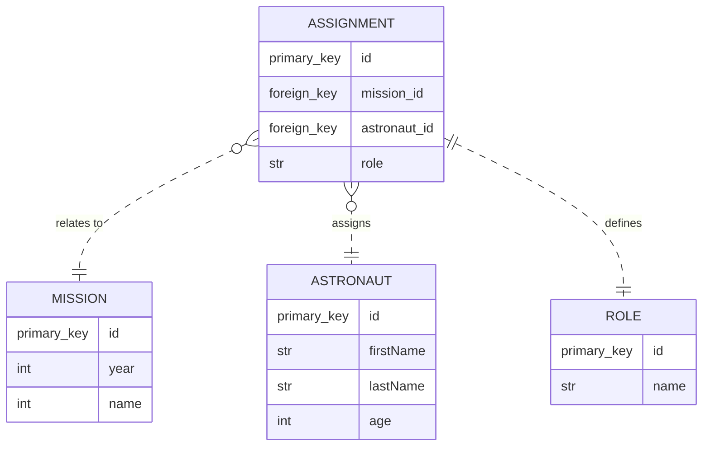

* ``ASSIGNMENT`` relates to ``one MISSION``
* ``ASSIGNMENT`` assigns ``one ASTRONAUT``
* ``ASSIGNMENT`` defines ``one ROLE``

* ``MISSION`` is related to ``zero or many ASSIGNMENT``
* ``ASTRONAUT`` is assigned to ``zero or many ASSIGNMENT``
* ``ROLE`` is defined in ``one ASSIGNMENT``

