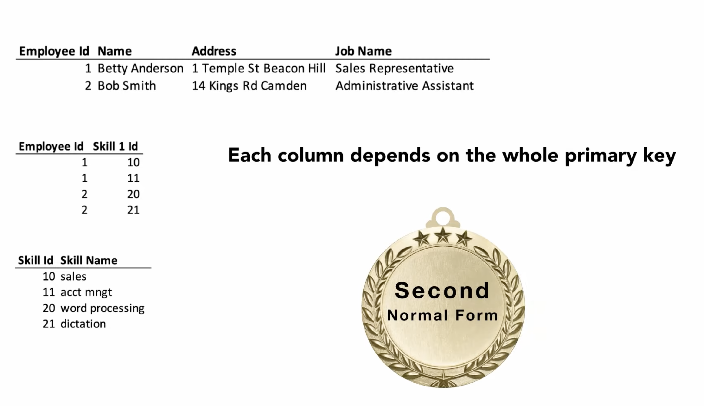
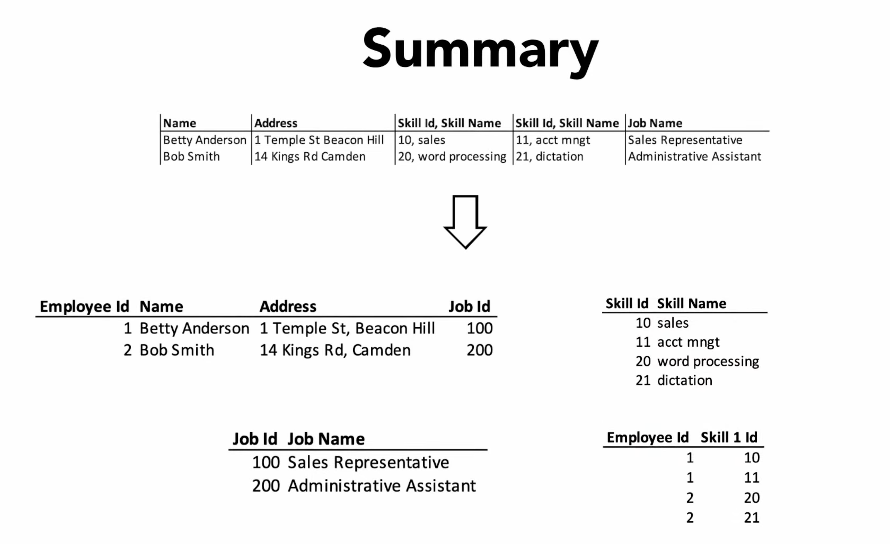

Theory Normalization
====================

.. important::

    * Entities - rows in database
    * Attributes - columns in database
    * Normalization is what gives data meaning
    * NF - Normal Form
    * In order to be in 3rd normal form, you need to be in 1st and 2nd NF
    * Core basics: 1st, 2nd, 3rd
    * Exceptions: 4th, 5th
    * 1st: atomic values, unique identifiers (PK), columns with same type
    * 2nd: all data must depend on the Primary Key
    * 3rd: PK define all Non-Key columns, those can't depend on any other Key
    * 4th: No multi-valued dependencies

Rationale
---------
.. glossary::

    normalization
        Database normalization is the process of structuring a database,
        usually a relational database, in accordance with a series of
        so-called normal forms in order to reduce data redundancy and
        improve data integrity. Normalization entails organizing the columns
        (attributes) and tables (relations) of a database to ensure that
        their dependencies are properly enforced by database integrity
        constraints. It is accomplished by applying some formal rules either
        by a process of synthesis (creating a new database design) or
        decomposition (improving an existing database design). A relational
        database relation is often described as 'normalized' if it meets
        third normal form. [#WikipediaDatabaseNormalization]_ [#Codd1972]_

    NF
        Normal Form

    Entity
    Entities
        Rows in database

    Attributes
        Columns in database

    Table
        Database Table

1st Normal Form
---------------
* Atomic Values
* Unique Identifiers (rows uniquely identified by ``PRIMARY KEY``)
* Entries in a column are same type

1st Normal Form enforces the following actions on the data:

1. A cell must never contain more than one value
   (each value needs to be in its own column)

   .. csv-table:: Assignments (problem)
       :header: name, role

       Melissa Lewis, Commander
       Mark Watney, Botanist
       Rick Martinez, Pilot

   Note that in this example astronaut's firstname and lastname is in the
   same column (name).

   .. csv-table:: Assignments (solution)
       :header: firstname, lastname, role

       Melissa, Lewis, Commander
       Mark, Watney, Botanist
       Rick, Martinez, Pilot

2. Each row must be unique
   (one column, or combination of columns must uniquely identify a row
   also known as ``PRIMARY KEY``)

   .. csv-table:: assignments (problem)
       :header: firstname, lastname

       Melissa, Lewis
       Mark, Watney
       Rick, Martinez

   Note, that this in problematic example we can have duplicate names,
   for example there could be more than one Mark Watney in the world.

   .. csv-table:: assignments (solution)
       :header: id (PK), firstname, lastname

       1, Melissa, Lewis
       2, Mark, Watney
       3, Rick, Martinez

   Now, even if we have two Mark Watneys, each of them will have a unique
   identifier (id).

3. Each column name must be unique

   .. csv-table:: assignments (problem)
       :header: name, year, name

       Melissa Lewis, 2035, Ares3
       Mark Watney, 2035, Ares3
       Rick Martinez, 2035, Ares3

   Some column names are very (such as ``name``) to the point, that there
   could be several independent columns which we can call by ``name``.
   Each column should have unique name.

   .. csv-table:: assignments (solution)
       :header: astronaut, year, mission

       Melissa Lewis, 2035, Ares3
       Mark Watney, 2035, Ares3
       Rick Martinez, 2035, Ares3

4. There must be no repeating groups

   .. csv-table:: Assignments (problem)
       :header: astronaut, year1, mission1, year2, mission2

       Melissa Lewis, 2031, Ares1, 2035, Ares3
       Mark Watney, 2031, Ares1, 2035, Ares3
       Rick Martinez, 2031, Ares1, 2035, Ares3

.. figure:: img/normalform-1st-atomicvalues.png

    A cell must never contain more than one value
    (each value needs to be in its own column)

.. figure:: img/normalform-1st-primarykey.png

    Each row must be unique
    (one column, or combination of columns must uniquely identify a row
    also known as ``PRIMARY KEY``)

.. figure:: img/normalform-1st-uniquecolumnnames.png

    Each column name must be unique

.. figure:: img/normalform-1st-norepeatinggroups.png

    There must be no repeating groups

.. figure:: img/normalform-1st-summary.png

    If both Atomic Values and Unique Identifiers rules are applied
    the database achieved 1st Normal Form

2nd Normal Form
---------------
* All data must depend on the Primary Key
* All attributes (non-key columns) dependent on the key (PK)

Problem:

.. csv-table:: assignments
    :header: id (PK), firstname, lastname, year, mission

    1, Melissa, Lewis, 2035, Ares3
    2, Mark, Watney, 2035, Ares3
    3, Rick Martinez, 2035, Ares3

Solution:

.. csv-table:: astronauts
    :header: id (PK), firstname, lastname

    1, Melissa, Lewis
    2, Mark, Watney
    3, Rick Martinez

.. csv-table:: missions
    :header: id (PK), year, mission

    1, 2031, Ares1
    2, 2033, Ares2
    3, 2035, Ares3

.. csv-table:: assignments
    :header: id (PK), astronaut_id (FK), mission_id (FK)

    1, 1, 3
    1, 2, 3
    1, 3, 3

.. figure:: img/normalform-2nd-primarykey.png

    All data must depend on the Primary Key

    If all data depend on the Primary Key the database achieved
    2nd Normal Form.

3rd Normal Form
---------------
* The Primary Key must fully define all Non-Key columns
* Non-Key columns must not depend on any other Key
* All fields (columns) can be determined only by the key in the table and no other column

Problem:

.. csv-table:: assignments
    :header: id (PK), firstname, lastname, year, mission

    1, Melissa, Lewis, 2035, Ares3
    2, Mark, Watney, 2035, Ares3
    3, Rick, Martinez, 2035, Ares3

Note that pair (2035, Ares3) repeats several times. Knowing the mission
name we can determine the year. This should be replaced with a relation (FK)
to the database which would store this pair at given primary key. The
important fact here is that, if we want to change year of a Ares3 mission,
let say it was delayed due to the budget constraints, we have to change it
in several places. Leaving one record unmodified will lead to data
inconsistency.

Solution:

.. csv-table:: assignments
    :header: id (PK), firstname, lastname, mission_id (FK)

    1, Melissa, Lewis, 3
    2, Mark, Watney, 3
    3, Rick, Martinez, 3

.. csv-table:: missions
    :header: id (PK), year, mission

    1, 2031, Ares1
    2, 2032, Ares2
    3, 2035, Ares3

Now changing a year for a mission would result in changing it for all
astronauts.

.. figure:: img/normalform-3rd-primarykeydefinesnonkeycolumns.png

    The Primary Key must fully define all Non-Key columns

.. figure:: img/normalform-3rd-summary.png

    If Primary Key fully defines all Non-Key columns and Non-Key columns does
    not depend on any other Key, the database achieved 3rd Normal Form.

4th Normal Form
---------------
* No multi-valued dependencies

Problem:

.. csv-table:: astronauts
    :header: id (PK), firstname, lastname, email

    1, Melissa, Lewis, mlewis@nasa.gov
    1, Melissa, Lewis, mlewis@gmail.com
    2, Mark, Watney, mwatney@nasa.gov
    3, Rick Martinez, rmartinez@nasa.gov

Note, that Melissa has two emails: work email mlewis@nasa.gov and private
email mlewis@gmail.com.

Solution:

.. csv-table:: astronauts
    :header: id (PK), firstname, lastname

    1, Melissa, Lewis
    2, Mark, Watney
    3, Rick Martinez

.. csv-table:: astronaut_emails
    :header: id (PK), email, astronaut_id (FK)

    1, mlewis@nasa.gov, 1
    2, mlewis@gmail.com, 1
    3, mwatney@nasa.gov, 2
    4, rmartinez@nasa.gov, 3

Recap
-----

