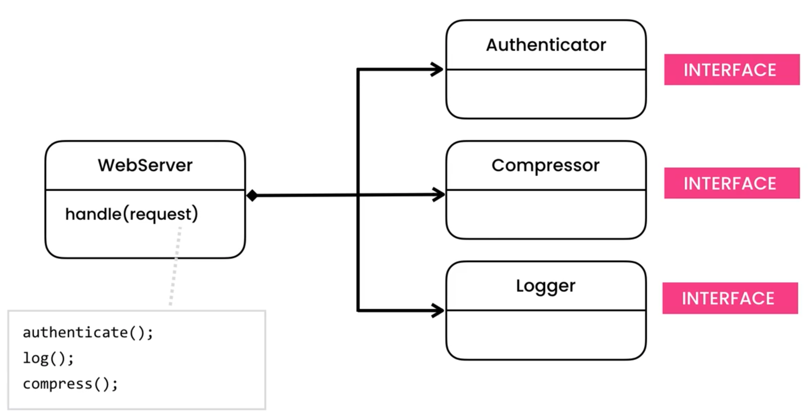
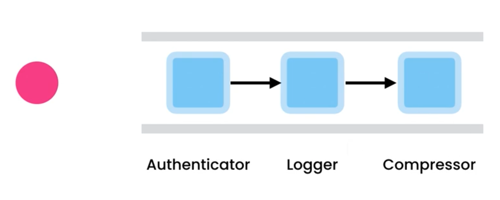

Chain of Responsibility
=======================

Important
---------
* EN: Chain of Responsibility
* PL: Łańcuch zobowiązań
* Type: object

Use Cases
---------
* Chain of objects
* Create a pipeline of classes with different responsibilities
* Open/Close Principle for adding new handlers

.. figure:: img/designpatterns-chainofresponsibility-flow.png

Problem
-------

Design
------

Implementation
--------------

.. literalinclude:: ../_src/designpatterns-chainofresponsibility.py
    :language: python

.. todo:: Assignments

* Add Encryptor handler
* Make pipeline: authenticator -> logger -> compressor -> encryptor
