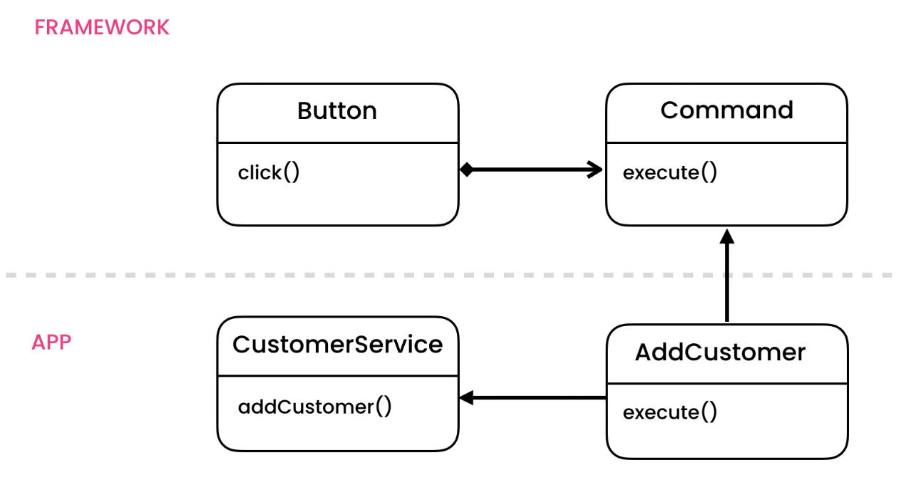

Command
=======
* EN: Command
* PL: Polecenie
* Type: object

Pattern
-------
* Receiver — The Object that will receive and execute the command
* Invoker — Which will send the command to the receiver
* Command Object — Itself, which implements an execute, or action method, and contains all required information
* Client — The main application or module which is aware of the Receiver, Invoker and Commands
* GUI Buttons, menus
* Macro recording
* Multi level undo/redo (See Tutorial)
* Networking — send whole command objects across a network, even as a batch
* Parallel processing or thread pools
* Transactional behaviour — Rollback whole set of commands, or defer till later
* Wizards

.. figure:: img/designpatterns-command-pattern.png

.. literalinclude:: uml/designpatterns-command-pattern.md
    :language: md

Problem
-------
.. figure:: img/designpatterns-command-problem.png

.. literalinclude:: uml/designpatterns-command-problem.md
    :language: md

.. literalinclude:: src/designpatterns-command-problem.py
    :language: python

Solution
--------

.. literalinclude:: uml/designpatterns-command-solution.md
    :language: md

Command pattern:

.. literalinclude:: src/designpatterns-command-solution-1.py
    :language: python

Composite commands (Macros):

.. literalinclude:: src/designpatterns-command-solution-2.py
    :language: python

Undoable commands:

.. literalinclude:: src/designpatterns-command-solution-3.py
    :language: python

Further Reading
---------------
* https://medium.com/design-patterns-in-python/command-design-pattern-in-python-2f15b09f3774

Assignments
-----------
.. todo:: Assignments
