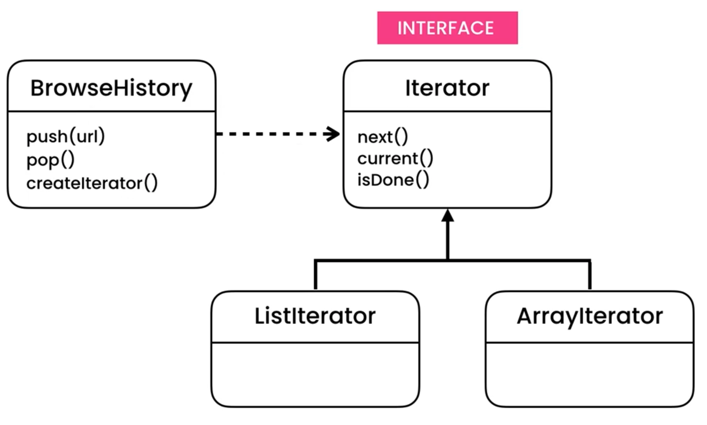

Iterator
========

Rationale
---------
* EN: Iterator
* PL: Iterator
* Type: object

Use Cases
---------
* History (like browser history)

Problem
-------
.. literalinclude:: ../_src/designpatterns-iterator-problem.py
    :language: python

Design
------

Implementation
--------------

.. literalinclude:: ../_src/designpatterns-iterator-impl.py
    :language: python

Pythonic
--------
.. literalinclude:: ../_src/designpatterns-iterator-pythonic-1.py
    :language: python

.. literalinclude:: ../_src/designpatterns-iterator-pythonic-2.py
    :language: python

Assignments
-----------
.. todo:: Create assignments
