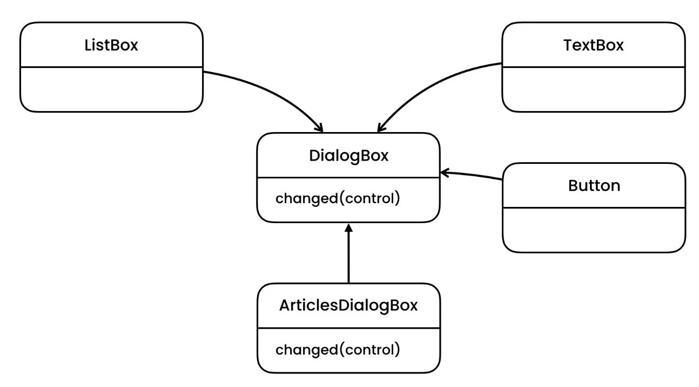
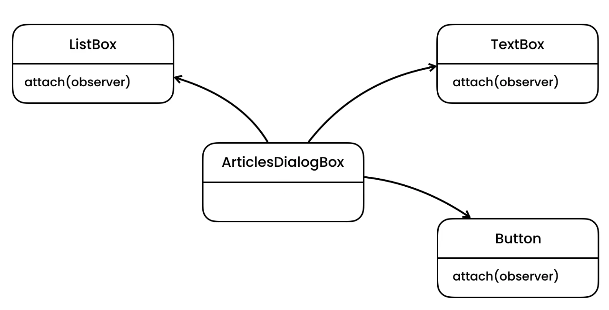

Mediator
========

Rationale
---------
* EN: Mediator
* PL: Mediator
* Type: object

Use Cases
---------
* Input fields which needs to collaborate
* Cannot submit form if all required fields are not filled
* If you select article in list of articles, editor form with current article content and title gets populated
* Auto slug-field based on title content

Design
------
.. figure:: ../_img/designpatterns-mediator-bad.png
.. figure:: ../_img/designpatterns-mediator-gof.png

Implementation
--------------
.. literalinclude:: ../_src/designpatterns-mediator.py
    :language: python

Mediator with Observer Pattern:

.. literalinclude:: ../_src/designpatterns-mediator-observer.py
    :language: python

Assignments
-----------
.. todo:: Create assignments

* Form with Username and Password
* If username and password is provided enable ``login`` button
