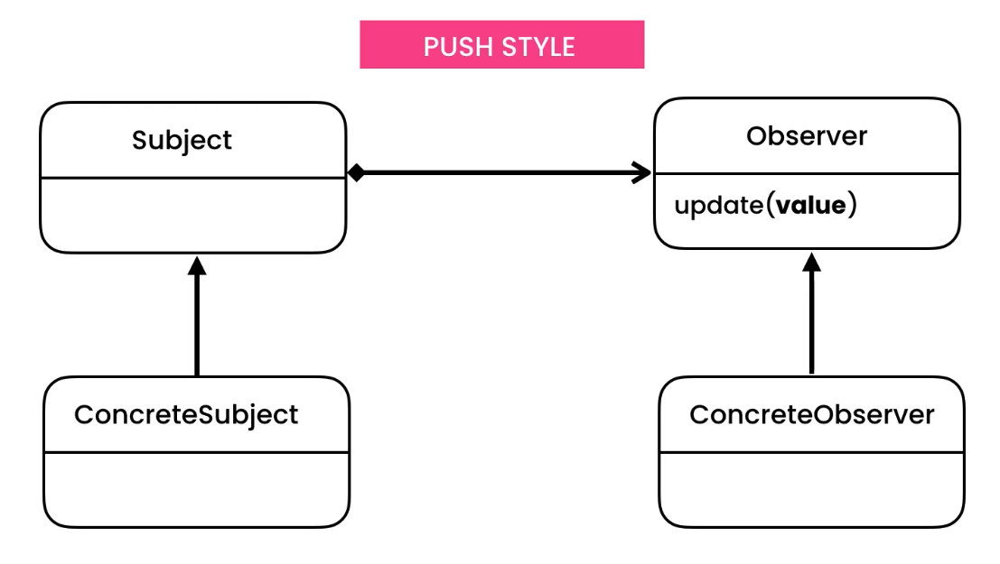

Observer
========
* EN: Observer
* PL: Obserwator
* Type: object

Use Cases
---------
* When the state of the object changes and you need to notify other objects about this change
* Notify chart about changes in data to refresh
* Spreadsheet formulas
* Push or pull style of communication

Design
------
.. figure:: img/designpatterns-observer-gof.png

.. figure:: img/designpatterns-observer-pull.png

Implementation
--------------
.. figure:: img/designpatterns-observer-usecase.png

.. literalinclude:: ../_src/designpatterns-observer.py
    :language: python

.. literalinclude:: ../_src/designpatterns-observer-push.py
    :language: python

.. literalinclude:: ../_src/designpatterns-observer-pull.py
    :language: python

.. todo:: Assignments
