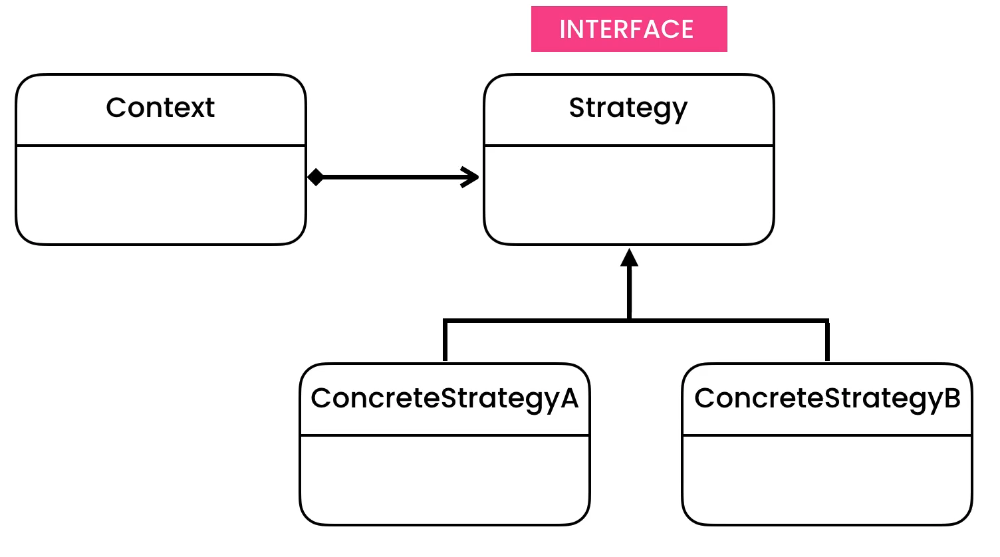
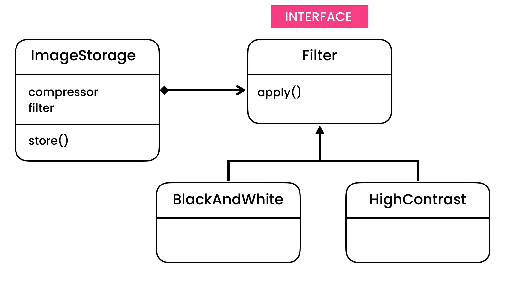
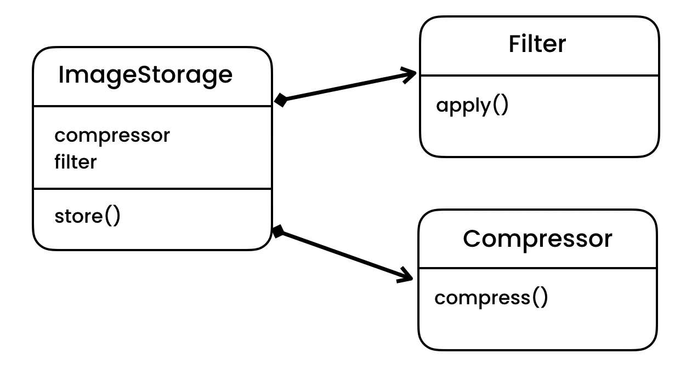

Strategy
========

Rationale
---------
* EN: Strategy
* PL: Strategia
* Type: object

Use Cases
---------
* Store images with compressor and filters

Problem
-------
.. code-block:: python

    from dataclasses import dataclass

    @dataclass
    class ImageStorage:
        _compressor: str
        _filter: str

        def store(self, filename) -> None:
            if self._compressor == 'jpeg':
                print('Compressing using JPEG')
            elif self._compressor == 'png':
                print('Compressing using PNG')

            if self._filter == 'black&white':
                print('Applying Black&White filter')
            elif self._filter == 'high-contrast':
                print('Applying high contrast filter')

Design
------
* Similar to `State Pattern`
* No single states
* Can have multiple states
* Different behaviors are represented by strategy objects

Implementation
--------------
.. figure:: ../_img/designpatterns-strategy-usecase1.png

.. literalinclude:: ../_src/designpatterns-strategy.py
    :language: python

Assignments
-----------
.. todo:: Create assignments
